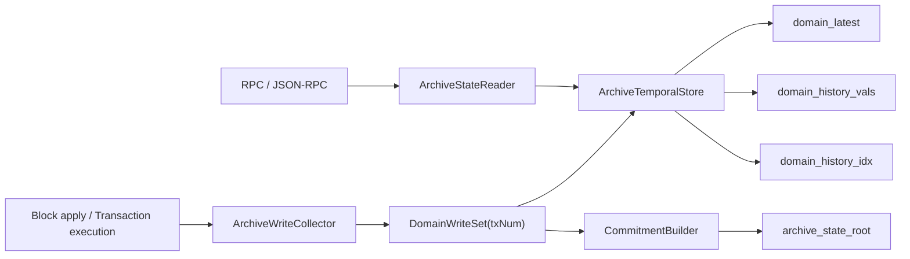

# java-tron 交易级状态树支持：Erigon V2/V3 模型调研

> ⚠️ **基础研究稿（最早），含已废弃命名——勿复制进实现**：域名 `CONTRACT_CODE/CONTRACT_META/DYNAMIC_GLOBAL`、状态点 `StatePoint`、root-policy `DOMAIN_ROOT_ONLY`、猜想域 `TRC10_ASSET/VOTE_WITNESS/DELEGATION_RESOURCE` 等均已被权威层取代（见 [00-ARCHIVE-V3-AUTHORITY-AND-DECISIONS.md](00-ARCHIVE-V3-AUTHORITY-AND-DECISIONS.md) §5）。本文对 Erigon V2/V3 模型的论述本身忠实（含"普通域 GetAsOf 在 history-miss 时回落 latest"），可作背景理解。

日期：2026-05-20

源码深挖后的落地路线图：[java-tron Archive 状态树：Erigon 源码深挖后的落地路线图](./20260601-java-tron-archive-erigon-source-synthesis-implementation-roadmap.md)

## 1. 背景和目标

[tronprotocol/java-tron#6289](https://github.com/tronprotocol/java-tron/issues/6289) 的目标是为 TRON 实现 Archive Node 能力，支持按历史区块查询账户余额、合约代码、合约存储，并进一步支撑 `eth_getBalance`、`eth_getCode`、`eth_getStorageAt`、`eth_call` 等以历史状态为输入的 ETH 兼容接口。issue 中同时指出几个关键约束：

- java-tron 当前不是完整 archive node；历史状态查询目前只有余额方向的优化能力，依赖 `storage.balance.history.lookup = true` / `--history-balance-lookup`。
- TRON 区块头现有 `txTrieRoot` 和 `accountStateRoot`，但 `accountStateRoot` 只覆盖余额语义，不等价于 Ethereum 的全局 `stateRoot`。
- TRON 状态分散在多类 DB 中，issue 里统计约 25 个状态相关 DB，覆盖 account、TRC10、contract、vote、delegation 等。
- archive node 预估数据量 80T+，需要考虑分段、多盘、历史查询聚合。
- 第一阶段倾向不把新 `stateRoot` 纳入共识，先在独立分支或 archive sidecar 中实现，降低 SR/fullnode 执行路径风险。

本调研聚焦 Erigon V2/V3 状态历史模型，并给出 java-tron 支持“交易级别状态树”的推荐技术路线。这里的“交易级别状态树”不只表示能查区块末尾状态，还表示每笔交易前后都存在明确的状态坐标，可选地计算和持久化该坐标对应的 root/proof。

## 2. 结论摘要

推荐以 Erigon V3 的 temporal/domain 模型作为目标设计，V2 只作为“before-value ChangeSet”思想参考。

核心判断：

- V2 的模型是当前态 + 区块级 before-value ChangeSet + 历史索引。它简单、易落地，适合做 block-level 历史状态查询，但天然不是交易级。
- V3 把时间坐标从 block number 升级为全局 `txNum`，所有 state/history/index 都围绕 `txNum` 组织，更适合 java-tron 的交易级状态树。
- java-tron 不应做“每个区块/每笔交易完整 snapshot”。应记录每个 domain key 的 before-value，并用 inverted index 加速 `GetAsOf`。
- 第一阶段不建议把 root 写入共识区块头。应先做 archive sidecar：历史状态查询可用、可回放验证、可重新计算 root。
- 交易级 root 应作为后续阶段启用：先支持 block-end archive root，再扩展为 tx-end root 或按需 root。
- 所有可变状态必须进入明确的 domain registry；不能只覆盖账户/合约存储后宣称全状态 root。

推荐路线：

1. 建立 java-tron archive `txNum` 和 state domain registry。
2. 在区块执行的 canonical apply 路径捕获每笔交易的 domain write-set。
3. 写入 `domain_latest`、`domain_history_vals`、`domain_history_idx`，先支持 `GetAsOf`。
4. 在 block-end 计算 sidecar `archiveStateRoot`，和回放结果比对。
5. 需要交易级证明时，再按 `txNum` 计算或缓存 tx-end root。

## 3. Erigon V2 模型

### 3.1 数据结构

Erigon V2 的核心表可以概括为：

| 类型 | 表 | 作用 |
|---|---|---|
| 当前态 | `PlainState` | 未哈希 key 的当前账户和存储，执行阶段直接读写 |
| 区块级历史 | `AccountChangeSet` / `StorageChangeSet` | 区块 N 中被修改 key 的修改前值 |
| 历史索引 | `E2AccountsHistory` / `E2StorageHistory` | key -> 发生变化的 block number 集合 |
| 哈希态 | `HashedAccounts` / `HashedStorage` | 将 plain key keccak 后供 trie 使用 |
| Trie 中间节点 | `TrieOfAccounts` / `TrieOfStorage` | 计算 state root 的中间 hash |

关键点在于：ChangeSet 存的是 before-value，而 after-value 留在 `PlainState`。因此查询历史状态时，可以先用历史索引找到目标高度之后最近一次变化，再读取那次变化里记录的 before-value；如果找不到变化，就读当前 `PlainState`。

### 3.2 写路径

V2 的 `PlainStateWriter` 在执行区块时写两类数据：

- 写当前态：账户、代码、合约 storage 最终进入 `PlainState` / code 表。
- 写历史：如果账户或 storage 被修改，`ChangeSetWriter` 记录该 key 的 original value，最后写入 `AccountChangeSet` / `StorageChangeSet`，并更新 `E2AccountsHistory` / `E2StorageHistory`。

这是一种很适合 archive 的最小增量模型：不保存每个区块的全量状态，只保存“被改动 key 的旧值”。

### 3.3 读路径

V2 的历史读取路径是：

```text
ReadAccount/ReadStorage(blockN, key)
  -> E2*History 找 >= blockN 的下一次变化
  -> 如果找到，去 *ChangeSet 读取该变化前值
  -> 如果找不到，读取 PlainState 当前值
```

这种读法的优点是读语义清晰、存储开销和写放大可控。缺点是时间粒度是 block number，不是 transaction number。

### 3.4 root 计算

V2 的同步阶段把执行、hash state、intermediate hashes 拆开：

```text
Execution
  -> 只执行区块，维护 PlainState 和 ChangeSet
HashState
  -> 将 PlainState key 哈希化，生成 HashedAccounts/HashedStorage
IntermediateHashes
  -> 基于 hashed state 生成 trie 中间节点和 state root
```

这说明 V2 并不是在每笔交易后立即维护完整 trie，而是先执行和记录历史，再在后置阶段计算 root。

### 3.5 对 java-tron 的启发和限制

可借鉴：

- before-value ChangeSet 比全量 snapshot 更适合 TRON 的 80T+ 规模。
- 当前态和历史态分离，可以降低普通执行路径复杂度。
- root 计算可以后置或异步化，第一阶段不用进入共识。

限制：

- block-level ChangeSet 不满足交易级状态树。
- root 计算依赖后置 HashState/IntermediateHashes；若要每笔交易都可证明，需要改为 tx-level 写集和 tx-level commitment。
- 如果把 V2 的 block number 改成 txNum，本质上就进入 V3 模型。

## 4. Erigon V3 模型

### 4.1 TemporalDB 和冷热分层

Erigon V3 把数据库抽象为 temporal database：热数据在 MDBX，旧数据 freeze 成不可变 snapshot 文件。目录上分成：

```text
datadir/
  chaindata/           hot MDBX
  snapshots/domain/    当前 domain 值快照
  snapshots/history/   历史值快照
  snapshots/idx/       inverted index
  snapshots/accessor/  访问加速索引
```

这对 java-tron 的意义很直接：热区保留最近可回滚数据，冷区按时间段冻结；多盘部署时，`chaindata` 和 domain/accessor 放快盘，history/idx 可放容量盘或分段节点。

### 4.2 txNum 是一等时间坐标

V3 的核心变化是使用 canonical `txNum`：

- `MaxTxNum` 保存 `block_number -> max_tx_num_in_block`。
- history 和 index 使用 txNum，不使用节点本地自增 transaction id。
- txNum 可以覆盖普通交易和系统交易，能表示 block 前后系统状态变更。

这比 block number 更适合 java-tron，因为 TRON 的需求不只是“某个区块末尾状态”，而是“交易级别状态树”。block height 应该只是 txNum 的派生索引。

### 4.3 Domain 模型

V3 将状态划分为 domains：

| Domain | 作用 |
|---|---|
| `AccountsDomain` | 账户状态 |
| `StorageDomain` | 合约 storage |
| `CodeDomain` | 合约代码 |
| `CommitmentDomain` | Merkle commitment/trie 节点 |
| `ReceiptDomain` / `RCacheDomain` | receipt cache/index，属于查询优化 |

每个 domain 有三类核心数据：

- values：当前值或某个 snapshot 区间内的最新值。
- history values：key 在某个 txNum 被修改时的 before-value。
- inverted index：key -> 发生变化的 txNum 集合，用于快速定位历史值。

V3 的 `GetAsOf(domain, key, txNum)` 语义非常重要：它返回“交易 `txNum` 修改该 key 之前可见的值”。如果要读交易 N 之后的状态，通常读下一个状态点，即 `GetAsOf(key, N + 1)`，或通过明确的 `StatePoint` 映射避免调用方直接做加一。

### 4.4 写路径

V3 执行写入时会带上 txNum：

```text
ApplyStateWrites(blockNum, txNum, writes)
  -> DomainPut(AccountsDomain, key, value, txNum, prevValue)
  -> DomainPut(StorageDomain, key, value, txNum, prevValue)
  -> DomainPut(CodeDomain, key, value, txNum, prevValue)
  -> 维护 commitment touch set
  -> step boundary 时可计算 commitment
```

并行执行时，Erigon 使用 block-level cache / shared domains 处理“本区块内前序交易写入必须对后续交易可见”的问题；串行执行时写入可直接进入 SharedDomains。这个设计对 java-tron 很关键，因为 archive 写入不能只看最终 block delta，否则丢失交易级中间态。

### 4.5 读路径

V3 的历史读路径可抽象为：

```text
HistoryReaderV3.Get(key, txNum)
  -> block cache / in-memory shared domains
  -> TemporalDB.GetAsOf(domain, key, txNum)
  -> history snapshots / hot DB
  -> latest value fallback
```

这个读路径同时满足：

- 同步执行中的 intra-block 读。
- RPC 对历史区块或历史交易点的读。
- 重放某笔交易时读取该交易开始前状态。

### 4.6 Commitment

V3 把 commitment 也作为 domain 管理，但不是每笔交易都强制计算 full root。典型策略是：

- 普通 state writes 记录 touched keys。
- step boundary 或 block boundary 计算 commitment。
- commitment state 可被保存，用于后续增量计算。

这比“每笔交易立即重算整棵树”更适合 TRON 的吞吐和数据规模。java-tron 可以先实现 block-end root，再扩展 tx-end root 缓存或按需计算。

## 5. V2/V3 对比

| 维度 | Erigon V2 | Erigon V3 | java-tron 建议 |
|---|---|---|---|
| 时间坐标 | block number | txNum | 采用 txNum，block height 只是索引 |
| 历史粒度 | 区块级 | 交易级 | 交易级 write-set |
| 历史内容 | before-value ChangeSet | domain history + inverted index | before-value + domain index |
| 当前态 | `PlainState` | domain latest values | 保留现有 store 当前态，同时旁路 archive latest |
| root 计算 | 后置 HashState/IntermediateHashes | commitment domain + step/block 计算 | sidecar root，先 block 后 tx |
| 冷热分层 | 主要 MDBX 表 + pruning | hot MDBX + frozen snapshots | 必须支持分段/多盘 |
| 交易级 root | 不天然支持 | 天然可支持 | 以 V3 为目标 |
| 实现难度 | 低 | 高 | 分阶段落地 |

## 6. java-tron 推荐架构

### 6.1 总体原则

1. Archive 状态与共识状态解耦。
   第一阶段不要修改区块头，也不要让 SR/fullnode 必须验证 archive root。

2. 以 canonical block apply 为唯一 archive 来源。
   java-tron 存在预执行和 rollback 语义，pending transaction / local validation 产生的临时状态不能写入 archive history。

3. 所有状态写入进入 domain registry。
   25 个状态 DB 需要逐项归类：纳入 root、仅纳入历史查询、完全排除。排除也要有显式理由。

4. 使用 canonical bytes。
   root 和 history 必须基于稳定序列化。避免 Java 对象序列化、map 非确定顺序、protobuf 默认值差异导致不同节点 root 不一致。

5. root 消费 write-set，不扫描业务 store。
   trie/commitment 应从 domain write-set 增量更新，而不是事后遍历所有 DB 推断变化。

### 6.2 组件划分



建议新增的核心模块：

- `ArchiveTxNumIndex`：维护 block/tx 与 txNum 的映射，详见 [模块 01 细化设计](./20260521-java-tron-archive-module-01-txnum-index.md)。
- `ArchiveDomainRegistry`：定义 domain id、key 编码、value 编码、root inclusion 策略，详见 [模块 02 细化设计](./20260521-java-tron-archive-module-02-domain-registry.md)。
- `ArchiveWriteCollector`：在 canonical execution 中收集每笔交易写集和 before-value，详见 [模块 03 细化设计](./20260521-java-tron-archive-module-03-write-collector.md)。
- `ArchiveTemporalStore`：实现 latest/history/index/snapshot，详见 [模块 04 细化设计](./20260521-java-tron-archive-module-04-temporal-store.md)。
- `ArchiveStateReader`：实现 `GetAsOf`、range/prefix scan、blockTag/txTag 解析，详见 [模块 05 细化设计](./20260521-java-tron-archive-module-05-state-reader.md)。
- `CommitmentBuilder`：基于 domain write-set 增量计算 sidecar root，详见 [模块 06 细化设计](./20260521-java-tron-archive-module-06-commitment-builder.md)。

### 6.3 txNum 设计

txNum 必须是全局单调、canonical、可重放的执行序号：

| 记录 | 说明 |
|---|---|
| `block_num -> min_tx_num` | 区块第一个逻辑 txNum |
| `block_num -> max_tx_num` | 区块最后一个逻辑 txNum |
| `tx_id -> tx_num` | 普通交易反查 |
| `tx_num -> block_num, tx_index, phase` | 支持交易前/后状态点 |
| `state_point -> effective_tx_num` | 避免 RPC 层处理 off-by-one |

建议显式建模 `StatePoint`：

```text
BLOCK_END(blockN)        -> after blockN final logical write
TX_BEFORE(txId)          -> before txNum(txId)
TX_AFTER(txId)           -> after txNum(txId)
MAINTENANCE_AFTER(block) -> after maintenance/system writes
```

内部仍可采用 Erigon 的 before-tx 语义：

```text
stateBefore(txNum) = GetAsOf(key, txNum)
stateAfter(txNum)  = GetAsOf(key, nextStatePoint(txNum))
```

这样可以避免 `eth_getBalance(address, blockTag)`、`eth_call(..., blockTag)`、交易级 debug API 在“区块末尾状态”上出现 off-by-one。

### 6.4 Domain 设计

java-tron 不应直接照搬 Ethereum 的 account/storage/code 三域，因为 TRON 状态被拆成多类 DB。建议将 domain 分为三层。

第一层：必须进入 root 的 consensus/application state。

| Domain | 示例内容 | key 建议 |
|---|---|---|
| `ACCOUNT` | AccountCapsule 中影响余额、资源、权限、asset、contract 标记等字段 | `0x01 || address` |
| `CONTRACT_CODE` | deployed bytecode / code hash | `0x02 || contract_address` |
| `CONTRACT_STORAGE` | TVM storage slot | `0x03 || contract_address || slot_key` |
| `CONTRACT_META` | ABI、origin、consume_user_resource_percent 等合约元数据 | `0x04 || contract_address` |
| `TRC10_ASSET` | asset issue、asset state | `0x05 || asset_id` |
| `VOTE_WITNESS` | witness、vote、brokerage 等治理状态 | `0x06 || sub_type || key` |
| `DELEGATION_RESOURCE` | stake/delegation/resource 相关状态 | `0x07 || sub_type || key` |
| `DYNAMIC_GLOBAL` | 动态全局参数中会被交易/维护改变且影响执行的字段 | `0x08 || property_key` |

第二层：查询需要但不一定进入 root 的索引型数据。

- transaction lookup、receipt lookup。
- event/log index。
- account trace/balance trace。
- solidity node / API acceleration cache。

第三层：明确排除 root 的派生缓存。

- 可由第一层状态重建的缓存。
- 纯统计指标。
- 本地节点运维元数据。

落地前必须做一次 java-tron store inventory，逐个 store 记录：

```text
store name
  -> 是否 canonical state
  -> 是否会被 transaction/maintenance 修改
  -> 是否影响 VM/actuator 执行
  -> 是否需要历史查询
  -> 是否进入 root
  -> canonical key/value bytes
```

### 6.5 存储模型

建议最小表模型：

| 表 | key | value |
|---|---|---|
| `archive_txnum_by_block` | `block_num` | `min_tx_num, max_tx_num` |
| `archive_txnum_by_txid` | `tx_id` | `tx_num, block_num, tx_index` |
| `archive_state_point` | `state_point_key` | `effective_tx_num` |
| `domain_latest` | `domain_id || domain_key` | `value, last_tx_num` |
| `domain_history_vals` | `domain_id || domain_key || changed_tx_num` | `prev_value` 或 deletion marker |
| `domain_history_idx` | `domain_id || domain_key` | compressed txNum set |
| `domain_segments_manifest` | `domain_id || range` | segment location/checksum |
| `archive_domain_root` | `domain_id || state_point` | `domain_root` |
| `archive_state_root` | `state_point` | `global_root` |

`domain_history_vals` 必须区分三种状态：

- key 从不存在到存在：写 creation marker。
- key 从存在到删除：prev_value 是删除前值，latest 删除。
- key 存在但 value 变为空字节：不能和 deletion marker 混淆。

### 6.6 Root 结构

TRON 状态分散，建议使用“domain root 聚合”的全局 root：

```text
domainRoot[domainId] = Merkle(domainKeyHash -> valueHash)
globalRoot = Merkle(domainId -> domainRoot)
```

优点：

- 25 个 DB 可以逐域迁移，便于灰度。
- proof 可以拆成 domain 内 proof + domain root proof。
- 某些 domain 可先只做 history，不进入 global root。
- 多盘/分段时可以按 domain 和 txNum range 切分。

注意：

- `domainId` 必须稳定，不允许重排。
- valueHash 必须使用 canonical bytes。
- domain root 缺省值必须统一，空 domain 也要有确定 root。
- 如果未来要兼容 Ethereum `eth_getProof`，需要额外定义 TRON account 到 Ethereum account proof 的映射；TRON 原生 domain proof 不等价于 Ethereum MPT proof。

### 6.7 写入算法

推荐 canonical block apply 流程：

```text
for block in canonical_chain:
  txContext = archiveTxNumIndex.beginBlock(block)

  for tx in block.transactions:
    txNum = txContext.nextUserTx(tx.id, tx.index)
    collector.beginTx(txNum)

    execute tx through existing Manager/Actuator/VM path
      on every canonical store put/delete:
        domain = registry.resolve(store, key)
        domainKey = registry.encodeKey(store, key)
        newValue = registry.encodeValue(store, value)
        prevValue = archiveTemporalStore.getLatest(domain, domainKey)
        collector.record(domain, domainKey, prevValue, newValue)

    archiveTemporalStore.apply(collector.writeSet)
    commitmentBuilder.touch(collector.writeSet)
    collector.endTx()

  for maintenance/system write:
    txNum = txContext.nextSystemTx(phase)
    collect and apply same as user tx

  root = commitmentBuilder.computeBlockEndRoot()
  archiveRootStore.put(BLOCK_END(block.number), root)
  txContext.endBlock()
```

关键点：

- before-value 应从 archive latest 或 canonical state before write 读取，不能从已被本交易覆盖后的值读取。
- 同一交易内同一 key 多次写，只需要保留第一次 before-value 和最后 newValue。
- 同一 block 内前序交易的写必须对后续交易可见。
- failed/revert 交易只记录最终落盘状态变化；VM 内部回滚掉的临时写不能进入 archive history。
- block maintenance、奖励、资源结算等系统写必须有 txNum，否则 block-end root 不能重放。

### 6.8 读取算法

`GetAsOf(domain, key, statePoint)`：

```text
effectiveTxNum = statePointIndex.resolve(statePoint)

changedTxNum = historyIdx.findFirstChangeAtOrAfter(domain, key, effectiveTxNum)
if changedTxNum exists:
  prev = historyVals.get(domain, key, changedTxNum)
  if prev is creation_marker:
    return NOT_FOUND
  return prev

return latest.get(domain, key)
```

RPC 映射：

| API | 读取内容 |
|---|---|
| `eth_getBalance(address, blockTag)` | `ACCOUNT` domain 的 block-end balance 字段 |
| `eth_getCode(address, blockTag)` | `CONTRACT_CODE` domain |
| `eth_getStorageAt(address, slot, blockTag)` | `CONTRACT_STORAGE` domain |
| `eth_call(call, blockTag)` | 用 `ArchiveStateReader(statePoint=BLOCK_END(blockTag))` 构造只读 VM state |
| `wallet/getaccountbalance` | 可迁移到同一 archive reader，保留现有 API 语义 |

对 `eth_call` 的要求更高：不仅账户余额/代码/storage 要历史化，所有会影响 TVM 执行的全局参数、资源价格、链参数、合约元数据都必须能按 blockTag 读取。否则 `eth_call` 在历史高度可能读取当前全局参数，结果不可信。

### 6.9 快照和多盘

参考 Erigon V3，不建议将所有历史留在 LSM/LevelDB/RocksDB 热库中。建议：

- 热库保留最近 N 个 solid/finalized block 的 history，便于 reorg/unwind。
- 超过 finalized window 后按 txNum range freeze 成 segment。
- segment 文件按 `domain / history / idx / accessor` 分层。
- manifest 记录 range、文件路径、checksum、版本、domain schema version。
- history/idx 支持多盘路径，查询层按 manifest 路由。
- freeze 边界必须在不可回滚高度之后，避免 snapshot range 需要 unwind。

一个可行目录：

```text
archive/
  hot/
  segments/
    domain/account/
    domain/storage/
    history/account/
    history/storage/
    idx/account/
    idx/storage/
    accessor/
  manifest/
```

## 7. 分阶段实施路线

### M0：状态盘点和语义冻结

交付物：

- java-tron 所有 store inventory。
- domain registry 初版。
- canonical key/value 编码规范。
- root inclusion policy。
- `StatePoint` 语义文档。

验收：

- 每个被交易或维护逻辑修改的状态 store 都有明确归属。
- `eth_call` 依赖的全局参数已纳入历史读取范围。

### M1：txNum 和 write-set collector

交付物：

- block/tx -> txNum 索引。
- canonical execution 路径 write collector。
- 单交易内去重、多交易顺序可见性测试。
- failed/revert/system tx 场景测试。

验收：

- replay 同一区块得到稳定 write-set。
- 预执行或 fork rollback 不污染 archive history。

### M2：TemporalStore 和历史查询

交付物：

- `domain_latest`、`domain_history_vals`、`domain_history_idx`。
- `GetAsOf` 和 prefix/range scan。
- `wallet/getaccountbalance` 迁移或旁路适配。
- `eth_getBalance`、`eth_getCode`、`eth_getStorageAt` 历史 blockTag。

验收：

- 从 genesis replay 或指定高度 replay 后，可查询任意已归档高度。
- 与现有 `balance.history.lookup` 在余额查询上交叉校验。

### M3：历史 `eth_call`

交付物：

- 基于 `ArchiveStateReader` 的只读 TVM state。
- 历史全局参数读取。
- 合约代码、storage、资源模型历史化。

验收：

- 对历史 blockTag 的 view/pure 合约调用结果可重放一致。
- 当前态和历史态 VM reader 分离，不影响普通执行。

### M4：block-end archive root

交付物：

- domain root + global root。
- block-end `archive_state_root`。
- replay verifier：同一区块重复计算 root 一致。

验收：

- root 不进入 block header，不影响共识。
- 可以在独立 archive branch 上校验一段主网历史。

### M5：交易级 root/proof

交付物：

- tx-end root 计算策略：全量存储、按需计算、或 step checkpoint + replay。
- domain proof。
- 可选 `eth_getProof` 兼容层设计。

验收：

- `TX_AFTER(txId)` 能返回稳定 root。
- proof 能验证 domain key/value 属于该 state point。

### M6：segment freeze 和多盘

交付物：

- segment writer/reader。
- manifest 和 checksum。
- 多盘路径配置。
- 历史索引压缩。

验收：

- 热库大小可控。
- 查询能跨 hot + multiple cold segments。
- freeze 后数据不可变且可校验。

## 8. 风险和开放问题

1. 25 个 DB 的覆盖边界。
   最大风险不是 trie 算法，而是漏掉某个影响执行的 store，导致 root 可重复但语义不完整。

2. canonical serialization。
   Protobuf 默认值、字段顺序、旧版本兼容、Java 对象包装都可能造成 root 不稳定。必须定义 bytes-level schema。

3. 预执行和 rollback。
   java-tron 会为了交易验证修改本地状态后回滚。Archive collector 必须只记录 canonical block apply。

4. failed/revert 语义。
   交易失败仍可能消耗资源或产生费用，VM 内部临时写应回滚，但手续费/资源等最终写必须记录。

5. maintenance/system writes。
   TRON 有区块维护、奖励、资源结算等非普通交易写入。若没有 txNum，block-end state 无法完整重放。

6. 历史全局参数。
   `eth_call` 历史正确性依赖链参数、资源价格、合约配置等也能按历史点读取。

7. txNum off-by-one。
   Erigon 的 `GetAsOf(txNum)` 是 before-tx 语义。java-tron 对外必须用 `StatePoint` 屏蔽实现细节。

8. reorg 和 freeze 边界。
   冷 segment 不应覆盖仍可能回滚的区间。建议只 freeze solid/finalized window 之后的数据。

9. 数据规模。
   80T+ 需要从第一天就设计 segment、压缩、manifest、多盘，不应等热库膨胀后再迁移。

10. 共识切换。
   如果未来要把 stateRoot 纳入区块头，需要 TIP/Proposal 明确启用高度、genesis root、旧高度 root 缺失语义、SR 性能预算和异常处理。

## 9. PoC 建议

最小 PoC 不要覆盖 25 个 DB，先选三个最接近 ETH 兼容接口的 domain：

- `ACCOUNT`
- `CONTRACT_CODE`
- `CONTRACT_STORAGE`

PoC 范围：

1. 在 replay 模式下为每笔交易分配 txNum。
2. 捕获账户余额、合约代码、合约 storage 的 before-value。
3. 实现 `GetAsOf`。
4. 接入 `eth_getBalance`、`eth_getCode`、`eth_getStorageAt` 的历史 blockTag。
5. 对一段测试链回放，比较当前态和历史态。
6. 再加入 block-end root，验证重复 replay root 一致。

PoC 不建议一开始实现：

- `eth_getProof`。
- 交易级每 tx root 全量持久化。
- 25 个 DB 全覆盖。
- 共识 header 修改。

这些都应在历史读取闭环稳定后推进。

## 10. 源码和资料索引

java-tron 资料：

- [java-tron issue #6289: Implementation of Archive Node on TRON](https://github.com/tronprotocol/java-tron/issues/6289)
- [java-tron Core Modules / ChainBase 文档](https://tronprotocol.github.io/documentation-en/developers/code-structure/)
- [wallet/getaccountbalance 文档](https://tronprotocol.github.io/documentation-en/api/http/account/getaccountbalance/)

Erigon V2 参考：

- [`v2.61.3 erigon-lib/kv/tables.go`](https://github.com/erigontech/erigon/blob/v2.61.3/erigon-lib/kv/tables.go)：`PlainState`、`AccountChangeSet`、`StorageChangeSet`、`E2*History`、Trie 表说明。
- [`v2.61.3 core/state/plain_state_writer.go`](https://github.com/erigontech/erigon/blob/v2.61.3/core/state/plain_state_writer.go)：执行写当前态和 ChangeSet。
- [`v2.61.3 core/state/change_set_writer.go`](https://github.com/erigontech/erigon/blob/v2.61.3/core/state/change_set_writer.go)：before-value ChangeSet 编码和 history index 写入。
- [`v2.61.3 core/state/historyv2read/history.go`](https://github.com/erigontech/erigon/blob/v2.61.3/core/state/historyv2read/history.go)：V2 `GetAsOf` 历史读取。
- [`v2.61.3 eth/stagedsync/stages/stages.go`](https://github.com/erigontech/erigon/blob/v2.61.3/eth/stagedsync/stages/stages.go)：`Execution`、`HashState`、`IntermediateHashes` 阶段。
- [`v2.61.3 eth/stagedsync/stage_hashstate.go`](https://github.com/erigontech/erigon/blob/v2.61.3/eth/stagedsync/stage_hashstate.go)：plain state 到 hashed state 的转换。

Erigon V3 参考：

- [`db/agents.md`](../../db/agents.md)：TemporalDB、hot/cold、domain/history/index/accessor 总览。
- [`db/kv/tables.go`](../../db/kv/tables.go)：`MaxTxNum`、domain enum、`StateDomains`、V2 legacy 表注释。
- [`db/kv/kv_interface.go`](../../db/kv/kv_interface.go)：`GetAsOf` before-tx 语义说明。
- [`db/kv/rawdbv3/txnum.go`](../../db/kv/rawdbv3/txnum.go)：block number 与 txNum 映射。
- [`db/state/statecfg/state_schema.go`](../../db/state/statecfg/state_schema.go)：domain schema、history/index 配置、commitment dependency。
- [`db/state/domain.go`](../../db/state/domain.go)：domain `GetAsOf`，先查 history 再 fallback latest。
- [`db/state/history.go`](../../db/state/history.go)：history 文件/DB 查询和 creation marker 语义。
- [`db/state/execctx/domain_shared.go`](../../db/state/execctx/domain_shared.go)：`SharedDomains`、`DomainPut`、`SetTxNum`、`SeekCommitment`、`ComputeCommitment`。
- [`execution/state/rw_v3.go`](../../execution/state/rw_v3.go)：`ApplyStateWrites`、per-tx `DomainPut`、step boundary commitment。
- [`execution/state/history_reader_v3.go`](../../execution/state/history_reader_v3.go)：V3 历史 reader 的 block cache / shared domains / TemporalDB 读取链。
- [`execution/stagedsync/exec3.go`](../../execution/stagedsync/exec3.go)：执行阶段 txNum 恢复和 commitment 校验。
- [`execution/state/intra_block_state.go`](../../execution/state/intra_block_state.go)：`FinalizeTx` 每交易调用、`CommitBlock` 区块收尾。
