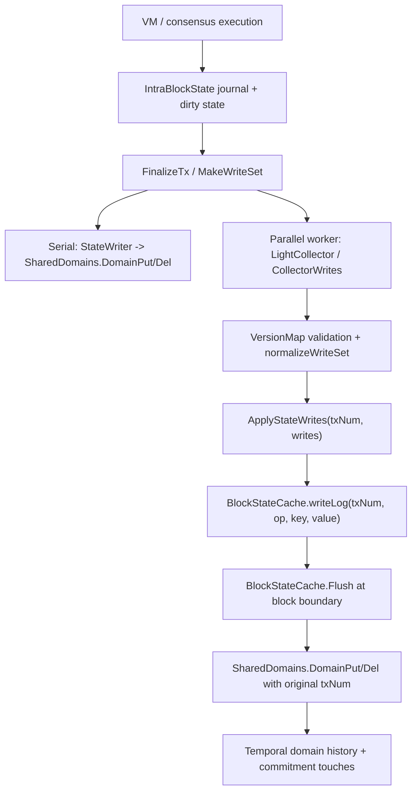

# 模块 03 ArchiveWriteCollector：Erigon 源码对照深挖

日期：2026-05-26

关联设计文档：[java-tron Archive 模块 03：ArchiveWriteCollector 细化设计](./20260521-java-tron-archive-module-03-write-collector.md)

前置源码对照：

- [模块 01：ArchiveTxNumIndex Erigon 源码对照深挖](./20260523-java-tron-module-01-txnum-index-erigon-source-deep-dive.md)
- [模块 02：ArchiveDomainRegistry Erigon 源码对照深挖](./20260525-java-tron-module-02-domain-registry-erigon-source-deep-dive.md)

## 1. 本轮调研范围

本轮继续沿着 Erigon 当前源码中的 V3 temporal domain 实现，重点对照 java-tron 的 `ArchiveWriteCollector`。核心问题不是“Erigon 有没有同名模块”，而是 Erigon 如何把执行层最终状态变化变成可按 `txNum` 写入 domain history 的交易级 write-set。

主要源码入口：

- `execution/state/versionedio.go:194`：`VersionedWrite` / `VersionedWrites` 写集模型。
- `execution/state/rw_v3.go:83`：`StateV3.applyVersionedWrites`，把写集落到 accounts/code/storage domain。
- `execution/state/rw_v3.go:369`：`StateV3.ApplyStateWrites`，串联 state write、step commitment。
- `execution/state/rw_v3.go:710`：`LightCollector`，并行 worker 中的轻量写集收集器。
- `execution/state/rw_v3.go:1030`：`BlockStateCache`，并行执行的 block-level state buffer。
- `execution/state/rw_v3.go:1276`：`BlockStateCache.Flush`，按原始 per-entry `txNum` 回放 writeLog。
- `db/state/execctx/domain_shared.go:817`：`SharedDomains.DomainPut`，domain 写入、no-op 判断、commitment touch。
- `db/state/execctx/domain_shared.go:878`：`SharedDomains.DomainDel`，domain 删除、account delete cascade。
- `execution/state/intra_block_state.go:2027`：`IntraBlockState.FinalizeTx`，交易结束写集 finalization。
- `execution/state/intra_block_state.go:2162`：`IntraBlockState.MakeWriteSet`，从 dirty state 生成 lower-level writes。
- `execution/stagedsync/exec3_serial.go:447`：串行执行路径调用 `MakeWriteSet`。
- `execution/stagedsync/exec3_parallel.go:2894`：并行执行 apply loop 调用 `ApplyStateWrites`。
- `execution/stagedsync/exec3_parallel.go:3052`：block 结束时 flush `BlockStateCache`。
- `execution/stagedsync/exec3_parallel.go:3225`：`normalizeWriteSet`，把 speculative/raw writes 清洗成 canonical writes。

## 2. 核心结论

Erigon 的写集采集不是一个孤立组件，而是由四层协作完成：

1. `IntraBlockState` / journal 负责交易执行期间的可回滚 dirty state。
2. `MakeWriteSet` / `LightCollector` / `VersionedWriteCollector` 负责把最终 dirty state 转成结构化写集。
3. `ApplyStateWrites` 负责把结构化写集映射到 temporal domains。
4. `BlockStateCache.writeLog` 在并行路径中按写入顺序保存每条 write 的原始 `txNum`，block 结束再 replay 到 `SharedDomains`。

对 java-tron 的直接启发是：`ArchiveWriteCollector` 不应只收集“区块最终 delta”。它必须在每个 logical tx 边界产生独立 write-set，并且即使为了性能在 block 末尾批量写入，也要保留每条写入原来的 `txNum`。否则同一个 block 内多笔交易更新同一个账户或 storage key 时，`TX_AFTER(txA)` 和 `TX_AFTER(txB)` 会被压扁成相同状态。

另一个关键点是 no-op 和 touch 需要分层处理。Erigon 的 `DomainPut` 会先 `TouchKey`，再比较 `prevVal` 和 `v`，相同则不写 history；`BlockStateCache` 仍然会记录 same-value rewrite，让 flush 有机会触达 commitment pipeline。java-tron 也应该区分：

- state history 是否产生新版本；
- commitment builder 是否需要知道该 key 在本 tx 被触达；
- audit/debug 是否需要知道发生过原始 store write。

## 3. Erigon 写集链路总览



串行路径和并行路径的最终目标一致：按 per-tx `txNum` 写 accounts/code/storage domain。差异在于串行路径可以直接写 `SharedDomains`，并行路径必须先进入 block-level cache，避免多个 worker 或 apply/finalize 阶段直接竞争 `sd.mem`。

## 4. 写集数据模型：VersionedWrite

`execution/state/versionedio.go:194` 定义：

```go
type VersionedWrite struct {
    Address accounts.Address
    Path    AccountPath
    Key     accounts.StorageKey
    Version Version
    Val     any
    Reason  tracing.BalanceChangeReason
}
```

字段含义：

- `Address`：账户地址，是 account/code/storage domain 的主维度。
- `Path`：账户字段或对象路径，例如 balance、nonce、incarnation、codeHash、code、storage、selfdestruct、createContract。
- `Key`：storage path 下的 slot key。
- `Version`：写入来自哪个 block / txIndex / incarnation。
- `Val`：写入后的值。storage 零值在 apply 阶段会变成 delete。
- `Reason`：balance change reason，主要服务 tracing / fee / txpool state diff。

`VersionedWrites.TouchUpdates` 在 `execution/state/versionedio.go:511` 把这些 path 映射成 commitment updates。这里可以看到 Erigon 的设计倾向：collector 不是直接暴露底层 bytes，而是先保留语义化 path，再由 apply/commitment 层按 domain 编码。

对 java-tron 的建议：

- `ArchiveWriteCollector` 内部可以先收集 `StoreWriteEvent`，但提交给 `ArchiveTemporalStore` 前应规范化为 `DomainWrite`。
- `DomainWrite` 不一定复制 Erigon 的 account-field path；java-tron 可以用 `domainId + domainKey + codecVersion` 表达账户、合约、storage、dynamic property 等 domain。
- 如果未来 `CommitmentBuilder` 需要 field-level updates，则 `DomainWrite` 中应保留 `semanticPath` 或在 `ArchiveDomainRegistry` 中提供 domain-specific decoder。

建议结构：

```java
final class TxDomainWrite {
  long txNum;
  long blockNum;
  int txIndex;
  short domainId;
  byte[] domainKey;
  WriteOp op;              // PUT | DELETE | DELETE_PREFIX | TOUCH
  byte[] beforeValue;      // optional, first value before this tx
  byte[] afterValue;       // null for delete
  int ordinalInTx;         // stable replay order
  WriteSource source;      // USER_TX | SYSTEM_TX | GENESIS | MIGRATION
}
```

## 5. 交易内回滚边界：journal 先收敛，再生成 write-set

Erigon 的 `journal` 在 `execution/state/journal.go:41` 开始定义，记录执行期间的修改，并通过 `journal.revert` 回滚到 snapshot。`IntraBlockState.RevertToSnapshot` 在 `execution/state/intra_block_state.go:1928` 调用 journal revert，撤销 snapshot 之后的修改。

这说明 Erigon 不把 VM 执行过程中的每次临时写直接当成 canonical write。交易内部 call frame revert、EVM exception、snapshot rollback 会先在 `IntraBlockState` 内部消化。只有交易结束后，`FinalizeTx` / `MakeWriteSet` 才把最终可见状态发给 writer。

`IntraBlockState.FinalizeTx` 在 `execution/state/intra_block_state.go:2027` 注释为 “should be called after every transaction”。它遍历 `journal.dirties`，调用 `updateAccount`，然后清空 journal/refund，明确“不允许跨交易 revert”。`MakeWriteSet` 在 `execution/state/intra_block_state.go:2162` 会把 dirty stateObjects 写到 state writer，并删除已经 reverted 的 versioned writes。

对 java-tron 的约束：

- Collector 不能只挂在最底层 KV `put/delete` 后就无条件提交 history，因为 revoking/snapshot 可能随后回滚。
- 如果 hook 在 `RevokingStore` 或 DB wrapper，需要支持 collector checkpoint：`snapshot()`、`rollbackTo(snapshot)`、`commitSnapshot()`。
- 更稳妥的边界是在 canonical transaction 执行成功/失败语义已经确定后，读取最终 dirty set 再生成 tx write-set。
- failed tx 不等于 empty write-set。它可能仍有手续费、nonce、receipt、resource usage 等 canonical 状态变化。collector 要捕获“执行框架最终提交的状态”，不是捕获“合约代码未 revert 的中间状态”。

## 6. 串行路径：直接写 domain，但仍按 txNum

串行执行路径在 `execution/stagedsync/exec3_serial.go:447`：

```go
stateWriter := state.NewWriter(se.doms.AsPutDel(se.applyTx), se.accumulator, txTask.TxNum)
ibs.MakeWriteSet(txTask.Rules(), stateWriter)
```

`stateWriter` 持有当前 `txTask.TxNum`，因此 `MakeWriteSet` 中的 account/storage/code 写入会直接通过 `SharedDomains.DomainPut/Del` 进入 temporal domain，并带上交易级 `txNum`。

后续 `execution/stagedsync/exec3_serial.go:561` 又调用：

```go
se.rs.ApplyStateWrites(ctx, se.applyTx, txTask.BlockNumber(), txTask.TxNum, nil,
    txTask.BalanceIncreaseSet, txTask.Rules(), nil)
```

这里 `writes` 为 nil，主要处理 balance increase set 这类独立于普通 write-set 的状态变化，并继续使用同一个 per-tx `txNum`。

对 java-tron 的启发：

- 如果 java-tron 当前是串行 block apply，可以先采用 Erigon 串行模式：在 canonical apply 线程中按 logical tx 直接生成 `TxWriteSet` 并提交 temporal store。
- 但即使直接提交，也要有 block 级 abort 能力；block 验证失败时，当前 block 的所有 tx write-set 必须丢弃。
- `ArchiveTxNumIndex` 给出的 logical txNum 必须在执行前绑定到 collector context，不能在区块结束后再倒推。

## 7. 并行路径：LightCollector 只收集候选，normalize 后才 apply

`LightCollector` 在 `execution/state/rw_v3.go:710` 定义。它是一个轻量 `StateWriter`，用于 parallel worker 中捕获 `MakeWriteSet` 输出。

几个关键行为：

- `UpdateAccountData` 只 emit 相对 `original` 改变过的 account fields。
- `WriteAccountStorage` 总是 emit storage write，去重/过滤留给后续 block cache 或 normalizer。
- `TakeWrites` 返回当前累积 writes 并清空 collector。

Erigon 的注释解释了一个重要 bug 场景：并行 worker 的 `original` 可能是 block-origin snapshot。如果第二笔交易只是 balance-only transfer，而 collector 把 block-origin nonce 也 emit 出去，那么 apply 时会把第一笔交易已经递增的 nonce 覆盖回旧值。修复方式是：

1. `LightCollector.UpdateAccountData` 只发 changed fields。
2. `applyVersionedWrites` 读取当前 base account，再 overlay present fields。

`execution/exec/state.go:514` 中 worker 把 `LightCollector` 的输出放到 `result.CollectorWrites`。但 Erigon 并不直接信任所有 speculative writes。`execution/stagedsync/exec3_parallel.go:2775` 明确 “Build clean write set from versionMap WriteSet - not CollectorWrites”，随后 `normalizeWriteSet` 在 `execution/stagedsync/exec3_parallel.go:3225` 过滤 no-op、stale incarnation、selfdestruct cascade 等。

对 java-tron 的启发：

- 如果未来 java-tron 引入 parallel execution 或 speculative execution，collector 不能把 worker 本地写入直接当成 canonical archive history。
- 需要区分 `candidate writes` 和 `validated writes`。
- 只有经过冲突检测、顺序合并、最终值解析后的 writes 才能进入 `ArchiveTemporalStore`。
- 对同一个 logical tx，collector 最终输出应等价于串行执行时的写集。

## 8. ApplyStateWrites：从语义写集到 domain writes

`StateV3.ApplyStateWrites` 在 `execution/state/rw_v3.go:369` 负责统一入口。它把 `VersionedWrites` 和 `balanceIncreases` 交给 `applyVersionedWrites`，并在 step boundary 触发 commitment。

`applyVersionedWrites` 的关键逻辑：

- 先按 address 聚合 writes。
- 每个 address 内合并 balance、nonce、incarnation、codeHash、code、selfdestruct、createContract、storage。
- 对 account fields，不要求 collector 提供完整账户；如果只有部分 fields，先从当前 domain 或 block cache 读取 base，再 overlay present fields。
- `SelfDestructPath=true` 时，删除 code 和 storage prefix；如果没有后续 account fields，则删除 account 本身。
- `CreateContractPath` 会清理旧 storage prefix。
- storage value bytes 长度为 0 时变成 `DomainDel`，非零时变成 `DomainPut`。
- `balanceIncreases` 作为独立输入处理，会读取当前 account、增加 balance，再写回或按空账户规则删除。

这对 java-tron 有两个直接设计要求：

1. Collector 输出不一定必须是“完整对象镜像”，但 apply/temporal 层必须能可靠地从当前 base 合成最终 after-value。
2. 对 delete-prefix 类操作必须有明确语义：是作为 prefix tombstone 存入 history，还是在 collector finalize 阶段展开成具体 key deletes。这个决定会影响 `ArchiveStateReader` 和 `CommitmentBuilder`。

Erigon 在 account delete 上选择了 cascade：`SharedDomains.DomainDel(AccountsDomain)` 会进一步删除 storage prefix 和 code。java-tron 如果有账户删除、合约删除、storage 清理等语义，也需要在 `ArchiveDomainRegistry` 中明确定义 cascade 边界，避免 collector 层和 temporal store 层重复删除或漏删。

## 9. BlockStateCache.writeLog：交易级历史的关键证据

`BlockStateCache` 在 `execution/state/rw_v3.go:1030` 的注释很直接：

- 它是并行 executor 的 block-level state buffer。
- read cache 提供 block-start committed state。
- write buffer 接收每个 tx 的 `ApplyStateWrites`。
- block 结束时 flush 到 `SharedDomains`。

最关键字段是：

```go
writeLog []bcWriteOp
```

注释说明每个 `Write*` / `DeleteAccount` 调用都会记录到 `writeLog`，并带上当时的 `txNum`。`Flush` 会按 entry 自己的 `txNum` 调用 `DomainPut` / `DomainDel`，从而让 AccountsDomain / StorageDomain / CodeDomain history 保持 per-tx 粒度。

`WriteAccount`、`WriteStorage`、`WriteCode`、`DeleteAccount` 分别在 `execution/state/rw_v3.go:1169`、`1177`、`1200` 附近向 `writeLog` append。`Flush` 在 `execution/state/rw_v3.go:1276` 顺序 replay。

Erigon 源码注释明确指出：如果 flush 时把所有 writes 都盖成 block finalize txNum，那么同一个 block 内的 per-tx history 会坍缩，`sd.GetAsOf`、historic balance、commitment-domain reads 都会错。

对应测试 `execution/state/block_cache_multiblock_flush_test.go:115` 进一步 pin 住这个 invariant：同一个账户在 txNum 3 和 txNum 5 分别写入，flush 后 `GetAsOf(txNum=4)` 必须看到 txNum 3 的 post-state，而 `GetAsOf(txNum=6)` 必须看到 txNum 5 的 post-state。

对 java-tron 的实现建议：

- 即使 `ArchiveTemporalStore` 最终按 block 批量写 DB，也要保留 `BlockWriteLogEntry(txNum, ordinal, domainId, key, op, value)`。
- block flush 只能改变物理写入时机，不能改变 logical version。
- 同一 block 内同一 key 多次写入时，history 必须保留每个改变点，不能只存 block final value。
- `BlockWriteSet` 可以按 tx 分组供 temporal store 批量写，也可以保留全局 writeLog 顺序供 prefix delete / cascade delete replay。

建议 java-tron block buffer：

```java
final class ArchiveBlockWriteBuffer {
  long blockNum;
  List<TxWriteSet> txWriteSets;
  List<BlockWriteLogEntry> writeLog; // append-only, contains original txNum

  void append(TxWriteSet txWriteSet);
  void flushTo(ArchiveTemporalStore store);
  void abort();
}
```

## 10. DomainPut / DomainDel：no-op、before-value、cascade

`SharedDomains.DomainPut` 在 `db/state/execctx/domain_shared.go:817` 调用 `domainPut`。关键顺序：

1. 禁止 nil value。
2. `TouchKey(domain, key, value)`。
3. 如果调用方没传 `prevVal`，则从 domain 读取 latest。
4. 对 accounts/code/storage/commitment 等 domain，如果 `prevVal == value`，直接 return nil。
5. 否则写入 `sd.mem.DomainPut(domain, key, value, txNum, prevVal)`。

`SharedDomains.DomainDel` 在 `db/state/execctx/domain_shared.go:878`：

- 先 `TouchKey(domain, key, nil)`。
- 读取 `prevVal`。
- `AccountsDomain` delete 会 cascade 到 storage prefix 和 code delete。
- `CodeDomain` 如果 `prevVal == nil`，直接 no-op。
- 最终写入 `sd.mem.DomainDel(domain, key, txNum, prevVal)`。

这说明 Erigon 将 before-value 获取和 no-op 过滤放在 domain apply 层，而不是要求 collector 完成所有判断。collector 可以记录“尝试写了什么”，domain 层决定“是否产生历史版本”。

java-tron 可以采用同样分层：

- `ArchiveWriteCollector`：捕获 canonical store writes，保留 first-before 和 final-after。
- `ArchiveTemporalStore`：比较当前 latest，决定是否 append history delta。
- `CommitmentBuilder`：可选择接收 touch list，即使最终 no-op 不产生 history。
- `ArchiveAudit`：记录 excluded/no-op/unregistered writes，便于调试。

但 java-tron 需要明确一个产品语义：交易级状态树通常只关心 state root，不关心“是否执行过 same-value put”。因此 same-value put 不应产生新的 state version；如果未来 debug API 需要返回 raw write trace，可以单独保存 write trace，不污染 state history。

## 11. Storage origin 语义：per-tx 和 block-final 不一样

`execution/state/state_object.go:311` 解释了 storage 更新时 `useBlockOrigin` 的差异：

- `useBlockOrigin=false`，用于 per-tx `FinalizeTx`，baseline 是 `originStorage`，也就是本 block 内最后一次写到 MDBX/domain 的值。
- `useBlockOrigin=true`，用于 `CommitBlock` 的 system-txNum write，baseline 是 `blockOriginStorage`，避免因为 origin 已等于 final dirty value 而跳过必须给 commitment 使用的 system write。

这个差异对应一个典型场景：slot 在 block 内经历 `A -> B -> A`。如果 per-tx 写集只和 block origin 比较，第二次写回 `A` 会被误判为 no-op，但交易级历史必须记录它，因为 `TX_AFTER(first)` 是 `B`，`TX_AFTER(second)` 是 `A`。

对 java-tron 的约束：

- no-op 判断必须基于“该 logical tx 执行前的 visible state”，不是 block-start state。
- system tx / block-final writes 要有独立 txNum 和独立 baseline 规则。
- `ArchiveTemporalStore` 的 latest view 在处理 block 内第 N 笔交易时，必须已经包含前 N-1 笔交易的 post-state。

## 12. Selfdestruct / delete-prefix / recreate 的边界

Erigon 对 selfdestruct、delete + recreate、storage prefix wipe 做了大量防御：

- `applyVersionedWrites` 遇到 `SelfDestructPath=true` 会删除 code 和 storage prefix。
- 如果后续还有 account fields，则视为 cleanup-before-recreate。
- `normalizeWriteSet` 在 `execution/stagedsync/exec3_parallel.go:3225` 会过滤 selfdestruct 地址上的 account-field/storage writes，避免删除后又被 raw SSTORE 写回 phantom slot。
- `BlockStateCache.DeleteAccount` 会把当前 account 标记为 nil，并删除 current code/storage，同时向 writeLog append delete-account op。
- `Flush` replay delete-account 时按原始 txNum 执行 account delete、code delete、storage prefix delete。

java-tron 不一定有完全相同的 EVM selfdestruct 语义，但同类问题一定存在：合约删除、账户删除、storage 清空、对象重建、同一 tx 内多次写同一 key。collector 需要把这些操作归一成明确的 domain 操作：

- `PUT(domain, key, value)`
- `DELETE(domain, key)`
- `DELETE_PREFIX(domain, prefix)` 或展开后的多条 `DELETE`
- `TOUCH(domain, key, valueOrNull)`

如果 `ArchiveTemporalStore` 以 history query 为优先，可以保存 prefix tombstone；如果 `CommitmentBuilder` 需要逐 key 更新，则必须在 builder 前展开 prefix delete。两者可以同时存在：history 层保存 tombstone，commitment 层通过 registry/domain reader 枚举受影响 keys。

## 13. 对 ArchiveWriteCollector 设计的修订建议

基于 Erigon 源码，模块 03 的原设计需要补强以下点。

### 13.1 增加 raw writeLog 和 normalized TxWriteSet 的双层模型

Erigon 的 `BlockStateCache.writeLog` 证明：原始写入顺序和 per-entry txNum 很重要。但最终 state history 不应该无条件保存所有 raw writes，因为同一 tx 内同 key 多次写、same-value put、rollback 写都需要归并或丢弃。

建议：

```text
StoreWriteEvent        // 原始 store hook 事件，可 rollback，可审计
TxWriteAccumulator     // tx 内按 domain key 归并，保留 first-before/final-after
TxWriteSet             // tx finalize 后的 normalized canonical writes
BlockWriteLogEntry     // block buffer 中的 append-only replay log，保留 txNum + ordinal
```

### 13.2 Collector 必须 rollback-aware

接口建议：

```java
interface ArchiveWriteCollector {
  void beginBlock(BlockContext block);
  void beginLogicalTx(LogicalTxContext tx);

  SnapshotId pushSnapshot();
  void rollbackTo(SnapshotId snapshotId);
  void releaseSnapshot(SnapshotId snapshotId);

  void recordPut(StoreId storeId, byte[] rawKey, byte[] rawValue);
  void recordDelete(StoreId storeId, byte[] rawKey);

  TxWriteSet finalizeLogicalTx();
  void abortLogicalTx(Throwable cause);

  BlockWriteSet finalizeBlock();
  void abortBlock(Throwable cause);
}
```

如果 collector hook 位于 java-tron revoking store 下层，则 `pushSnapshot/rollbackTo` 是必需能力。如果 hook 位于 transaction finalization 之后，则可以简化，但仍要处理 block abort。

### 13.3 no-op 不应等同于无事件

Erigon 的 same-value storage test 在 `execution/state/system_call_storage_test.go:164` 说明，即使 value 相同，writeLog 也要保留事件，让 flush 调用 `DomainPut` 并触发 commitment touch；`DomainPut` 自己会判断不写 history。

java-tron 可以把 no-op 分成三类：

- `NO_CHANGE_HISTORY`：before == after，不追加 temporal history。
- `TOUCH_FOR_COMMITMENT`：commitment builder 需要知道 key 被触达。
- `AUDIT_ONLY`：只用于调试或覆盖率，不进入状态树。

### 13.4 Prefix delete 要有统一 owner

Erigon 的 account delete cascade 由 `SharedDomains.DomainDel(AccountsDomain)` 触发，但 `applyVersionedWrites` 和 `BlockStateCache.Flush` 也会显式处理 code/storage 删除。java-tron 需要避免多个层重复扩展 prefix delete。

建议由 `ArchiveDomainRegistry` 声明 cascade rule，由 `ArchiveWriteCollector` 在 tx finalize 时输出规范化操作：

```text
DELETE ACCOUNT_DOMAIN/accountKey
DELETE CONTRACT_CODE_DOMAIN/accountKey
DELETE_PREFIX CONTRACT_STORAGE_DOMAIN/accountKey/*
```

`ArchiveTemporalStore` 决定 tombstone 存储方式，`CommitmentBuilder` 决定是否展开。

### 13.5 system tx 必须进入同一 collector 链路

Erigon block finalize 中的 withdrawals / system calls 会创建 finalize writes，并使用 block-end txNum 通过 `ApplyStateWrites` 写入 `BlockStateCache`。java-tron 的 block reward、maintenance、witness reward、dynamic properties update、proposal/economics updates 等系统写入，也必须被建模为 logical tx，而不是散落在 block final delta 中。

## 14. 建议新增测试矩阵

模块 03 后续落地时，测试应优先覆盖 Erigon 已经用测试 pin 住的 invariants。

1. 同 block 两笔 tx 写同一 account key：
   - tx1: value `A -> B`
   - tx2: value `B -> C`
   - `TX_AFTER(tx1)` 读到 `B`
   - `TX_AFTER(tx2)` 读到 `C`

2. 同 block `A -> B -> A`：
   - 第二笔写回 block-start value 也必须产生 tx-level history。
   - no-op 判断不能用 block-start baseline。

3. 同 tx 内多次写同 key：
   - raw writeLog 保留顺序用于审计。
   - normalized `TxWriteSet` 只保留 first-before 和 final-after。

4. VM/internal rollback：
   - reverted call frame 内的 storage/account writes 不进入 `TxWriteSet`。
   - tx 失败后的手续费、nonce、resource accounting 等 canonical writes 仍进入。

5. block abort：
   - 已收集的 block write buffer 整体丢弃。
   - temporal latest/history 不可见该 block 的任何 tx writes。

6. same-value write：
   - 不追加 state history version。
   - 可选地产生 touch/audit event。

7. delete-prefix：
   - account/contract/storage 删除后，历史 reader 在 delete tx 之后读不到旧 storage。
   - 如果同 block 后续 recreate，后续 write 不能被旧 prefix tombstone 误杀。

8. system tx：
   - 用户 tx 后的 reward / dynamic property update 有独立 txNum。
   - `TX_AFTER(lastUserTx)` 和 `BLOCK_END` 状态可区分。

9. parallel/speculative collector：
   - candidate writes 经过 validation 后再进入 archive。
   - stale original value 不覆盖前序 tx 已提交值。

## 15. 当前模块 03 文档需要更新的设计点

原模块 03 设计已经覆盖了 canonical source、rollback、dedup、no-op、system tx 等方向。本轮源码深挖后，建议在后续实现版中明确补充：

- `ArchiveWriteCollector` 不是单一“拦截器”，而是 raw event、tx accumulator、block writeLog、temporal commit 四段协议。
- `TxWriteSet` 与 `BlockWriteLog` 都必须带 `txNum`，不能只在 block 层记录一次。
- no-op policy 应下沉到 temporal/domain apply 层，但 collector 要保留 touch/audit 信号。
- prefix delete/cascade delete 必须由 registry 声明 owner，避免重复扩展。
- speculative/parallel 写集必须有 validation/normalization 阶段。
- system logical tx 要复用同一 collector pipeline。

## 16. 下一步建议

下一步如果继续模块 03，可以转向 java-tron 源码对照，重点确认：

- canonical block apply 的 transaction 边界在哪里最适合 `beginLogicalTx/finalizeLogicalTx`。
- `Manager`、`RevokingDatabase`、各 `Store` 的 put/delete 是否有统一 hook 点。
- VM snapshot/revert 如何和 store-level rollback 对齐。
- block reward、maintenance、dynamic property update 是否都能映射到 logical tx。
- 现有 state root / merkle root 计算入口能否接收 collector 产出的 `TxWriteSet`。

这些问题确认后，模块 03 就可以从设计文档推进到 java-tron 侧接口草案和最小侵入实现方案。
