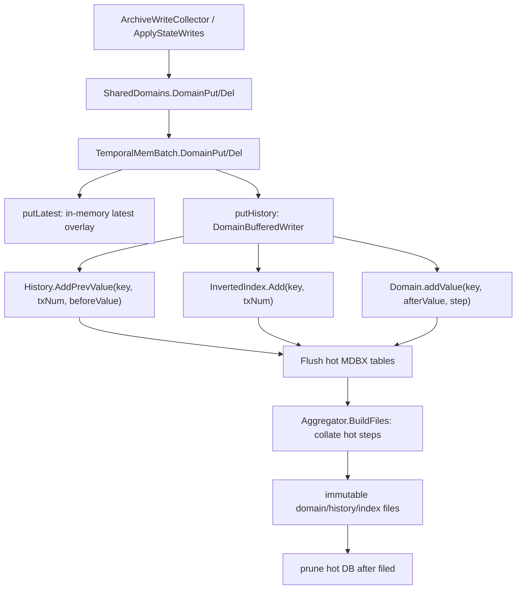

# 模块 04 ArchiveTemporalStore：Erigon 源码对照深挖

日期：2026-05-27

关联设计文档：[java-tron Archive 模块 04：ArchiveTemporalStore 细化设计](./20260521-java-tron-archive-module-04-temporal-store.md)

前置源码对照：

- [模块 01：ArchiveTxNumIndex Erigon 源码对照深挖](./20260523-java-tron-module-01-txnum-index-erigon-source-deep-dive.md)
- [模块 02：ArchiveDomainRegistry Erigon 源码对照深挖](./20260525-java-tron-module-02-domain-registry-erigon-source-deep-dive.md)
- [模块 03：ArchiveWriteCollector Erigon 源码对照深挖](./20260526-java-tron-module-03-write-collector-erigon-source-deep-dive.md)

## 1. 本轮调研范围

本轮对照 Erigon 的 temporal DB / aggregator / domain history 源码，继续细化 java-tron 的 `ArchiveTemporalStore`。模块 04 的核心问题是：当模块 03 已经产出按 `txNum` 排序的 `BlockWriteSet` 后，如何增量持久化 latest state、history before-value、changed-key index，并支持任意 `txNum` 的历史读取。

主要源码入口：

- `db/kv/temporal/kv_temporal.go:63`：TemporalDB 的定位，抽象 DB + snapshots，提供 time-travel API。
- `db/state/temporal_mem_batch.go:51`：`TemporalMemBatch`，热写入的内存 overlay。
- `db/state/temporal_mem_batch.go:132`：`TemporalMemBatch.DomainPut`。
- `db/state/temporal_mem_batch.go:137`：`TemporalMemBatch.DomainDel`。
- `db/state/temporal_mem_batch.go:142`：`putHistory`，写 history before-value。
- `db/state/temporal_mem_batch.go:149`：`putLatest`，写 in-memory latest overlay。
- `db/state/temporal_mem_batch.go:216`：`TemporalMemBatch.GetLatest`。
- `db/state/temporal_mem_batch.go:265`：`TemporalMemBatch.GetAsOf`，支持 in-flight time-travel reads。
- `db/state/temporal_mem_batch.go:765`：`TemporalMemBatch.Flush`，写入 MDBX 并递增 state version。
- `db/state/domain.go:71`：`Domain`，domain latest state 的热/冷文件抽象。
- `db/state/domain.go:321`：`DomainBufferedWriter.PutWithPrev`。
- `db/state/domain.go:336`：`DomainBufferedWriter.DeleteWithPrev`。
- `db/state/domain.go:397`：`DomainBufferedWriter.Flush`。
- `db/state/history.go:50`：`History`，history before-value 和 changed tx index 的组合。
- `db/state/history.go:368`：`historyBufferedWriter.AddPrevValue`。
- `db/state/inverted_index.go:58`：`InvertedIndex`，key -> changed txNum 的索引。
- `db/state/inverted_index.go:342`：`InvertedIndexBufferedWriter.Add`。
- `db/state/domain.go:1384`：`DomainRoTx.GetAsOf`。
- `db/state/history.go:1209`：`HistoryRoTx.HistorySeek`。
- `db/state/domain.go:1595`：`DomainRoTx.GetLatest`。
- `db/state/domain.go:1639`：`DomainRoTx.RangeAsOf`。
- `db/state/aggregator.go:60`：`Aggregator`，负责 snapshot files、visible view、collate、merge、prune。
- `db/state/aggregator.go:832`：`Aggregator.buildFiles`。
- `db/state/aggregator.go:1028`：`Aggregator.BuildFiles`。
- `db/state/aggregator.go:2395`：`Aggregator.BeginFilesRo`，读取原子发布的 visible files。
- `db/state/aggregator.go:2511`：`AggregatorRoTx.Unwind`。
- `db/state/domain.go:1203`：`DomainRoTx.unwind`。
- `db/state/execctx/domain_shared.go:648`：`SharedDomains.Flush`。
- `db/state/execctx/domain_shared.go:667`：`SharedDomains.GetLatest`。
- `db/state/execctx/domain_shared.go:808`：`SharedDomains.GetAsOf`。

## 2. 核心结论

Erigon V3 的 temporal store 不是“每个 tx 保存一份状态”，而是三类数据的组合：

1. `Domain`：保存 domain key 的 latest/current value，热区在 MDBX，冷区在不可变 `.kv` 文件。
2. `History`：保存每次变化前的 before-value，用于回答 `GetAsOf(key, txNum)`。
3. `InvertedIndex`：保存 key 在哪些 txNum 发生过变化，用于快速找到“从某个 txNum 开始，下一次改变这个 key 的 txNum”。

`GetAsOf(key, N)` 的语义是“logical tx N 执行前的值”。查询时先找 history 中 `>= N` 的第一条变更记录，如果找到，就返回那条变更发生前的 before-value；如果找不到，说明从 N 到当前都没有再改过这个 key，可以返回 latest value。

这套模型对 java-tron 很适合，因为交易级状态树需要的是状态版本点，而不是完整交易 trace。java-tron 的 `ArchiveTemporalStore` 应该保存：

- latest value：当前可见状态；
- history before-value：每次变化前的值；
- changed tx index：key -> changed txNums；
- segment manifest/progress：冷热分层、完整性校验、prune/unwind 边界。

## 3. Erigon 写入链路总览



Erigon 把写入分成两个阶段：

- 执行阶段写入 `TemporalMemBatch`，支持当前 batch 内读写和可选的 in-memory historical reads。
- flush/collate 阶段把 batch 写到 MDBX，再把旧 step freeze 成 snapshot files，并在安全后 prune MDBX。

java-tron 不必复制 Erigon 的文件格式，但应复制这个分层：hot mutable store 负责最近可回滚区间，cold immutable segments 负责长期历史。

## 4. TemporalMemBatch：热写入 overlay

`TemporalMemBatch` 在 `db/state/temporal_mem_batch.go:51` 定义。它持有：

- `domains [kv.DomainLen]map[string][]dataWithTxNum`：普通 domain 的 in-memory latest/history overlay。
- `storage *btree.Map[string, []dataWithTxNum]`：storage domain 的有序结构，支持 prefix/range。
- `domainWriters [kv.DomainLen]*DomainBufferedWriter`：最终 flush 到 domain/history/index hot tables。
- `inMemHistoryReads`：是否保留同一 key 在内存里的多个 txNum 版本，以支持 in-flight `GetAsOf`。
- unwind changeset 相关字段：用于 reorg/unwind 后让未 flush 或已 flush 的热状态读回正确值。

`DomainPut` 和 `DomainDel` 非常短：

```go
func (sd *TemporalMemBatch) DomainPut(domain kv.Domain, k string, v []byte, txNum uint64, preval []byte) error {
    sd.putLatest(domain, k, v, txNum)
    return sd.putHistory(domain, common.ToBytesZeroCopy(k), v, txNum, preval)
}

func (sd *TemporalMemBatch) DomainDel(domain kv.Domain, k string, txNum uint64, preval []byte) error {
    sd.putLatest(domain, k, nil, txNum)
    return sd.putHistory(domain, common.ToBytesZeroCopy(k), nil, txNum, preval)
}
```

这里的关键是同一条 domain write 同时更新两个方向：

- `putLatest`：让后续同 block / same batch 读到最新 after-value。
- `putHistory`：把 before-value 交给 `DomainBufferedWriter`，用于历史查询。

对 java-tron 的实现建议：

- `applyBlockWriteSet` 必须先按 txNum 顺序更新 hot latest，再写 history/index。
- 同一 block 内后续 tx 的 `prevValue` 校验应基于已经应用过前序 tx 的 hot latest。
- 如果要支持 block apply 过程中 RPC 或 commitment 的历史读取，需要像 Erigon `inMemHistoryReads` 一样保留 in-memory 多版本；如果只在 block commit 后提供历史查询，可以先不开放这条路径。

## 5. DomainBufferedWriter：一次写同时产生 latest、history、index

`DomainBufferedWriter.PutWithPrev` 在 `db/state/domain.go:321`：

- 计算 `step = txNum / stepSize`。
- 调用 `History.AddPrevValue(k, txNum, preval)`。
- 可选写 domain diff。
- 调用 `addValue(k, v, step)` 写 domain latest value。

`DeleteWithPrev` 在 `db/state/domain.go:336` 做同样的事情，只是 after-value 为 nil。

这说明 Erigon 的 temporal write 是三件事的原子组合：

1. history 记录 before-value；
2. inverted index 记录 key 在 txNum 改过；
3. domain values 记录 after-value 所在 step。

`DomainBufferedWriter.Flush` 在 `db/state/domain.go:397` 先 flush history writer，再 flush domain values。history writer 内部会先 flush inverted index，再 flush history values。

对 java-tron 的约束：

- `ArchiveTemporalStore` 的 apply 单元不能只写 latest。latest、history、changed-index、progress 必须在同一个 DB transaction 内提交。
- 如果 history 写成功但 latest 失败，或 latest 成功但 index 失败，都会破坏 `GetAsOf`。
- `prevValue` 应由 collector 提供并由 temporal store 校验；若缺失，store 可以从 latest 读取，但要记录指标，因为这会增加随机读。

## 6. History 和 InvertedIndex 的组合

`History` 在 `db/state/history.go:50` 嵌入了 `InvertedIndex`。源码注释写明：

- history `.v`：保存 before-values；
- history `.vi`：`txNum + key -> offset in .v`；
- inverted index：key -> changed txNums；
- keys table：txNum -> key。

`historyBufferedWriter.AddPrevValue` 在 `db/state/history.go:368`：

- 如果 original 为 nil，转换成空 `[]byte{}`。
- 写 `key -> txNum + original` 到 history values。
- 同时把 `txNum -> key` 收集进 inverted index writer。

空 before-value 在 Erigon 中是一个语义化 marker：这个 key 在该 tx 创建，执行前不存在。`DomainRoTx.GetAsOf` 在 `db/state/domain.go:1384` 看到 history 返回空 value 时，返回 not found。

`InvertedIndexBufferedWriter.Add` 在 `db/state/inverted_index.go:342` 同时写：

- `indexKeys`: `txNum -> key`
- `index`: `key -> txNum`

对 java-tron 的建议 schema：

```text
archive_latest
  key:   domainId || domainKey
  value: latestValue | tombstone

archive_history
  key:   domainId || domainKey || txNum
  value: beforeValue | ABSENT_MARKER

archive_changed_index
  key:   domainId || domainKey
  value: encoded sorted txNums / roaring / Elias-Fano segment

archive_tx_changed_keys
  key:   domainId || txNum
  value: domainKey list
```

`archive_tx_changed_keys` 不是 exact-key `GetAsOf` 必需的，但对 range/prefix、unwind、integrity check、segment build 很有用。Erigon 的 keys table 就承担了类似角色。

## 7. GetAsOf：before-tx 语义

Erigon 的 `DomainRoTx.GetAsOf` 在 `db/state/domain.go:1384`：

1. 调用 `HistorySeek(key, txNum)`。
2. 如果 history 找到 before-value：
   - 空值表示 key 在该变更 tx 之前不存在；
   - 非空值就是 `txNum` 执行前可见值。
3. 如果 history 没找到，回退到 `GetLatest(key)`。

`HistorySeek` 在 `db/state/history.go:1209` 先查 files，再查 MDBX。关键语义是查找 `>= txNum` 的第一条 changed tx：

- files 路径通过 inverted index 的 `seekInFiles(key, txNum)` 找到 equal-or-higher txNum，再去 history file 取 before-value；
- DB 路径通过 `SeekBothRange(key, encodeTs(txNum))` 找到同 key 下第一个 txNum >= requested txNum。

例子：

```text
初始：K = old
tx10: K old -> A      history(K, 10) = old
tx12: K A   -> B      history(K, 12) = A
latest(K) = B

GetAsOf(K, 10) = old  // tx10 执行前
GetAsOf(K, 11) = A    // tx10 后、tx12 前
GetAsOf(K, 12) = A    // tx12 执行前
GetAsOf(K, 13) = B    // tx12 后，没有更高 history，fallback latest
```

这和模块 01/04 设计中的 `TX_BEFORE` / `TX_AFTER` 映射一致：

- `TX_BEFORE(txN)` 读取 `GetAsOf(key, txNumN)`。
- `TX_AFTER(txN)` 读取 `GetAsOf(key, nextLogicalTxNum)`；如果 txN 是 block 内最后一个用户交易，`nextLogicalTxNum` 可能是 system tx 或 block-end point。

java-tron 的 API 层必须隐藏这个细节，避免上层误把 `GetAsOf(key, N)` 当成 tx N 执行后的状态。

## 8. GetLatest 和 overlay 读取顺序

`SharedDomains.GetLatest` 在 `db/state/execctx/domain_shared.go:667` 的读取顺序是：

1. 当前 `TemporalMemBatch`，包含当前 tx / 当前 batch 未 flush 状态；
2. parent `SharedDomains`，用于 read-through domain chaining；
3. state cache；
4. backing temporal tx / aggregator；
5. aggregator 内部先查 MDBX hot DB，再查 cold files。

`DomainRoTx.GetLatest` 在 `db/state/domain.go:1595` 也先查 DB，再查 files。这个顺序服务于 Erigon 的冷热分层：最近可变状态在 MDBX，旧状态在 snapshot files。

java-tron 可以采用同样的读取层级：

```text
TxOverlay -> BlockOverlay -> HotLatestDB -> ColdLatestSegment -> absent
```

如果 java-tron 第一阶段不支持 in-flight reads，可以先简化为：

```text
HotLatestDB -> ColdLatestSegment -> absent
```

但 `applyBlockWriteSet` 内部校验 `prevValue` 时必须看见本 block 已应用前序 tx 的结果，因此至少需要 block-level apply overlay 或在同一个 DB transaction 内顺序读写 latest。

## 9. RangeAsOf / PrefixAsOf：history stream 与 latest stream 合并

`DomainRoTx.RangeAsOf` 在 `db/state/domain.go:1639`：

- 从 history 构造某个 txNum 的历史状态流；
- 从 latest state 构造 latest 流；
- 通过 `stream.UnionKV` 合并。

`HistoryRangeAsOfFiles` 在 `db/state/history_stream.go:36` 的注释明确：返回某个 txNum 的 state，也就是 txNum 执行前的状态。

range/prefix 历史查询比 exact key 难，因为“某个 key 在 history 中没有记录”并不代表它不存在，可能只是从该 txNum 到当前没有变化，需要从 latest 流补齐。因此 Erigon 用 history stream + latest stream union 的方式重建视图。

java-tron 的 `rangeAsOf/prefixAsOf` 可以分阶段：

第一阶段：

- 只支持 exact `getAsOf`，满足账户、storage slot、合约代码等核心读取。
- prefix/range 通过 latest keys + changed keys 做保守扫描，性能不作为第一目标。

第二阶段：

- 为每个 domain 建 segment-level key index；
- history segment 支持按 prefix 枚举 changed keys；
- latest segment 支持 prefix scan；
- 合并 history-state stream 和 latest stream，并按 domainKey 去重。

## 10. 冷热分层：BuildFiles、visible files、prune

Erigon 的 `Aggregator` 在 `db/state/aggregator.go:60` 负责：

- 管理每个 domain 和 standalone index；
- 维护 `stepSize`、`stepsInFrozenFile`；
- 管理 dirty files 和 atomic visible snapshot；
- 后台 build/merge/prune；
- 限制 collation 不超过已经可用的 block/tx 边界。

`Aggregator.BuildFiles` 在 `db/state/aggregator.go:1028` 触发后台 build 并等待结束。内部 `buildFiles` 在 `db/state/aggregator.go:832` 大致分两阶段：

1. 打开 read tx，从 MDBX hot tables collate 某个 step 的 domain/history/index 数据。
2. 释放 read tx，基于 collation 结果并行 build immutable files。

`Domain.collate` 在 `db/state/domain.go:711` 对某个 step 扫描 domain values table。`History.collate` 在 `db/state/history.go:524` 左右处理 history 和 inverted index。build 完成后通过 `IntegrateDirtyFiles` 发布，`Aggregator.BeginFilesRo` 在 `db/state/aggregator.go:2395` 从 atomic `visible` 视图打开只读 files。

对 java-tron 的建议：

- `ArchiveTemporalStore` 第一阶段可以只用 RocksDB/LevelDB hot tables，但 schema 必须预留 cold segment manifest。
- segment build 必须按 txNum step 范围，例如 `[startTxNum, endTxNum)`。
- segment publish 应是原子的：manifest 可见前，文件必须完成 checksum/index；manifest 可见后，reader 才能打开。
- prune hot tables 必须在 segment build + manifest publish + integrity check 后执行。
- 不要允许 unwind 到已经 prune 且没有可恢复数据的 txNum 之前。

## 11. Unwind / reorg 语义

Erigon 在 `TemporalMemBatch.Flush` 中如果存在 unwind changeset，会先调用 temporal tx 的 `Unwind`，再 flush 当前 writers。`AggregatorRoTx.Unwind` 在 `db/state/aggregator.go:2511` 逐 domain 调用 `DomainRoTx.unwind`，并清理 standalone inverted index。

`DomainRoTx.unwind` 在 `db/state/domain.go:1203` 的注释非常关键：

- 对每个 diff entry，删除当前 write step 的 domain value；
- 在 unwind target 对应 step 恢复 prevValue；
- `nil` 表示 prev value 在其他 step，跳过恢复；
- 空 `[]byte{}` 表示之前不存在，需要写 empty tombstone，防止 `GetLatestFromDb` 穿透到 files 返回陈旧数据；
- 恢复 entry 的 step tag 必须在 filed range 之后，否则 `GetLatestFromDb` 会忽略它并回退到 files。

这说明 hot/cold 分层下的 unwind 不是简单删除最新行。它必须考虑：

- 当前 key 是否已有 cold file 覆盖；
- hot DB 中 step tag 的排序和可见性；
- deletion marker 防止穿透到旧 segment；
- history/index 同步 prune。

java-tron 的第一阶段可以简化，但必须保留 invariant：

- 在 finalized/pruned 边界内支持 reorg/unwind。
- 不允许或显式拒绝 unwind 到 cold segment 不可恢复区间之前。
- 对 delete/uncreate 场景要写 tombstone，不能让 latest reader 穿透到旧 segment 返回已删除值。

## 12. Erigon 文件模型对 java-tron 的抽象映射

Erigon 文件类型可以抽象为：

```text
Domain latest files:
  .kv   key -> latest value in step range
  .bt   key -> offset index
  .kvei key existence filter

History files:
  .v    before-values
  .vi   txNum+key -> offset

Inverted index files:
  .ef   key -> encoded changed txNums
```

java-tron 不一定要采用相同扩展名或压缩方案，但应保留同样的逻辑层：

```text
ArchiveLatestSegment
  domainId
  txNumFrom
  txNumTo
  key -> latest value / tombstone
  optional existence filter

ArchiveHistorySegment
  domainId
  txNumFrom
  txNumTo
  key+txNum -> beforeValue / ABSENT_MARKER

ArchiveChangeIndexSegment
  domainId
  txNumFrom
  txNumTo
  key -> sorted changed txNums

ArchiveSegmentManifest
  segmentId
  domainId
  range
  file paths
  checksums
  codecVersion
  build status
```

## 13. java-tron apply 算法建议

`ArchiveTemporalStore.applyBlockWriteSet` 应该是 block 原子事务：

```text
applyBlockWriteSet(blockWriteSet):
  begin db transaction
  assert blockWriteSet.blockNum == expectedNextBlock

  for txWriteSet in blockWriteSet ordered by txNum:
    for write in txWriteSet ordered by ordinal:
      latest = getHotLatestForUpdate(write.domainId, write.domainKey)

      if write.beforeValue is present:
        assert latest == write.beforeValue
      else:
        write.beforeValue = latest

      if write.op is PUT:
        if latest == write.afterValue:
          recordNoOpOrTouch(write)
          continue
        history.put(domainKey, txNum, latestOrAbsentMarker)
        changedIndex.add(domainKey, txNum)
        latest.put(domainKey, write.afterValue)

      if write.op is DELETE:
        if latest is absent:
          recordNoOpOrTouch(write)
          continue
        history.put(domainKey, txNum, latest)
        changedIndex.add(domainKey, txNum)
        latest.putTombstone(domainKey)

      if write.op is DELETE_PREFIX:
        keys = enumerateVisibleKeys(prefix)
        for key in keys:
          apply DELETE(domainId, key, txNum)

  update domain progress
  update txNum/block progress
  commit db transaction
```

几个细节：

- no-op 不应写 state history，但可以记录 touch/audit。
- `latest.putTombstone` 在 hot/cold 混合读时很重要，防止 reader 穿透到 cold segment。
- prefix delete 第一阶段可以展开成具体 key delete，语义最清晰；后续为了体积可以引入 prefix tombstone，但 reader 和 commitment builder 都会更复杂。
- apply 时必须按 txNum 顺序处理，不允许为了批量写打乱同 key 的版本顺序。

## 14. java-tron GetAsOf 算法建议

exact key：

```text
getAsOf(domainId, key, asOfTxNum):
  h = history.seekFirstChangedAtOrAfter(domainId, key, asOfTxNum)
  if h exists:
    if h.beforeValue == ABSENT_MARKER:
      return NOT_FOUND
    return h.beforeValue

  latest = latest.get(domainId, key)
  if latest is TOMBSTONE or absent:
    return NOT_FOUND
  return latest.value
```

`history.seekFirstChangedAtOrAfter` 可以先查 hot index，再查 cold segment index。为了避免跨冷热重复或遗漏，建议按 range 切分：

- 如果 `asOfTxNum` 在 hot window 内，先查 hot changed-index；
- 对 cold segments，查第一个 `txNumTo > asOfTxNum` 的 segment；
- 返回全局最小的 changed txNum；
- 根据 changed txNum 到对应 history table/segment 读取 before-value。

prefix/range：

```text
rangeAsOf(domainId, prefix, asOfTxNum):
  changedKeys = history.keysChangedAtOrAfter(prefix, asOfTxNum)
  latestKeys = latest.keysByPrefix(prefix)
  return merge(
    changedKeys resolved by getAsOf,
    latestKeys filtered by getAsOf visibility
  )
```

第一阶段可以接受较慢实现，但测试语义必须先固定。

## 15. 事务性、progress、integrity

Erigon `TemporalMemBatch.Flush` 在 `db/state/temporal_mem_batch.go:765` 会：

1. 处理 unwind changeset；
2. flush diff set；
3. flush domain/history/index writers；
4. `IncrementStateVersion`。

java-tron 也需要明确 progress 表：

```text
archive_progress
  latestAppliedBlockNum
  latestAppliedTxNum
  perDomainAppliedTxNum
  hotWindowStartTxNum
  coldSegmentEndTxNum
  schemaVersion
```

完整性检查至少覆盖：

- latest/history/index progress 是否一致；
- 每条 history 是否能在 changed-index 中找到 txNum；
- changed-index 的 txNum 是否能在 history 中找到 before-value；
- segment manifest checksum 是否匹配；
- cold segment range 是否连续、无重叠；
- hot prune 边界不能超过 cold segment confirmed end；
- latest tombstone 不能被 cold latest 穿透。

## 16. 模块 04 设计需要补强的点

原模块 04 已经覆盖 latest、history、inverted index、hot/cold、unwind、manifest 等方向。结合 Erigon 源码，建议进一步明确：

- `GetAsOf` 查询的是 before-tx state；`TX_AFTER` 要映射到下一个 logical txNum。
- history 保存的是 before-value，不是 after-value。
- exact key 查询依赖 key -> changed txNum 的 equal-or-higher seek。
- no-op 不写 history，但 touch/audit 要和 state history 分开。
- delete 需要 tombstone，避免 hot/cold reader 穿透。
- block apply 必须按 txNum 顺序原子提交 latest/history/index/progress。
- range/prefix 查询不是 latest scan 的简单过滤，必须合并 history view 和 latest view。
- cold segment publish 必须通过 manifest 原子可见。
- unwind 必须受 hot window / segment 可恢复边界约束。

## 17. 建议新增测试矩阵

1. exact `GetAsOf` before-tx 语义：
   - tx10: `K old -> A`
   - tx12: `K A -> B`
   - 验证 `GetAsOf(K, 10)=old`、`GetAsOf(K, 11)=A`、`GetAsOf(K, 12)=A`、`GetAsOf(K, 13)=B`。

2. key creation marker：
   - tx10 创建 K；
   - `GetAsOf(K, 10)` not found；
   - `GetAsOf(K, 11)` 返回创建后的值。

3. key deletion tombstone：
   - cold segment 中存在 K；
   - hot tx 删除 K；
   - latest 和 `GetAsOf` 不能穿透到 cold segment 返回旧值。

4. same-value no-op：
   - before == after；
   - 不产生 history；
   - 可选 touch/audit 可查询。

5. 同 block 多 tx 同 key：
   - 每个 txNum 都能作为历史版本点查询；
   - block flush 不能坍缩成 block-end txNum。

6. range/prefix as-of：
   - 一个 key 只在 latest；
   - 一个 key 在 asOf 后发生变化，需要 history before-value；
   - 一个 key 在 asOf 前删除；
   - 合并结果去重且符合 prefix。

7. hot -> cold segment：
   - build segment 后 prune hot；
   - `GetLatest/GetAsOf/rangeAsOf` 结果不变。

8. unwind：
   - 在 hot window 内回滚到 txNum；
   - latest/history/index/progress 一起恢复；
   - 尝试回滚到已 prune 且不可恢复区间时明确失败。

9. manifest crash recovery：
   - 文件写完但 manifest 未发布，reader 不可见；
   - manifest 发布后 checksum 不匹配，启动时拒绝或 rebuild。

## 18. 下一步建议

模块 04 继续落地前，应转向 java-tron 源码确认：

- 当前底层数据库和 Store 是否能在一个 block apply transaction 中原子提交 archive sidecar。
- 是否已有 block/transaction progress 表可复用。
- java-tron 的 undo/revoking 数据能否作为 `prevValue` 来源或 unwind changeset。
- prefix/range 查询实际需要覆盖哪些 Store/domain。
- cold segment 第一阶段是独立文件、RocksDB column family，还是外置 sidecar DB。

确认这些后，可以把 `ArchiveTemporalStore` 写成接口草案和最小可运行 schema。
