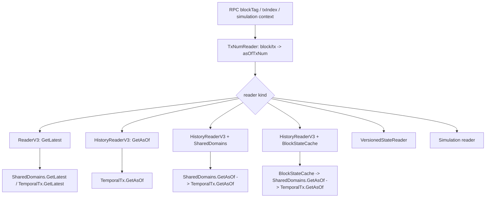

# 模块 05 ArchiveStateReader：Erigon 源码对照深挖

日期：2026-05-27

关联设计文档：[java-tron Archive 模块 05：ArchiveStateReader 细化设计](./20260521-java-tron-archive-module-05-state-reader.md)

前置源码对照：

- [模块 01：ArchiveTxNumIndex Erigon 源码对照深挖](./20260523-java-tron-module-01-txnum-index-erigon-source-deep-dive.md)
- [模块 02：ArchiveDomainRegistry Erigon 源码对照深挖](./20260525-java-tron-module-02-domain-registry-erigon-source-deep-dive.md)
- [模块 03：ArchiveWriteCollector Erigon 源码对照深挖](./20260526-java-tron-module-03-write-collector-erigon-source-deep-dive.md)
- [模块 04：ArchiveTemporalStore Erigon 源码对照深挖](./20260527-java-tron-module-04-temporal-store-erigon-source-deep-dive.md)

## 1. 本轮调研范围

本轮对照 Erigon 的 state reader、history reader、RPC helper、parallel/finalize overlay reader，继续细化 java-tron 的 `ArchiveStateReader`。模块 05 的核心问题是：模块 04 提供 `GetAsOf(domain, key, txNum)` 之后，上层如何用账户、storage、code、RPC blockTag/txTag、VM 只读 state adapter 的语义安全地读取历史状态。

主要源码入口：

- `execution/state/database.go:39`：`StateReader` 接口。
- `execution/state/database.go:53`：`HistoricalStateReader` 接口。
- `execution/state/history_reader_v3.go:34`：`HistoryReaderV3` 读链说明。
- `execution/state/history_reader_v3.go:67`：`NewHistoryReaderV3`，只读 persisted history。
- `execution/state/history_reader_v3.go:75`：`NewHistoryReaderV3WithSharedDomains`，叠加 in-batch memory。
- `execution/state/history_reader_v3.go:85`：`NewHistoryReaderV3WithBlockCache`，叠加 parallel block write buffer。
- `execution/state/history_reader_v3.go:107`：`HistoryReaderV3.getAsOf`。
- `execution/state/history_reader_v3.go:181`：`StateHistoryStartTxNum`，历史可用起点。
- `execution/state/history_reader_v3.go:192`：`ReadAccountData`。
- `execution/state/history_reader_v3.go:217`：`ReadAccountStorage`。
- `execution/state/history_reader_v3.go:232`：`HasStorage`。
- `execution/state/history_reader_v3.go:263`：`ReadAccountCode`。
- `execution/state/rw_v3.go:996`：`ReaderV3`，latest/current reader。
- `execution/state/rw_v3.go:1325`：`CachedReaderV3`，parallel block cache reader。
- `execution/state/rw_v3.go:1356`：`CachedReaderV3.ReadAccountData`。
- `execution/state/rw_v3.go:1460`：`ReaderV3.ReadAccountData`。
- `execution/state/rw_v3.go:1495`：`ReaderV3.ReadAccountStorage`。
- `execution/state/rw_v3.go:1529`：`ReaderV3.ReadAccountCode`。
- `execution/state/versionedio.go:232`：`versionedStateReader`，parallel validation/versionMap overlay reader。
- `execution/stagedsync/committer.go:523`：`asOfStateReader`，commitment calculator 的 as-of reader。
- `rpc/rpchelper/helper.go:181`：`CreateStateReaderFromBlockNumber`。
- `rpc/rpchelper/helper.go:192`：`CreateHistoryStateReader`。
- `rpc/rpchelper/helper.go:230`：`CreateHistoryCachedStateReader`。
- `rpc/jsonrpc/eth_simulation.go:657`：simulation block reader selection。
- `rpc/jsonrpc/eth_simulation.go:1007`：`simulationIntraBlockStateReader`。
- `rpc/jsonrpc/eth_api.go:372`：`checkPruneHistory`。
- `execution/state/finalize_reader_blockcache_test.go:30`：block finalize 必须读取 block cache 的回归测试。

## 2. 核心结论

Erigon 的 reader 层不是简单的 `get(key)` 包装，而是按场景拆成多种 view：

1. latest/current reader：`ReaderV3` 通过 `TemporalGetter.GetLatest` 读取当前状态。
2. persisted history reader：`HistoryReaderV3(ttx, txNum)` 通过 `ttx.GetAsOf` 读取某个 txNum 前的历史状态。
3. in-batch history reader：`HistoryReaderV3WithSharedDomains` 先查 `sd.GetAsOf`，再查 `ttx.GetAsOf`，让同 batch 未 flush 的 prior-tx writes 可见。
4. block-cache-aware history reader：`HistoryReaderV3WithBlockCache` 在 parallel finalize 时先查 `BlockStateCache`，避免读到 pre-block stale state。
5. speculative/versioned reader：`versionedStateReader` 叠加 read set 和 version map，服务 parallel execution validation。
6. commitment reader：`asOfStateReader` 对 accounts/storage/code 用 `GetAsOf`，对 commitment branches 用 `GetLatest`。
7. simulation reader：把模拟执行写入的 `sd.mem` 叠加在 canonical historical base 上。

对 java-tron 的直接启发是：`ArchiveStateReader` 不应该只有一个实现。应把“读哪个 state point”和“叠加哪些 overlay”建模成显式 reader view，避免历史 RPC、执行重放、block finalize、proof/root 计算互相污染。

### 2.1 本轮复核补充锚点

本轮按本地 Erigon 源码复核了以下 reader 约束：

| Erigon 位置 | 源码事实 | java-tron 落地约束 |
| --- | --- | --- |
| `execution/state/database.go:39-56` | `StateReader` 暴露 account/storage/code 语义方法，`HistoricalStateReader` 只额外暴露 txNum | `ArchiveStateReader` 对上层暴露 typed read，不让 JSON-RPC/VM 拼 domain key |
| `execution/state/history_reader_v3.go:34-56` | history reader 读链是 `blockCache -> sd.GetAsOf -> ttx.GetAsOf`；严格 persisted history 消费者传 `sd=nil/blockCache=nil` | PR6 historical getter 默认只读已提交 archive，不看 live store 或 block-local buffer |
| `execution/state/history_reader_v3.go:107-153` | `getAsOf` 只在配置了 overlay 时先查 overlay，否则落到 `ttx.GetAsOf(domain,key,txNum)` | java-tron 的 persisted `DefaultArchiveStateReader` 不做 latest fallback；overlay reader 放到 PR8/PR9 |
| `execution/state/history_reader_v3.go:181-188` | `StateHistoryStartTxNum` 用 accounts/storage/code 三个 domain 的历史起点做 prune guard | java-tron `ArchiveStateReaderFactory` 要把 archive gap/start 变成 `HISTORY_UNAVAILABLE`，不能把 key missing 当成 archive missing |
| `execution/state/history_reader_v3.go:192-229` | account/storage 把业务 query 映射成 domain key，再调用 `getAsOf`；storage missing 返回 zero value + `ok=false` | java-tron reader core 保留 `ArchiveReadResult.missing()`，JSON-RPC adapter 再转 `0x0`/`0x`/32-byte zero |
| `execution/state/history_reader_v3.go:263-278` | code 按 address key 读 `CodeDomain`，缺失返回 nil/empty | java-tron P0 `CODE` domain 继续以 21-byte address 为 key |
| `execution/state/rw_v3.go:996-1003`、`1460-1558` | latest `ReaderV3` 通过 `TemporalGetter.GetLatest` 读 account/storage/code | java-tron latest JSON-RPC path 继续走现有 Wallet/latest Store，不和 archive history reader 混用 |
| `rpc/rpchelper/helper.go:181-202`、`226-242` | RPC helper 根据 latest flag 选择 latest reader 或 history reader；history reader 的 `+1` 在 helper 内收敛 | java-tron RPC 层只生成 `StatePoint.blockEnd(N)`，`lastTxNum + 1` 只在 `ArchiveStateReaderFactory` 中发生 |
| `db/state/aggregator.go:2449-2454` | 普通 domain `GetAsOf` 不 fallback latest；只有 commitment domain 缺失时特殊 fallback latest | java-tron account/contract/code/storage history miss 绝不 fallback latest；commitment/root 是模块 06 的独立逻辑 |

## 3. Erigon reader 链路总览



这个分层的重点不是性能，而是防止读错时间点：

- latest reader 不能用于历史 RPC。
- persisted history reader 不能看到尚未 flush 的 block-local writes。
- parallel finalize reader 如果不看 block cache，会把前序 tx 的 in-block write 覆盖掉。
- simulation reader 必须把前一模拟块写入叠加在 canonical base 上。

## 4. StateReader 接口：面向执行语义，不暴露 domain

`execution/state/database.go:39` 定义 `StateReader`：

```go
type StateReader interface {
    ReadAccountData(address accounts.Address) (*accounts.Account, error)
    ReadAccountDataForDebug(address accounts.Address) (*accounts.Account, error)
    ReadAccountStorage(address accounts.Address, key accounts.StorageKey) (uint256.Int, bool, error)
    HasStorage(address accounts.Address) (bool, error)
    ReadAccountCode(address accounts.Address) ([]byte, error)
    ReadAccountCodeSize(address accounts.Address) (int, error)
    ReadAccountIncarnation(address accounts.Address) (uint64, error)
    SetTrace(trace bool, tracePrefix string)
    Trace() bool
    TracePrefix() string
}
```

这个接口不暴露 domain id、domain key、history index。EVM / state object 只看到账户、storage、code 这些执行语义。domain 编码被 reader 内部封装：

- account: `AccountsDomain[address]`
- storage: `StorageDomain[address || slot]`
- code: `CodeDomain[address]`

对 java-tron 的建议：

- `ArchiveStateReader` 对 TVM/Actuator/RPC 暴露业务语义方法，不让上层拼 domain key。
- domain key 编码统一委托 `ArchiveDomainRegistry`。
- exact query 可以保留低层方法用于 debug，但默认接口应是语义化读取。

建议接口：

```java
interface ArchiveStateReader extends AutoCloseable {
  StatePoint point();
  long asOfTxNum();

  Optional<AccountCapsule> getAccount(ByteString address);
  Optional<ContractCapsule> getContract(ByteString address);
  Optional<byte[]> getContractCode(ByteString address);
  Optional<DataWord> getContractStorage(ByteString address, DataWord slot);

  Optional<byte[]> getRawDomainValue(short domainId, byte[] domainKey);
  DomainRangeIterator rangeDomain(short domainId, byte[] from, byte[] to, int limit);
}
```

## 5. ReaderV3：latest/current reader

`ReaderV3` 在 `execution/state/rw_v3.go:996` 定义，持有 `kv.TemporalGetter`。它通过 `GetLatest` 读取当前状态：

- `ReadAccountData` 调 `getter.GetLatest(AccountsDomain, address)`，反序列化 account。
- `ReadAccountStorage` 拼 `address || slot`，调 `getter.GetLatest(StorageDomain, composite)`。
- `ReadAccountCode` 调 `getter.GetLatest(CodeDomain, address)`。
- `HasStorage` 先确认 account 没被删除，再用 `HasPrefix(StorageDomain, address)`。

`SharedDomains.AsGetter` 在 `db/state/execctx/domain_shared.go:408` 把 `SharedDomains` 包成 `TemporalGetter`，其 `GetLatest` 会先看 mem batch，再看 backing temporal tx。也就是说 latest reader 是可以看到当前执行批次未完全落盘状态的。

java-tron 映射：

- `LatestStateReader` 可用于 node 当前头状态和 canonical execution。
- 它不应该服务历史 RPC，因为 latest 语义会随链头移动。
- 如果 archive sidecar 和 canonical store 分离，latest reader 应明确读 canonical live store 还是 archive latest store，不能隐式 fallback。

## 6. HistoryReaderV3：persisted history reader

`HistoryReaderV3` 在 `execution/state/history_reader_v3.go:34` 的注释把读链写得很清楚：

```text
blockCache -> sd.GetAsOf -> ttx.GetAsOf
```

legacy constructor `NewHistoryReaderV3(ttx, txNum)` 不传 `sd` 和 `blockCache`，因此只读取 persisted history。RPC 等消费者需要严格读取已提交历史时使用这个路径。

`getAsOf` 在 `execution/state/history_reader_v3.go:107`：

- 若有 `blockCache`，先查 account/storage 当前 block 写入；
- 若有 `sd`，再查 `sd.GetAsOf(domain, key, txNum)`；
- 最后查 `ttx.GetAsOf(domain, key, txNum)`。

`ReadAccountData`、`ReadAccountStorage`、`ReadAccountCode` 分别把业务查询映射到 domain key，并调用 `getAsOf`。

java-tron 映射：

- `ArchiveStateReader.open(StatePoint)` 默认应创建 persisted historical view。
- 如果 state point 位于已提交 block，不能读当前 live store。
- 如果请求早于 archive 起点，返回明确错误，而不是 silently fallback 到 latest。

## 7. txNum 映射：RPC 层隐藏 before/after 细节

`rpchelper.CreateHistoryStateReader` 在 `rpc/rpchelper/helper.go:192`：

```go
minTxNum := txNumsReader.Min(blockNumber)
txNum := minTxNum + txnIndex + 1 // 1 system txNum in beginning of block
return state.NewHistoryReaderV3(tx, txNum)
```

这里沿用了 Erigon 的 before-tx `GetAsOf` 语义。读取 block 内第 `txnIndex` 笔交易执行前状态时，使用 `minTxNum + txnIndex + 1`。很多 block-end 查询会传 `blockNumber+1, txnIndex=0`，本质上是读取下一个 block 开始前的状态，也就是前一个 block 结束状态。

例如 `rpc/jsonrpc/eth_call.go:867` 对历史 block call 使用：

```go
CreateHistoryStateReader(ctx, tx, blockNumber+1, 0, txNumReader)
```

java-tron 的 `ArchiveStateReader` 要把这些细节收敛在 `ArchiveTxNumIndex.resolve(StatePoint)` 中：

```text
BLOCK_BEFORE(B)  -> firstLogicalTxNum(B)
TX_BEFORE(tx)    -> txNum(tx)
TX_AFTER(tx)     -> nextLogicalTxNum(tx)
BLOCK_END(B)     -> firstLogicalTxNum(B + 1), or block-end system point
```

RPC/API 层不应直接做 `+1`，否则不同接口很容易出现 off-by-one。

## 8. 历史可用性和 prune 错误

Erigon 有两层 guard：

- `StateHistoryStartTxNum` 在 `execution/state/history_reader_v3.go:181` 取 accounts/storage/code 三个 domain 的 history 起点最小值。
- `BaseAPI.checkPruneHistory` 在 `rpc/jsonrpc/eth_api.go:372` 根据 prune mode 判断请求 block 是否早于可用历史。

`CreateHistoryStateReader` 如果发现请求 txNum 小于 `StateHistoryStartTxNum`，会返回 `PrunedError`，并给出历史可用起点 block。

java-tron 需要同类错误模型：

- `ARCHIVE_NOT_ENABLED`
- `STATE_BEFORE_ARCHIVE_START`
- `STATE_PRUNED`
- `FUTURE_STATE`
- `SEGMENT_UNAVAILABLE`
- `SEGMENT_CORRUPTED`

这些错误不能混成 `not found`。`not found` 只表示该 key 在目标 state point 不存在。

## 9. BlockStateCache-aware reader：parallel finalize 的教训

`execution/state/finalize_reader_blockcache_test.go:30` 记录了一个真实风险：parallel executor 中，per-tx writes 先进入 `BlockStateCache`，直到 block boundary 才 flush 到 `SharedDomains`。如果 block finalize 阶段构造 historic reader 只查 `sd.GetAsOf -> ttx.GetAsOf`，它会读到 pre-block balance，然后 finalize 写回时覆盖前序 tx 的 in-block 更新。

修复是 `NewHistoryReaderV3WithBlockCache`：

- account/storage 先查 `BlockStateCache.GetCurrent*`；
- cache hit 即 authoritative，包括 deletion；
- miss 才回退到 `sd.GetAsOf` 和 `ttx.GetAsOf`。

java-tron 的启发：

- 如果 `ArchiveWriteCollector` 或 execution pipeline 有 block-level buffer，任何 block-final/system-tx reader 都必须能看到 buffer 中的当前状态。
- persisted history reader 和 in-flight execution reader 必须分开。
- `BLOCK_END` reader 如果在 block apply 尚未 commit 时使用，需要 overlay block buffer；如果 block 已 commit，则读 persisted archive。

## 10. CachedReaderV3：pre-block view 和 current view 是两种模式

`CachedReaderV3` 在 `execution/state/rw_v3.go:1325` 包装 `ReaderV3` 和 `BlockStateCache`。它有一个重要布尔值 `readCurrent`：

- `readCurrent=false`：读 committed cache，给 parallel workers 一个稳定的 pre-block view。
- `readCurrent=true`：读 current write buffer，给 block finalize IBS 看见所有 per-tx writes。

`NewCachedReaderV3` 是 pre-block view，`NewCurrentCachedReaderV3` 是 post-tx/current view。

java-tron 不一定需要同名类，但需要同样区分：

```text
CanonicalPreBlockReader
InFlightTxReader
BlockFinalizeReader
PersistedArchiveReader
```

这些 reader 的 fallback 顺序不同，不能靠一个 boolean 在调用点随意切换。建议用 factory 方法按用途创建。

## 11. versionedStateReader：parallel/speculative overlay

`versionedStateReader` 在 `execution/state/versionedio.go:232` 叠加了：

- 当前 tx read set；
- `VersionMap` 中 prior tx 的写入；
- 底层 `StateReader`。

它解决的不是普通 RPC 历史读取，而是 parallel execution 中“当前 tx 应该看到哪些已验证或可见版本”的问题。例如：

- account fields 是分字段更新的，读取 account 时需要把 versionMap 中 balance/nonce/codeHash overlay 到 base account。
- prior tx selfdestruct 后，后续 tx 不能继续读旧 account/storage/code。
- 仅靠 AddressPath 不足以合成被 fee/tip 创建的账户，需要从 balance/nonce 等字段合成。

java-tron 如果第一阶段没有 parallel/speculative execution，可以暂不实现这层。但接口设计上应预留：

```text
ArchiveStateReader + OverlayWriteSet + ValidationView
```

这样未来支持并发执行、批量模拟或 debug trace replay 时，不需要改动底层 temporal store。

## 12. commitment/as-of reader：不同 domain 可有不同时间语义

`asOfStateReader` 在 `execution/stagedsync/committer.go:523` 是 commitment calculator 使用的 reader：

- accounts/storage/code 用 `GetAsOf(txNum)`，避免读到 future state；
- `CommitmentDomain` 用 `GetLatest`，因为 branch nodes 由 calculator 顺序写入。

这个差异很重要：不是所有 domain 都适合同一个 as-of 策略。java-tron 的交易级状态树可能也会有：

- plain state domain：按 `asOfTxNum` 读；
- trie node / commitment cache domain：按 calculator 当前进度读；
- metadata/progress domain：按 latest 读；
- receipt/log domain：按 tx/block index 读。

因此 `ArchiveStateReader` 应支持 domain policy：

```text
domain read policy:
  AS_OF_STATE_POINT
  LATEST_WITHIN_VIEW
  OVERLAY_THEN_AS_OF
  UNSUPPORTED_FOR_HISTORY
```

不要把所有 Store 都硬塞进同一种 `GetAsOf` 语义。

## 13. simulation reader：overlay + canonical base

`eth_simulateV1` 中的 `simulationIntraBlockStateReader` 在 `rpc/jsonrpc/eth_simulation.go:1007` 说明：多块模拟时，上一模拟块的 state changes 只在 `sharedDomains.mem` 中，普通 `HistoryReaderV3` 读 canonical DB 会漏掉这些变化。

它的读顺序是：

```text
sharedDomains.GetMemBatch().GetLatest(domain, key)
miss -> roTx.GetAsOf(domain, key, firstMinTxNum)
```

这对 java-tron 的历史 `triggerconstantcontract`、debug simulation、批量模拟很有参考价值：

- 历史 base state 来自 archive as-of；
- 模拟过程中产生的临时写入进入 overlay；
- 后续模拟交易/块读取 overlay；
- 结束后 overlay 丢弃，不能污染 archive。

## 14. HasStorage / range 读取的特殊性

`HistoryReaderV3.HasStorage` 在 `execution/state/history_reader_v3.go:232` 使用 `RangeAsOf(StorageDomain, addressPrefix, txNum)`。注释指出：如果 storage 被删除，historical `RangeAsOf` 可能返回空 values；需要扫描到非空 slot 才能判断 has storage。

这说明 range/prefix 历史读取的语义比 exact key 更复杂：

- 空 value 可能表示 deletion marker；
- prefix 下没有非空 slot 才能说 no storage；
- account delete 后 storage history 还可能有清理记录，但上层语义应视为无 storage。

java-tron 的 `prefixAsOf` 必须对 tombstone 和 empty value 有一致语义。第一阶段建议：

- exact storage slot 用 `getAsOf`；
- `hasStorage/prefixAsOf` 仅用于 debug/proof/root 构建；
- 对删除 marker 做统一过滤；
- 设置 limit，避免历史 prefix scan 无界。

## 15. kvcache / request cache

Erigon 有多层 cache：

- `CachedReader`：包装任意 `StateReader`，写入 `shards.StateCache`。
- `CachedReader3`：基于 `kvcache.CacheView` 读 latest account/storage/code。
- `cachedHistoryReaderV3`：先查 cache 的 `GetAsOf`，miss 再走 `HistoryReaderV3`。
- `CachedReaderV3`：借助 `BlockStateCache` 稳定 pre-block 或 current view。

java-tron 的 reader cache 应遵守两个原则：

1. cache key 必须包含 `statePoint/asOfTxNum`、domain、domainKey、registry/schema version。
2. cache 只能缩短读取路径，不能改变 fallback 语义。

建议 cache 层级：

```text
RequestLocalCache       // 单次 RPC/VM call 内
ArchiveSegmentCache     // segment block/index/page cache
HotLatestCache          // current/latest only
ExecutionOverlayCache   // block apply / simulation only
```

不要让 latest cache 服务 historical state point，除非 cache view 本身支持 `GetAsOf`。

## 16. 对 ArchiveStateReader 设计的修订建议

结合 Erigon 源码，模块 05 原设计应进一步明确：

- `ArchiveStateReader` 是 view factory，不是单一 reader。
- `StatePoint -> asOfTxNum` 必须集中在 `ArchiveTxNumIndex`，RPC 层不要自己 `+1`。
- exact 业务读取封装 domain 编码；debug raw domain 读取作为低层 API。
- historical reader 默认只读 persisted archive，不 fallback live Store。
- in-flight execution/finalize/simulation 必须显式传 overlay。
- 不同 domain 可配置不同 read policy。
- reader 必须持有一致 manifest/progress snapshot，不能一次请求中跨 segment publish 读出混合视图。
- prune/archive 起点错误必须和 key-not-found 区分。

建议 factory：

```java
interface ArchiveStateReaderFactory {
  ArchiveStateReader openPersisted(StatePoint point);
  ArchiveStateReader openLatest();
  ArchiveStateReader openWithOverlay(StatePoint base, ArchiveOverlay overlay);
  ArchiveStateReader openForCommitment(StatePoint point, CommitmentReadPolicy policy);
}
```

## 17. 建议新增测试矩阵

1. block-end off-by-one：
   - block N 修改账户；
   - `BLOCK_END(N)` 能看到修改；
   - `BLOCK_BEFORE(N)` 看不到。

2. tx before/after：
   - 同 block 两笔 tx 修改同 key；
   - `TX_BEFORE(tx2)` 等于 `TX_AFTER(tx1)`；
   - `TX_AFTER(tx2)` 是第二笔后的值。

3. strict historical reader：
   - latest store 有新值；
   - persisted archive 的历史点是旧值；
   - historical reader 不得 fallback 到 latest。

4. archive 起点前：
   - 请求早于 `historyStartTxNum`；
   - 返回 prune/archive 错误，不是 not-found。

5. block overlay reader：
   - 前序 tx 写入 block buffer，未 flush；
   - block-final reader 必须看到该写入。

6. simulation overlay：
   - 模拟 block1 修改 state；
   - 模拟 block2 读取时看到 block1 overlay；
   - persisted archive 未被污染。

7. storage deletion marker：
   - storage prefix 下全是 tombstone/empty；
   - `hasStorage` 返回 false。

8. request cache 隔离：
   - 同 key 不同 asOfTxNum 返回不同值；
   - cache key 不包含 txNum 时测试应失败。

9. domain read policy：
   - plain state 用 as-of；
   - commitment/progress domain 用 latest-within-view；
   - unsupported domain 返回明确错误。

## 18. 下一步建议

模块 05 后续对照 java-tron 源码时，应重点确认：

- RPC/API 层的 blockTag、transaction index、debug state point 解析入口。
- TVM / actuator / repository 的只读 state 接口能否替换为 archive reader adapter。
- 当前合约 storage/code/account 读取是否有统一抽象。
- `triggerconstantcontract`、历史查询、debug trace 是否会混用 pending/latest state。
- 是否已有请求级 cache，可扩展为带 `asOfTxNum` 的 historical cache。
- proof/root 工具需要 exact key 还是 prefix/range reader。

确认这些入口后，`ArchiveStateReader` 可以推进到 java-tron 侧接口草案和 RPC 集成方案。
