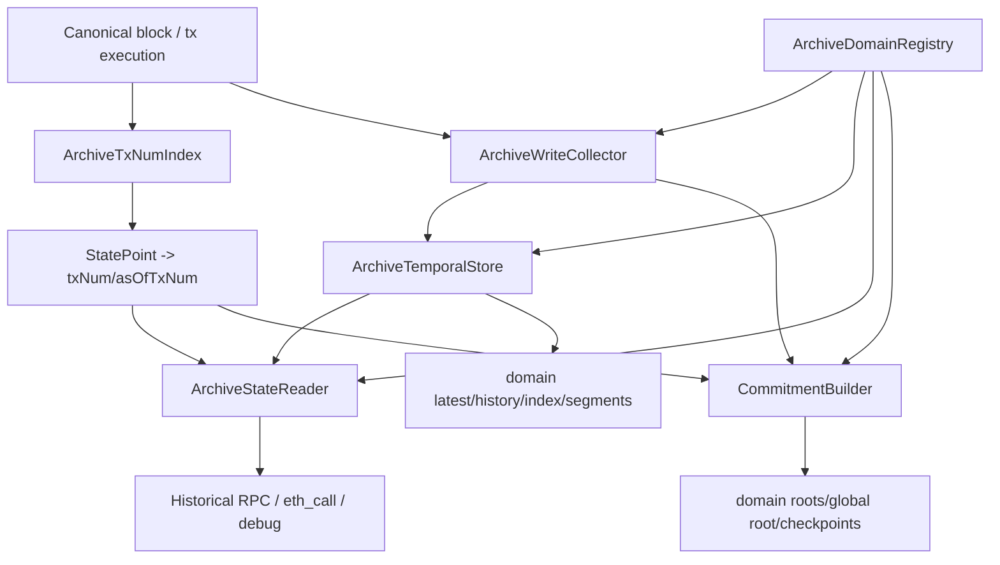

# java-tron Archive 状态树：Erigon 源码深挖后的落地路线图

日期：2026-06-01

关联总文档：[java-tron 交易级状态树支持：Erigon V2/V3 模型调研](./20260520-java-tron-archive-state-erigon-v2-v3-research.md)

关联需求：[tronprotocol/java-tron#6289 Implementation of Archive Node on TRON](https://github.com/tronprotocol/java-tron/issues/6289)

java-tron 源码初步对照：[Milestone 0：java-tron Archive 状态树源码定位](./20260601-java-tron-archive-milestone-0-source-map.md)

实现蓝图：[java-tron Archive 状态树实现蓝图](./20260602-java-tron-archive-implementation-blueprint.md)

端到端实现矩阵：[java-tron Archive 端到端实现矩阵与 PR 执行队列](./20260602-java-tron-archive-end-to-end-implementation-matrix.md)

六模块本地源码对照实现总表：[java-tron Archive：六个模块本地源码对照实现总表](./20260602-java-tron-archive-module-by-module-java-tron-implementation-map.md)

S1/S2 编码执行包：[java-tron Archive S1/S2 编码执行包](./20260602-java-tron-archive-s1-s2-coding-packet.md)

S3 ArchiveDomainRegistry 编码执行包：[java-tron Archive S3：ArchiveDomainRegistry 编码执行包](./20260602-java-tron-archive-s3-domain-registry-coding-packet.md)

S4 ArchiveWriteCollector 编码执行包：[java-tron Archive S4：ArchiveWriteCollector 编码执行包](./20260602-java-tron-archive-s4-write-collector-coding-packet.md)

S5 Contract Storage semantic hook 编码执行包：[java-tron Archive S5：Contract Storage Semantic Hook 编码执行包](./20260602-java-tron-archive-s5-contract-storage-semantic-coding-packet.md)

S6 ArchiveRawStore + temporal codecs 编码执行包：[java-tron Archive S6：ArchiveRawStore + Temporal Codecs 编码执行包](./20260602-java-tron-archive-s6-raw-store-temporal-codecs-coding-packet.md)

S7 Temporal commit/unwind/startup 编码执行包：[java-tron Archive S7：Temporal Commit / GetAsOf / Unwind / Startup 编码执行包](./20260602-java-tron-archive-s7-temporal-commit-unwind-startup-coding-packet.md)

S8 ArchiveStateReader core 编码执行包：[java-tron Archive S8：ArchiveStateReader Core 编码执行包](./20260602-java-tron-archive-s8-state-reader-core-coding-packet.md)

S9 JSON-RPC historical getters 编码执行包：[java-tron Archive S9：JSON-RPC Historical Getters 编码执行包](./20260602-java-tron-archive-s9-jsonrpc-historical-getters-coding-packet.md)

S10 Sparse Merkle tree core + root codecs 编码执行包：[java-tron Archive S10：Sparse Merkle Tree Core + Root Codecs 编码执行包](./20260602-java-tron-archive-s10-sparse-merkle-root-codecs-coding-packet.md)

S11 CommitmentBuilder integration + rebuild verifier 编码执行包：[java-tron Archive S11：CommitmentBuilder Integration + Rebuild Verifier 编码执行包](./20260602-java-tron-archive-s11-commitment-builder-integration-rebuild-coding-packet.md)

PR1/PR2 代码级规格：[java-tron Archive PR1/PR2 代码级实现规格](./20260602-java-tron-archive-pr1-pr2-implementation-spec.md)

PR1/PR2 逐文件 Patch 清单：[java-tron Archive PR1/PR2 逐文件 Patch 清单](./20260602-java-tron-archive-pr1-pr2-patch-checklist.md)

模块 01 逐文件 Patch 清单：[java-tron Archive 模块 01：ArchiveTxNumIndex 逐文件 Patch 清单](./20260602-java-tron-archive-module-01-txnum-index-patch-checklist.md)

模块 02 逐文件 Patch 清单：[java-tron Archive 模块 02：ArchiveDomainRegistry 逐文件 Patch 清单](./20260602-java-tron-archive-module-02-domain-registry-patch-checklist.md)

模块 03 逐文件 Patch 清单：[java-tron Archive 模块 03：ArchiveWriteCollector 逐文件 Patch 清单](./20260602-java-tron-archive-module-03-write-collector-patch-checklist.md)

模块 04 逐文件 Patch 清单：[java-tron Archive 模块 04：ArchiveTemporalStore 逐文件 Patch 清单](./20260602-java-tron-archive-module-04-temporal-store-patch-checklist.md)

模块 05 逐文件 Patch 清单：[java-tron Archive 模块 05：ArchiveStateReader 逐文件 Patch 清单](./20260602-java-tron-archive-module-05-state-reader-patch-checklist.md)

模块 06 逐文件 Patch 清单：[java-tron Archive 模块 06：CommitmentBuilder 逐文件 Patch 清单](./20260602-java-tron-archive-module-06-commitment-builder-patch-checklist.md)

PR3/PR4 WriteCollector 代码级规格：[java-tron Archive PR3/PR4 WriteCollector 代码级实现规格](./20260602-java-tron-archive-pr3-pr4-write-collector-implementation-spec.md)

PR5 TemporalStore 代码级规格：[java-tron Archive PR5 TemporalStore 代码级实现规格](./20260602-java-tron-archive-pr5-temporal-store-implementation-spec.md)

PR6 StateReader/JSON-RPC 代码级规格：[java-tron Archive PR6 StateReader/JSON-RPC 代码级实现规格](./20260602-java-tron-archive-pr6-state-reader-jsonrpc-implementation-spec.md)

PR7 CommitmentBuilder 代码级规格：[java-tron Archive PR7 CommitmentBuilder 代码级实现规格](./20260602-java-tron-archive-pr7-commitment-builder-implementation-spec.md)

PR8 historical eth_call 代码级规格：[java-tron Archive PR8 historical eth_call 代码级实现规格](./20260602-java-tron-archive-pr8-historical-eth-call-implementation-spec.md)

PR9 Proof/Debug API 代码级规格：[java-tron Archive PR9 Proof/Debug API 代码级实现规格](./20260602-java-tron-archive-pr9-proof-debug-api-implementation-spec.md)

模块设计：

- [模块 01：ArchiveTxNumIndex](./20260521-java-tron-archive-module-01-txnum-index.md)
- [模块 02：ArchiveDomainRegistry](./20260521-java-tron-archive-module-02-domain-registry.md)
- [模块 03：ArchiveWriteCollector](./20260521-java-tron-archive-module-03-write-collector.md)
- [模块 04：ArchiveTemporalStore](./20260521-java-tron-archive-module-04-temporal-store.md)
- [模块 05：ArchiveStateReader](./20260521-java-tron-archive-module-05-state-reader.md)
- [模块 06：CommitmentBuilder](./20260521-java-tron-archive-module-06-commitment-builder.md)

Erigon 源码对照：

- [模块 01 源码对照](./20260523-java-tron-module-01-txnum-index-erigon-source-deep-dive.md)
- [模块 02 源码对照](./20260525-java-tron-module-02-domain-registry-erigon-source-deep-dive.md)
- [模块 03 源码对照](./20260526-java-tron-module-03-write-collector-erigon-source-deep-dive.md)
- [模块 04 源码对照](./20260527-java-tron-module-04-temporal-store-erigon-source-deep-dive.md)
- [模块 05 源码对照](./20260527-java-tron-module-05-state-reader-erigon-source-deep-dive.md)
- [模块 06 源码对照](./20260601-java-tron-module-06-commitment-builder-erigon-source-deep-dive.md)

java-tron 源码对照：

- [模块 01 ArchiveTxNumIndex 源码对照](./20260601-java-tron-module-01-txnum-index-java-tron-source-deep-dive.md)
- [模块 02 ArchiveDomainRegistry 源码对照](./20260601-java-tron-module-02-domain-registry-java-tron-source-deep-dive.md)
- [模块 03 ArchiveWriteCollector 源码对照](./20260601-java-tron-module-03-write-collector-java-tron-source-deep-dive.md)
- [模块 04 ArchiveTemporalStore 源码对照](./20260601-java-tron-module-04-temporal-store-java-tron-source-deep-dive.md)
- [模块 05 ArchiveStateReader 源码对照](./20260601-java-tron-module-05-state-reader-java-tron-source-deep-dive.md)
- [模块 06 CommitmentBuilder 源码对照](./20260601-java-tron-module-06-commitment-builder-java-tron-source-deep-dive.md)

## 1. 文档边界

已确认 java-tron 源码位于 `/Users/boson/IdeaProjects/java-tron`。本文基于 Erigon V2/V3 源码深挖收敛整体落地路线；java-tron 侧初步源码定位见 [Milestone 0：java-tron Archive 状态树源码定位](./20260601-java-tron-archive-milestone-0-source-map.md)，六个模块的 java-tron 逐项源码对照见上方清单。

本文回答三个问题：

1. 六个模块应该如何组合成完整系统。
2. java-tron 第一阶段应该先做哪些能力，哪些能力延后。
3. 已对照 java-tron 源码后，应该按什么顺序做实现切入。

核心原则：

```text
先做 archive sidecar，后谈 consensus root。
先保证历史状态查询正确，后追求每 tx root 全量持久化。
先固定 txNum/domain/write-set/reader/root 语义，后优化存储和并行计算。
```

## 2. 总体系统形态

Erigon V3 给出的主线不是“加一张历史表”，而是把执行状态拆成六层：



模块关系要保持单向：

- `ArchiveTxNumIndex` 只负责时间坐标。
- `ArchiveDomainRegistry` 只负责 domain 元数据和 canonical codec。
- `ArchiveWriteCollector` 只负责捕获 canonical write-set。
- `ArchiveTemporalStore` 只负责 latest/history/index/segment。
- `ArchiveStateReader` 只负责按 state point 读取状态。
- `CommitmentBuilder` 只负责 root/checkpoint/proof。

不要让任何一个模块偷做其他模块的职责。Erigon 的正确性来自边界清晰：txNum、domain、history reader、commitment context 分别独立。

## 3. 端到端写路径

建议 java-tron 的 archive 写路径如下：

```text
begin block
  -> ArchiveTxNumIndex.beginBlock(blockNum, blockId)

for each logical tx:
  -> txNum = ArchiveTxNumIndex.allocateTx(...)
  -> execute tx through canonical apply path
  -> ArchiveWriteCollector.collect(txNum, dirty state / write log)
  -> ArchiveWriteCollector records tx writes
  -> if persistTxRoots=true:
       CommitmentBuilder must process tx boundary explicitly; S11 P0 fails fast if unsupported

block finalize / maintenance / system writes:
  -> allocate SYSTEM_TX txNum
  -> collect/apply writes

end block:
  -> ArchiveTxNumIndex.endBlock(blockNum, maxTxNum)
  -> if rootPolicy includes BLOCK_END:
       CommitmentBuilder.stageBlockEnd(BlockWriteSet, ArchiveBatch)
  -> persist txNum index, history, root records in one ArchiveBatch
```

几个必须显式建模的 tx 类型：

- user transaction；
- failed/reverted transaction 的最终费用和资源扣减；
- block finalize；
- maintenance；
- reward/distribution；
- governance parameter update；
- internal system contract write。

不要把这些写入都压到 block end 的匿名 delta 中。否则 `BLOCK_END` 可能能重放，但 `TX_AFTER`、debug trace、历史 `eth_call` 都会缺少明确状态边界。

## 4. 端到端读路径

历史查询必须通过 `StatePoint`，不要让 RPC 层自己拼 `blockNum + txIndex + 1`。

```text
RPC blockTag / txTag
  -> ArchiveTxNumIndex.resolve(StatePoint)
  -> ArchiveStateReaderFactory.open(point, overlayPolicy)
  -> reader.readAccount / readCode / readStorage / call
```

Reader 的关键不是接口数量，而是 view 类型：

| view | base | overlay | 用途 |
|---|---|---|---|
| latest | latest store | current in-memory writes | 普通 latest 查询 |
| persisted historical | archive history as-of | none | blockTag 历史查询 |
| in-block historical | archive history as-of | block apply buffer | block 内 finalize / simulation |
| commitment | archive history/current | commitment node view | root/proof |
| rebuild | history as-of | rebuild temp nodes | root rebuild |
| simulation | historical base | simulation writes | `eth_call` / traceCall |

这个分层直接来自 Erigon 的 `HistoryReaderV3`、`BlockStateCache`、`asOfStateReader`、`RebuildStateReader`。java-tron 如果只有一个 `Repository` 或 `Store` facade，archive 读路径会很容易混入 latest state。

## 5. 全局不变量

### 5.1 StatePoint 是唯一外部坐标

外部接口只使用：

```java
sealed interface StatePoint {
  record BlockBefore(long blockNum) implements StatePoint {}
  record BlockEnd(long blockNum) implements StatePoint {}
  record TxBefore(long blockNum, int txIndex) implements StatePoint {}
  record TxAfter(long blockNum, int txIndex) implements StatePoint {}
  record SystemTxAfter(long blockNum, SystemTxKind kind) implements StatePoint {}
}
```

内部可以转成 `txNum` / `asOfTxNum`，但不要把 off-by-one 暴露给 RPC、reader、commitment。

### 5.2 每个状态写入必须属于一个 txNum

Erigon V3 的经验是：只要写入没有 txNum，历史读取和 root 计算都会退化到 block-level。java-tron 的 archive branch 里，任何进入 archive domain 的写入都必须绑定：

- `blockNum`
- `blockId`
- `logicalTxIndex`
- `txNum`
- `StatePoint`
- `domainId`

### 5.3 DomainRegistry 是跨模块合约

domain id、key codec、value codec、root policy、history policy 不能散落在各模块。

所有模块读取同一份 registry descriptor，并把 `registryChecksum` 写入：

- segment manifest；
- root record；
- checkpoint；
- proof；
- rebuild metadata。

### 5.4 WriteCollector 只捕获 canonical writes

pending transaction、mempool validation、constant call、simulation 都不应污染 archive history。

collector 的输入点必须在 canonical block apply 路径，并且在 VM rollback/revert 后只看最终生效写入。

### 5.5 TemporalStore 存 before-value，不存全量 snapshot

写入模型：

```text
latest[domain,key] = newValue
history_idx[domain,key] += txNum
history_vals[domain,key,txNum] = prevValue
```

查询模型：

```text
GetAsOf(domain,key,asOfTxNum)
  -> 找 asOfTxNum 之后第一次修改
  -> 如果找到，返回那次修改前值
  -> 如果找不到，返回 latest/current value
```

这是 Erigon V2/V3 都保留下来的核心思想。

### 5.6 Commitment 输入按 commitment path 排序

Erigon 源码明确显示，trie update 必须按 hashed key 排序。java-tron 的 root builder 也应固定：

```text
sort by commitmentPath ASC, then domainId/key tie-breaker ASC
```

不能依赖 Java map 遍历、RocksDB iterator 的物理顺序或 store 名称顺序。

### 5.7 Root 更新和 checkpoint 绑定原始 state point

如果 root node 更新被异步或延迟写入，必须保留原始：

- blockNum；
- blockId；
- txNum；
- txIndex；
- rootAlgorithm；
- registryChecksum。

否则 unwind/reorg 时会出现 root node 写入归属到错误 block 的问题。Erigon 的 deferred branch update 修复点已经证明这是高风险区域。

## 6. 推荐代码分层

实际包名要等 java-tron 源码确认。下面是建议形态：

```text
org.tron.core.archive
  ArchiveService
  ArchiveConfig
  ArchiveLifecycle

org.tron.core.archive.txnum
  ArchiveTxNumIndex
  StatePoint
  TxNumRange

org.tron.core.archive.domain
  ArchiveDomainRegistry
  ArchiveDomainDescriptor
  DomainCodec
  RootPolicy

org.tron.core.archive.collector
  ArchiveWriteCollector
  TxWriteSet
  DomainWrite
  SemanticStateWrite

org.tron.core.archive.store
  ArchiveTemporalStore
  DomainLatestStore
  DomainHistoryStore
  ChangedKeyIndex
  SegmentManifest

org.tron.core.archive.reader
  ArchiveStateReader
  ArchiveStateReaderFactory
  ArchiveOverlay

org.tron.core.archive.commitment
  CommitmentBuilder
  CommitmentTree
  RootRecord
  ArchiveStateProof
```

执行路径只依赖 `collector` 和 `store` 的薄接口。RPC/debug/proof 通过 `reader` 和 `commitment` 使用 archive 数据。

## 7. 第一阶段 PoC 范围

不要第一阶段覆盖 issue 里提到的 25 类 DB。PoC 目标是闭环，而不是覆盖面最大。

建议只选：

1. account 基础状态。
2. contract code。
3. contract storage。

PoC 必须支持：

- 为每个 canonical logical tx 分配 txNum。
- 捕获三类 domain 的 before-value 和 after-value。
- 写 `latest/history/index`。
- 支持 `GetAsOf`。
- 接入历史 `eth_getBalance`、`eth_getCode`、`eth_getStorageAt`。
- 支持 block-end sidecar root。
- 支持从 history changed keys rebuild block-end root。

PoC 暂不做：

- 25 个 domain 全覆盖。
- 每 tx root 全量持久化。
- Ethereum-compatible `eth_getProof`。
- consensus stateRoot。
- 多盘 segment 聚合。
- 大规模并行 commitment。

PoC 成功标准：

```text
同一段链重复 replay:
  latest state 一致
  historical GetAsOf 一致
  block-end archive root 一致
  rebuild root == incremental root
```

## 8. 第二阶段：交易级状态树

在 PoC 稳定后，开启交易级能力。

### 8.1 tx-level reader

支持：

- `TX_BEFORE(block, txIndex)`
- `TX_AFTER(block, txIndex)`
- `BLOCK_END(block)`

测试必须覆盖同一 block 内多笔交易修改同一 key：

```text
tx1: A.balance = 10
tx2: A.balance = 20

TX_AFTER(tx1) -> 10
TX_BEFORE(tx2) -> 10
TX_AFTER(tx2) -> 20
BLOCK_END -> 20
```

### 8.2 tx-level root policy

先做按需计算，再做全量持久化：

| 模式 | 行为 | 建议 |
|---|---|---|
| `BLOCK_END_ONLY` | 每 block root | 默认 |
| `TX_ON_DEMAND` | 查询/proof 时按 changed-key replay 计算 tx root | 第二阶段优先 |
| `TX_CHECKPOINTED` | 每 N tx 或热点 block 保存 tx root | 性能折中 |
| `TX_AFTER_ALL` | 每 tx 保存 root | 最后启用 |

这样可以避免第一版因为 TRON TPS 高而把 root storage 写爆。

### 8.3 tx-level proof

proof 数据结构从一开始就要支持，但 API 可以延后：

```text
domain proof
  + global domain proof
  + registry checksum
  + algorithm id
  + state point
```

PR9 把这部分落成 archive-native debug/proof API：`debug_getArchiveRoot`、`debug_getArchiveProof`、`debug_verifyArchiveProof` 和可选 `debug_traceCall`。它不实现 Ethereum-compatible `eth_getProof`，因为 TRON archive sidecar root 不等价于 Ethereum MPT account/storage proof。

## 9. 第三阶段：全 domain 覆盖

当三类 PoC 稳定后，再扩展到更多 TRON 状态。

扩展顺序建议：

1. account / contract / storage。
2. resource / bandwidth / energy 相关状态。
3. TRC10 asset。
4. vote / witness / delegation。
5. governance parameter。
6. exchange / proposal / dynamic properties。
7. 其他 ChainBase stores。

每新增一个 domain 必须完成：

- descriptor；
- key codec；
- value canonical codec；
- delete semantics；
- history policy；
- root policy；
- reader API 映射；
- migration/backfill 方案；
- domain-level tests；
- replay root tests。

不要把某个 store 加进 root 前只做“序列化 bytes 放进去”。必须证明序列化稳定、字段顺序稳定、默认值/缺失值语义稳定。

## 10. 第四阶段：segment、多盘、冷数据

`java-tron#6289` 提到 archive 数据预估 80T+，单盘不可持续。因此 segment 不是后期优化，而是第一版 schema 就要预留的边界。

建议：

```text
hot store:
  recent latest/history/index
  unwind window
  current root nodes

cold segment:
  immutable domain values
  immutable history values
  immutable changed-key index
  optional commitment nodes
  manifest

manifest:
  segment id
  txNum range
  block range
  domain list
  registry checksum
  root algorithm
  file checksum
  compaction version
```

freeze 条件必须基于 finality/solid window，不能 freeze 仍可能 reorg 的区间。

## 11. 第五阶段：candidate consensus root

只有 archive sidecar 跑稳定后，才考虑 consensus root。

需要 TIP/Proposal 明确：

- activation height；
- activation 前历史 root 缺失语义；
- genesis/current-state bootstrap root；
- root domain list；
- canonical encoding；
- hash algorithm；
- SR 性能预算；
- root mismatch 处理；
- fullnode 是否强制计算；
- archive node 和普通 fullnode 的职责差异。

在此之前，root record 应标记：

```text
root_scope = ARCHIVE_SIDECAR
consensus_participation = NONE
```

## 12. java-tron 源码对照顺序

java-tron 源码已按六个模块完成逐项对照；本节保留为后续实现前的核查顺序。当前完成产物包括 Milestone 0 初步源码地图，以及上方 `java-tron 源码对照` 清单中的六篇模块文档。

### 12.1 ChainBase / DB 层

确认：

- Store 抽象。
- RocksDB/LevelDB column family 或多 DB 组织。
- snapshot / iterator / batch write 能力。
- rollback / reorg 机制。
- 当前 `balance.history.lookup` 数据结构。
- 多 Store 一致读写事务边界。

产物：

```text
java-tron ArchiveTemporalStore 源码对照.md
```

### 12.2 block/tx 执行入口

确认：

- block apply 主入口；
- transaction apply 主入口；
- failed/revert 处理；
- receipt/result 写入；
- maintenance/system writes；
- fork/reorg 回滚；
- pending/constant call 和 canonical apply 的分界。

产物：

```text
java-tron ArchiveWriteCollector 源码对照.md
```

### 12.3 Repository / VM state 层

确认：

- TVM 如何读写 account/contract/storage。
- dirty state/journal 是否可导出 write-set。
- 是否有 per-tx commit/rollback hook。
- 合约 storage key/value 编码。
- code hash / code bytes 存储关系。

产物：

```text
java-tron ArchiveStateReader + WriteCollector 源码对照.md
```

### 12.4 existing roots

确认：

- `txTrieRoot` 生成逻辑。
- `accountStateRoot` 生成逻辑。
- `accountStateRoot` 是否启用、覆盖哪些字段。
- 区块头 root 校验位置。
- 是否已有 MPT/Merkle 工具。

产物：

```text
java-tron CommitmentBuilder 源码对照.md
```

### 12.5 RPC/API 层

确认：

- `eth_getBalance`
- `eth_getCode`
- `eth_getStorageAt`
- `eth_call`
- blockTag 解析；
- historical state 目前如何 fallback；
- `wallet/getaccountbalance` 和 `balance.history.lookup`。

产物：

```text
java-tron ArchiveStateReader RPC 集成方案.md
```

## 13. 实施任务拆分

### Milestone 0：源码定位和设计冻结

目标：不改核心逻辑，只确认切入点。

任务：

1. 梳理 Store/domain 清单。
2. 梳理 canonical block apply hook。
3. 梳理 VM write-set 可捕获点。
4. 梳理 historical balance 现有实现。
5. 确认 root 工具和 accountStateRoot 现状。
6. 输出 domain registry 初版。

验收：

- 每个 PoC domain 都有明确写入口、读入口、key/value codec。
- 确认 pending/simulation 不会进入 archive collector。

### Milestone 1：TxNumIndex

目标：建立交易级时间坐标。

任务：

1. block -> txNum range。
2. txId -> txNum。
3. txNum -> block/txIndex。
4. system txNum 规则。
5. StatePoint resolver。
6. reorg/unwind 回滚 txNum index。

验收：

- 能解析 `BLOCK_END`、`TX_BEFORE`、`TX_AFTER`。
- 同 block 多 tx 顺序稳定。

### Milestone 2：WriteCollector

目标：捕获 canonical tx write-set。

任务：

1. 接入 account writes。
2. 接入 contract code writes。
3. 接入 contract storage writes。
4. failed/revert 只保留最终生效写。
5. block finalize/system writes 建 txNum。
6. same-value rewrite 策略。

验收：

- replay 一段链，write-set 可重放得到 latest state。
- pending/constant call 不产生 archive writes。

### Milestone 3：TemporalStore

目标：保存和查询历史状态。

任务：

1. domain latest。
2. before-value history。
3. changed-key index。
4. `GetAsOf`。
5. unwind。
6. compact/freeze manifest 占位。

验收：

- `ArchiveTemporalStore.GetAsOf` 能为 `eth_getBalance` / `eth_getCode` / `eth_getStorageAt` 提供历史原语。
- 同 block 内 `TX_AFTER` 查询正确。

### Milestone 4：StateReader

目标：把 archive history 接入业务读接口。

任务：

1. historical reader。
2. latest reader。
3. overlay reader。
4. commitment reader。
5. RPC blockTag adapter。
6. `eth_call` historical adapter。

验收：

- `eth_getBalance` / `eth_getCode` / `eth_getStorageAt` 能按历史 blockTag 返回。
- 历史 `eth_call` 不读取 latest store。
- blockTag off-by-one 测试通过。

### Milestone 5：CommitmentBuilder block-end root

目标：先实现 block-end sidecar root。

任务：

1. domain root tree。
2. global root tree。
3. root records。
4. checkpoint state。
5. rebuild from changed keys。
6. root diff/debug 工具。

验收：

- incremental block-end root 等于 rebuild root。
- 重启后从 checkpoint 继续，root 一致。

### Milestone 6：tx-level root/proof

目标：交易级 root 和 proof。

任务：

1. `TX_ON_DEMAND` root。
2. optional tx root cache。
3. proof node schema。
4. existence proof。
5. non-existence proof。
6. domain proof + global proof verifier。

验收：

- 同 block 多 tx root 可区分。
- proof 能验证到 global root。

## 14. 风险清单

| 风险 | 表现 | 规避 |
|---|---|---|
| txNum off-by-one | 历史查询读到前一笔或后一笔状态 | 只暴露 `StatePoint`，集中 resolver |
| pending 污染 | constant call 或 mempool validation 写入 archive | collector 只挂 canonical apply |
| store 覆盖不全 | root 声称全状态但漏 domain | registry 标记 coverage，先 `PARTIAL` |
| codec 不稳定 | 重启或版本升级 root 改变 | canonical codec + version + checksum |
| same-value rewrite 混乱 | history/root/audit 语义不一致 | 分离 write、history、touch |
| prefix delete | storage clear 无法证明 | collector 展开 concrete keys 或 tombstone 设计 |
| latest 混入 history | 历史 RPC / root 读到未来值 | reader view 显式化 |
| root node 归属错误 | unwind/reorg 后 root 指向未来 | node updates 绑定 blockId/statePoint |
| segment 过早 freeze | reorg 需要回滚冷数据 | 只 freeze finalized/solid window |
| 每 tx root 写爆 | TPS 高导致 root nodes 过多 | 先 `TX_ON_DEMAND` / checkpoint |
| historical eth_call 污染 VMConfig | `ConfigLoader.load` 改写全局静态 VM flags | PR8 先加锁和恢复，后续推进 per-execution `VmRules` |

## 15. 最小测试矩阵

1. txNum resolver：
   - genesis；
   - empty block；
   - multi-tx block；
   - failed tx；
   - system tx；
   - reorg。

2. write collector：
   - account update；
   - code deploy/update/delete；
   - storage update/delete；
   - revert；
   - same-value rewrite；
   - block finalize。

3. temporal store：
   - latest；
   - `GetAsOf(BLOCK_END)`；
   - `GetAsOf(TX_AFTER)`；
   - delete non-existence；
   - unwind；
   - changed-key range。

4. state reader:
   - historical RPC；
   - historical `eth_call`；
   - overlay isolation；
   - archive gap；
   - prune/freeze boundary。

5. commitment:
   - deterministic order；
   - block-end root；
   - tx-on-demand root；
   - rebuild equals incremental；
   - checkpoint restore；
   - proof verifier。

## 16. 当前文档状态

已经完成：

- Erigon V2/V3 总体模型调研。
- 六个 java-tron archive 模块的细化设计。
- 六个模块逐一对照 Erigon 当前源码。
- Milestone 0 java-tron 源码定位。
- 六个模块逐一对照 java-tron 本地源码。
- java-tron Archive 状态树实现蓝图。
- PR1/PR2 代码级实现规格。
- PR3/PR4 WriteCollector 代码级实现规格。
- PR5 TemporalStore 代码级实现规格。
- PR6 StateReader/JSON-RPC 代码级实现规格。
- PR7 CommitmentBuilder 代码级实现规格。
- PR8 historical eth_call 代码级实现规格。
- PR9 Proof/Debug API 代码级实现规格。
- 本文的整体落地路线收敛。

当前已确认 java-tron 源码本地路径：`/Users/boson/IdeaProjects/java-tron`。

下一步如果进入代码实现，建议按 PR1/PR2 代码级规格开始：先补 archive 默认关闭配置、no-op `ArchiveService`、`ArchiveExecutionContext`、`TronStoreWithRevoking.getDbName()` 修复和 `Manager.processBlock` txNum hook，把交易级时间坐标稳定下来。若继续细化文档，下一份可把 PR1/PR2 规格拆成可直接提交的逐文件 patch 清单，或补充多盘 segment/运维迁移方案。
