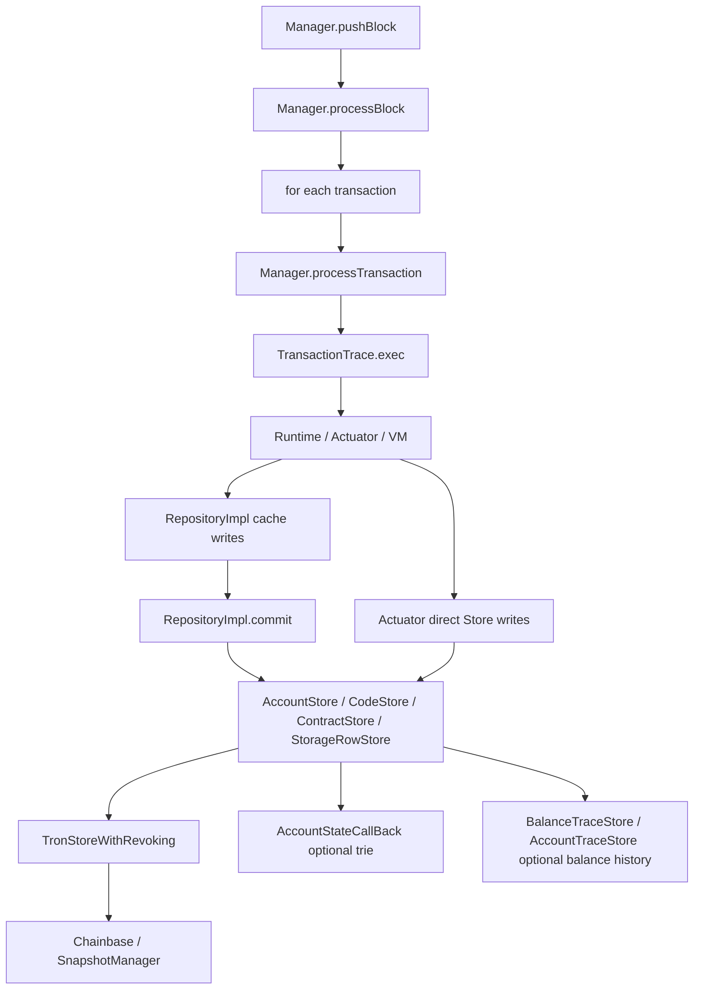

# Milestone 0：java-tron Archive 状态树源码定位

> ⚠️ **config 定位已过时（REFUTED）**：本文称"源码无 `reference.conf` / 没有 `StorageConfig.java`、应走旧手工解析 `Storage`/`Args` 路径"——两文件 4e80 即存在，且 `StorageConfig` 正是 #6615（`c977f826ba`，4e80 祖先）用 **ConfigBeanFactory** 替换手工解析后引入的。配置实现须走 **L1 的 ConfigBeanFactory 路径**，**勿照本文 §3.1/§4.1 的 config-wiring 口径**。其余源码定位（store 清单、hook 点等）仍可参考，注意行号漂移。详见 [00-ARCHIVE-V3-AUTHORITY-AND-DECISIONS.md](00-ARCHIVE-V3-AUTHORITY-AND-DECISIONS.md) §4。

日期：2026-06-01

java-tron 源码路径：`/Users/boson/IdeaProjects/java-tron`

关联路线图：[java-tron Archive 状态树：Erigon 源码深挖后的落地路线图](./20260601-java-tron-archive-erigon-source-synthesis-implementation-roadmap.md)

关联需求：[tronprotocol/java-tron#6289 Implementation of Archive Node on TRON](https://github.com/tronprotocol/java-tron/issues/6289)

## 1. 本轮目标

本轮开始进入 java-tron 源码侧，只做 `Milestone 0`：确认 archive state / 交易级状态树的真实切入点，不改 java-tron 代码。

源码定位覆盖五个面：

1. ChainBase / Store / revoking DB。
2. block / transaction canonical apply。
3. TVM `Repository` 和 contract storage。
4. 当前 `txTrieRoot` / `accountStateRoot`。
5. JSON-RPC / historical balance 查询入口。

结论先行：

- java-tron 当前有 revoking snapshot 机制，但不是 Erigon V3 那种按 `txNum` 组织的 temporal history。
- 当前历史查询能力主要是 balance 专用链路：`storage.balance.history.lookup`、`BalanceTraceStore`、`AccountTraceStore`、`wallet/getaccountbalance`。
- JSON-RPC 的 `eth_getBalance`、`eth_getCode`、`eth_getStorageAt`、`eth_call` 目前显式只接受 `latest`；数值 block/tag 会被拒绝。
- TVM 状态写入集中在 `RepositoryImpl` 的 cache/commit 路径，但普通 actuator 也会直接写 `AccountStore` 等 store；archive collector 不能只挂 Repository。
- 现有 `accountStateRoot` 是可选 proposal/config 控制的 account trie，value 只包含 address、balance、allowance，不是完整 archive state root。

## 2. 源码地图总览



Archive PoC 的最小切入面应覆盖两条写入路径：

- direct actuator writes：例如 `TransferActuator` 直接调用 `AccountStore.put`。
- TVM repository writes：`RepositoryImpl` 缓存 account/code/contract/storage，最终 commit 到 store。

因此第一版 collector 更适合挂在 Store/domain 写入边界，或者在 Store 边界加 archive sidecar hook；只挂 `RepositoryImpl.commit()` 会漏掉非 TVM actuator 和 block-level/system 写入。

## 3. ChainBase / Store 层

### 3.1 Store 清单

`chainbase/src/main/java/org/tron/core/ChainBaseManager.java:73` 是全局 store manager。和 archive 状态最相关的 store：

- `AccountStore`：`ChainBaseManager.java:81`
- `DynamicPropertiesStore`：`ChainBaseManager.java:99`
- `CodeStore`：`ChainBaseManager.java:141`
- `ContractStore`：`ChainBaseManager.java:144`
- `StorageRowStore`：`ChainBaseManager.java:156`
- `TransactionRetStore`：`ChainBaseManager.java:193`
- `BalanceTraceStore`：`ChainBaseManager.java:218`
- `AccountTraceStore`：`ChainBaseManager.java:222`

PoC 三个 domain 的直接对应：

| Archive domain | java-tron store | 说明 |
|---|---|---|
| `ACCOUNT` | `AccountStore` | account capsule，当前已有 balance trace hook |
| `CONTRACT_CODE` | `CodeStore` | contract bytecode |
| `CONTRACT_META` | `ContractStore` | contract metadata、codeHash、version、trxHash |
| `CONTRACT_STORAGE` | `StorageRowStore` | contract storage row，key 经过 `Storage.compose` |

注意：`eth_getCode` 现在走 `Wallet.getContractInfo`，不仅需要 `CodeStore`，还依赖 `ContractStore` / `ContractCapsule` 信息；`eth_getStorageAt` 需要 contract version 和 trxHash 生成 storage row key。

### 3.2 Store 基类

`chainbase/src/main/java/org/tron/core/db/TronStoreWithRevoking.java:40` 是大部分 store 的基类。

关键方法：

- `put(byte[] key, T item)`：`TronStoreWithRevoking.java:88-93`
- `delete(byte[] key)`：`TronStoreWithRevoking.java:97-98`
- `get(byte[] key)`：`TronStoreWithRevoking.java:102-103`
- `getUnchecked(byte[] key)`：`TronStoreWithRevoking.java:107-115`
- `getFromRoot(byte[] key)`：`TronStoreWithRevoking.java:118-119`
- `has(byte[] key)`：`TronStoreWithRevoking.java:135-136`
- `iterator()`：`TronStoreWithRevoking.java:184-185`

底层是 `IRevokingDB revokingDB`，每个 store 构造时创建 `Chainbase(new SnapshotRoot(db))`。

这说明 java-tron 已有“当前态 + 可回滚 snapshot”机制，但没有通用历史 before-value 表，也没有 `GetAsOf(domain,key,txNum)`。

### 3.3 Revoking snapshot

`chainbase/src/main/java/org/tron/core/db2/core/SnapshotManager.java:48` 管多个 `Chainbase`。

关键方法：

- `buildSession()`：`SnapshotManager.java:115`
- `advance()`：`SnapshotManager.java:160`
- `retreat()`：`SnapshotManager.java:165`
- `merge()`：`SnapshotManager.java:170`

`chainbase/src/main/java/org/tron/core/db2/core/Chainbase.java:26` 是 per-store revoking DB。它支持：

- `put`：`Chainbase.java:123`
- `delete`：`Chainbase.java:128`
- `getUnchecked`：`Chainbase.java:152`
- `getFromRoot`：`Chainbase.java:143`
- `getNext`：`Chainbase.java:313`

`getNext` 目前明确标注为 `for accout-trace`，并按 key 排序取下一个 key。它支撑 `AccountTraceStore` 的历史余额查找，但不是通用 domain history index。

对 archive 的含义：

- revoking snapshot 可继续服务 hot rollback。
- archive history 需要新增独立 temporal store，不应复用 `SnapshotManager` stack 当长期历史。
- `getFromRoot` 只能读 root DB 当前持久态，不等价于历史 block/tx state。

## 4. 当前历史余额能力

### 4.1 配置入口

`storage.balance.history.lookup` 默认关闭：

- `framework/src/main/resources/config.conf:80`
- `common/src/main/java/org/tron/core/Constant.java:370`：配置 key `storage.balance.history.lookup`

CLI 映射：

- `common/src/main/java/org/tron/common/parameter/CommonParameter.java:626-627`：`--history-balance-lookup` 和字段默认 `false`
- `framework/src/main/java/org/tron/core/config/args/Args.java:1130`：从 config 写入 `CommonParameter.historyBalanceLookup`

### 4.2 写入路径

`chainbase/src/main/java/org/tron/core/store/AccountStore.java:68` 覆盖 `put`。

当 `historyBalanceLookup` 开启时：

- 新账户且 balance 非零：记录 balance。
- 旧账户 balance 变化：记录 diff 和 block-level trace。
- 最后仍调用 `super.put`，并触发 `accountStateCallBackUtils.accountCallBack`。

`AccountStore.delete` 在 `AccountStore.java:92`，开启历史余额时记录负 balance 和 block trace，然后 `super.delete`。

`BalanceTraceStore` 保存 block 内 transaction balance trace：

- `initCurrentTransactionBalanceTrace`：`BalanceTraceStore.java:99`
- `resetCurrentTransactionTrace`：`BalanceTraceStore.java:67`

`AccountTraceStore` 保存 address + block number 的 balance：

- `recordBalanceWithBlock`：`AccountTraceStore.java:32`
- `getPrevBalance`：`AccountTraceStore.java:39`

### 4.3 读取路径

`framework/src/main/java/org/tron/core/Wallet.java:4355` 的 `getAccountBalance` 是历史余额查询入口。

它会：

1. 校验 account identifier。
2. 用 `BlockIndexStore` 校验 block number/hash 匹配。
3. 调 `AccountTraceStore.getPrevBalance(address, blockNumber)`。
4. 返回找到的最近 balance 和对应 block identifier。

这条链路和 Erigon V2/V3 的相似点：

- 使用 address + reversed block number 做有序索引。
- 查历史点时找后继/最近记录。

关键限制：

- 只覆盖 balance，不覆盖 account 完整字段。
- 粒度是 block number，不是 txNum。
- 不覆盖 code、contract、storage。
- 不是 before-value domain history，而是 balance 专用 trace。
- 不能直接支撑 `eth_getStorageAt`、`eth_getCode`、历史 `eth_call`。

对 archive 设计的建议：

```text
可以借鉴 AccountTraceStore 的 key ordering 思路，
但 ArchiveTemporalStore 应使用 domainId + key + txNum 的通用 before-value 模型。
```

## 5. Block / Transaction 执行入口

### 5.1 push block

`framework/src/main/java/org/tron/core/db/Manager.java:1261-1267` 是 `pushBlock`。

它做：

- 校验 block tx merkle root：`Manager.java:1306`
- `khaosDb.push(block)`。
- fork switch。
- 最终进入 `applyBlock` / `processBlock`。

### 5.2 process block

`framework/src/main/java/org/tron/core/db/Manager.java:1824` 是 `processBlock`。

关键顺序：

- 初始化 block balance trace：`Manager.java:1837`
- `merkleContainer.resetCurrentMerkleTree()`。
- `accountStateCallBack.preExecute(block)`：`Manager.java:1855`
- 遍历 block transactions。
- 每笔 tx 前 `accountStateCallBack.preExeTrans()`：`Manager.java:1870`
- `processTransaction(transactionCapsule, block)`：`Manager.java:1871`
- 每笔 tx 后 `accountStateCallBack.exeTransFinish()`：`Manager.java:1872`
- block tx 全部结束后 `accountStateCallBack.executePushFinish()`：`Manager.java:1878`
- shielded merkle tree 保存：`Manager.java:1882`
- `payReward(block)`：`Manager.java:1891`
- proposal / consensus apply / dynamic properties / bloom：`Manager.java:1896` 到 `Manager.java:1917`

对 txNum 的直接影响：

```text
user tx loop 之后仍有 payReward、proposal、consensus apply、dynamic properties、bloom 等 block-level 写入。
```

ArchiveTxNumIndex 不能只给普通交易分配 txNum。至少需要：

- regular txNum：每笔用户交易。
- block reward/system txNum：`payReward`。
- maintenance/proposal txNum：`proposalController.processProposals`。
- block metadata txNum：`updateDynamicProperties` / transaction ret / bloom 等是否进入 archive domain 要由 registry 决定。

### 5.3 process transaction

`framework/src/main/java/org/tron/core/db/Manager.java:1498` 是 `processTransaction`。

关键步骤：

- block 内 tx 初始化 balance trace：`Manager.java:1522`
- 创建 `TransactionTrace`。
- bandwidth / multi-sig fee / memo fee。
- `trace.init(blockCap, eventPluginLoaded)`。
- `trace.checkIsConstant()`。
- `trace.exec()`。
- block 内设置 result / check。
- `trace.finalization()`。
- 写 `TransactionStore`。
- 构建 `TransactionInfoCapsule`。
- block 内更新 current transaction balance trace 并 reset：`Manager.java:1594` 到 `Manager.java:1597`

`chainbase/src/main/java/org/tron/core/db/TransactionTrace.java:186` 的 `exec()` 调 `runtime.execute(transactionContext)`，这是 VM/actuator 实际执行入口。

`TransactionTrace.finalization()` 在 `TransactionTrace.java:213`，会 `pay()` 并在无 runtime error 时处理 delete accounts。

对 ArchiveWriteCollector 的建议：

- tx 级 collector 的边界应覆盖 `processTransaction` 的完整结果，包括 bandwidth/fee、runtime、finalization。
- 如果只在 VM `RepositoryImpl.commit` 捕获，会漏掉 `consumeBandwidth`、`pay`、普通 actuator 直接 store 写入。
- 最稳妥的一阶段 hook 是 Store 写入边界 + 当前 tx/block context。

## 6. TVM Repository / Storage

### 6.1 Repository 接口

`actuator/src/main/java/org/tron/core/vm/repository/Repository.java:10` 是 TVM repository 接口。

与 PoC 三个 domain 直接相关：

- `getAccount` / `updateAccount`
- `saveCode` / `getCode`
- `putStorageValue` / `getStorageValue` / `getStorage`
- `commit`
- `newRepositoryChild`

### 6.2 RepositoryImpl cache

`actuator/src/main/java/org/tron/core/vm/repository/RepositoryImpl.java:82` 是实现。

内部 cache：

- `accountCache`
- `codeCache`
- `contractCache`
- `contractStateCache`
- `storageCache`
- dynamic/delegation/votes 等更多 cache

`newRepositoryChild` 在 `RepositoryImpl.java:180`。这说明 TVM 执行中存在 child repository，类似 overlay。

`commit()` 在 `RepositoryImpl.java:753`，依次 flush：

- `commitAccountCache`：`RepositoryImpl.java:948`
- `commitCodeCache`：`RepositoryImpl.java:960`
- `commitContractCache`
- `commitContractStateCache`
- `commitStorageCache`：`RepositoryImpl.java:1001`
- dynamic/delegation/votes 等

`saveCode` 在 `RepositoryImpl.java:625`，Constantinople 后会更新 contract code hash。

`getCode` 在 `RepositoryImpl.java:650`，先查 cache/parent，最后查 `CodeStore`。

`putStorageValue` 在 `RepositoryImpl.java:660`，写入 `Storage` cache。

`getStorageValue` 在 `RepositoryImpl.java:681`。

`getBalance` 在 `RepositoryImpl.java:731`。

### 6.3 Storage key 编码

`actuator/src/main/java/org/tron/core/vm/program/Storage.java:15` 是 contract storage helper。

关键逻辑：

- `compose` 在 `Storage.java:46`。
- storage row key 使用 `addrHash` 的前 16 bytes + slot key 的后 16 bytes。
- contract version 1 时先对 key 做 `Hash.sha3(key)`。
- create2 场景可用 `generateAddrHash(trxId)` 改变 address hash。
- `commit()` 在 `Storage.java:96`，dirty row 为零值时 delete，否则 put 到 `StorageRowStore`。

对 ArchiveDomainRegistry 的直接要求：

```text
CONTRACT_STORAGE domain 的 logical key 不能只看 StorageRowStore 物理 key。
至少要记录 address、slot、contractVersion、trxHash/addrHash 规则，或者把物理 key codec 明确版本化。
```

否则未来历史 `eth_getStorageAt(address,slot,blockTag)` 无法稳定反推或 proof。

## 7. 普通 actuator 直接写 Store

`actuator/src/main/java/org/tron/core/actuator/TransferActuator.java:31` 的 `execute` 直接使用 `AccountStore`：

- 读取 `AccountStore`。
- 新账户时 `accountStore.put(toAddress, toAccount)`。
- `adjustBalance(...)` 最终也会写账户状态。

这说明 java-tron 状态写入不是全部经过 `RepositoryImpl`。因此：

- `RepositoryImpl` 是 TVM/contract 的重要 collector 点。
- `TronStoreWithRevoking` 或具体 `*Store.put/delete` 是更完整的 archive sidecar hook 点。
- 对一些特殊 store，仍可能需要 domain-specific hook 处理 canonical key/value。

建议第一版 collector 采用两层：

1. Store-level generic hook：捕获所有 `put/delete(domain,key,value)`。
2. Repository/Storage semantic hook：为 contract storage 提供 address/slot/version 元数据，避免只看到物理 row key。

## 8. 当前 root 机制

### 8.1 txTrieRoot

`protocol/src/main/protos/core/Tron.proto:505` 定义 `txTrieRoot`。

`chainbase/src/main/java/org/tron/core/capsule/BlockCapsule.java:218` 的 `calcMerkleRoot` 对 block transactions 计算 Merkle root。

`BlockCapsule.validateMerkleRoot` 在 `BlockCapsule.java:233`。

`BlockCapsule.setMerkleRoot` 在 `BlockCapsule.java:246`。

这只是交易列表 root，不是 state root。

### 8.2 accountStateRoot

`protocol/src/main/protos/core/Tron.proto:514` 定义 `accountStateRoot`。

开关：

- `framework/src/main/resources/config.conf:734`：`allowAccountStateRoot = 0` 配置样例，当前本地源码没有 `common/src/main/resources/reference.conf`
- `framework/src/main/java/org/tron/core/config/args/Args.java:993-995`：从 `committee.allowAccountStateRoot` 读取配置
- `chainbase/src/main/java/org/tron/core/store/DynamicPropertiesStore.java:2355`：保存 proposal/config 值
- `DynamicPropertiesStore.allowAccountStateRoot()`：`DynamicPropertiesStore.java:2368`

执行链路：

- `Manager.processBlock` 调 `accountStateCallBack.preExecute(block)`：`Manager.java:1870`
- 每 tx 前后：`preExeTrans` / `exeTransFinish`：`Manager.java:1885`、`Manager.java:1887`
- push block 校验 root：`executePushFinish`：`Manager.java:1893`
- generate block 设置 root：`Manager.java:1747`、`Manager.java:1751`

`framework/src/main/java/org/tron/core/db/accountstate/callback/AccountStateCallBack.java:52` 初始化 trie。它从 parent block 的 `accountStateRoot` 恢复 root，然后每笔 tx 后把 `AccountStore` callback 收集到的 entries 写入 trie。

`executePushFinish` 在 `AccountStateCallBack.java:74`，若 block header 已带 root 且计算不一致，抛 `BadBlockException`。

`executeGenerateFinish` 在 `AccountStateCallBack.java:94`，生成 block 时写入 `accountStateRoot`。

`AccountStateCallBackUtils.accountCallBack` 在 `chainbase/src/main/java/org/tron/core/db/accountstate/AccountStateCallBackUtils.java:13`，只接收 account key 和 account capsule。

`AccountStateEntity` 只把 `Account` 的 address、balance、allowance 放进 trie value：

- `chainbase/src/main/java/org/tron/core/db/accountstate/AccountStateEntity.java:16`

它没有包含完整 account 字段、contract code、contract storage、votes、delegation 等。

### 8.3 AccountStateStoreTrie

`framework/src/main/java/org/tron/core/db/accountstate/storetrie/AccountStateStoreTrie.java:19` 是 trie node store。

`getAccount(byte[] key, byte[] rootHash)` 在 `AccountStateStoreTrie.java:39`，使用 `TrieImpl` 从某个 root 读取 account entity。

`TrieService`：

- latest/full root：`framework/src/main/java/org/tron/core/db/accountstate/TrieService.java:24`
- solidity root：`TrieService.java:29`

这条链路可借鉴为 `CommitmentBuilder` 的最小原型，但不能直接视为 archive state root：

- 覆盖范围太窄。
- 时间粒度是 block root，不是 tx root。
- key/value canonical 只针对 account state entity。
- delete 语义需要再确认。当前搜索只发现 `AccountStateCallBack.deleteAccount` 定义，未发现它被 `AccountStore.delete` 调用。

## 9. JSON-RPC 历史接口现状

`framework/src/main/java/org/tron/core/services/jsonrpc/TronJsonRpc.java` 暴露 ETH 兼容方法：

- `eth_getBalance`：`TronJsonRpc.java:90`
- `eth_getStorageAt`：`TronJsonRpc.java:96`
- `eth_getCode`：`TronJsonRpc.java:103`
- `eth_call`：`TronJsonRpc.java:162`

但实现层在这些状态读取接口前调用 `requireLatestBlockTag`：

- `requireLatestBlockTag`：`TronJsonRpcImpl.java:387`
- `eth_getBalance` 实现：`TronJsonRpcImpl.java:457`，`TronJsonRpcImpl.java:459` 调 require latest
- `eth_getStorageAt` 实现：`TronJsonRpcImpl.java:611`，`TronJsonRpcImpl.java:613` 调 require latest
- `eth_getCode` 实现名为 `getABIOfSmartContract`：`TronJsonRpcImpl.java:635`，`TronJsonRpcImpl.java:637` 调 require latest
- `eth_call`：`TronJsonRpcImpl.java:1001`，`TronJsonRpcImpl.java:1044` 调 require latest

`requireLatestBlockTag` 的行为：

```text
latest -> 允许
其他 tag -> TAG [earliest | pending | finalized | safe] not supported
数值 block -> QUANTITY not supported, just support TAG as latest
```

`eth_call` 还有一个特殊点：如果 block param 是 EIP-1898 风格 map，代码会先校验 blockNumber/blockHash 存在，然后把 `blockNumOrTag` 重置成 `latest`，最后仍然 require latest。这说明现有 `eth_call` 没有历史执行 view，只做存在性检查。

对 ArchiveStateReader 的建议：

- 新增 historical reader 后，第一批 JSON-RPC 接入点就是这四个 require latest 的位置。
- `parseBlockNumber` / `getBlockByNumOrTag` 可以复用，但必须新增 `StatePointResolver`，不要让 RPC 方法直接计算 as-of。
- `eth_call` 需要 historical repository adapter，不只是把 `getBalance/getCode/getStorageAt` 改成历史读。

## 10. 推荐 Milestone 0 输出

基于源码定位，建议正式实现前先输出四份 java-tron 侧设计/对照文档：

1. `ArchiveDomainRegistry` 初版 domain 清单：
   - `ACCOUNT`
   - `CONTRACT`
   - `CONTRACT_CODE`
   - `CONTRACT_STORAGE`
   - `DYNAMIC_PROPERTIES`
   - `VOTES`
   - `DELEGATION`
   - 后续扩展其他 stores。

2. `ArchiveWriteCollector` hook 方案：
   - Store-level hook。
   - Repository semantic hook。
   - block/tx context propagation。
   - failed/revert 语义。

3. `ArchiveStateReader` RPC 接入方案：
   - `eth_getBalance`
   - `eth_getCode`
   - `eth_getStorageAt`
   - `eth_call`
   - `wallet/getaccountbalance` 的兼容/迁移。

4. `CommitmentBuilder` 与现有 `accountStateRoot` 关系：
   - 现有 root 保持不动。
   - 新 archive root 作为 sidecar。
   - 后续可复用 `TrieImpl` 或替换为独立 tree engine。

## 11. 第一阶段实现切点建议

### 11.1 TxNumIndex

切入点：

- `Manager.processBlock` 的交易循环。
- `processTransaction` 前后。
- user tx 后的 block-level system writes。

建议先做 sidecar index，不改变 block header。

### 11.2 WriteCollector

优先 hook：

- `TronStoreWithRevoking.put/delete` 的 sidecar callback。
- 用 `ArchiveDomainRegistry` 将具体 store 映射到 domain id。
- 当前 tx/block context 用 thread-local 或显式 manager context 传入。

补充 hook：

- `RepositoryImpl.commit` 用于提取 contract storage 的 semantic key。
- `Storage.commit` 用于 storage row 的 address/slot/value/delete 信息。

### 11.3 TemporalStore

不要复用 `BalanceTraceStore` 作为通用历史库。建议新增：

```text
archive-domain-latest
archive-domain-history
archive-domain-history-index
archive-txnum-index
archive-segment-manifest
```

底层可以先用现有 LevelDB/RocksDB wrapper，接口上按 Erigon domain/history/index 拆。

### 11.4 StateReader

最小 PoC reader：

- account balance / account raw。
- code。
- contract storage。

接入 JSON-RPC 时先替换 `requireLatestBlockTag` 后面的读取路径，不要改 block 查询路径。

### 11.5 CommitmentBuilder

第一阶段只做 sidecar block-end root：

- 不动 `accountStateRoot`。
- 不动 `txTrieRoot`。
- root record 写 archive sidecar store。
- 用 changed keys rebuild 验证 incremental root。

## 12. 风险和源码待确认点

1. Store hook 的事务边界：
   - 需要确认 `SnapshotManager` session merge/reset 时，sidecar writes 如何随主状态一起提交或回滚。

2. Failed/revert：
   - `TransactionTrace.finalization` 仍可能写费用、资源、delete account。
   - collector 应以最终 store writes 为准，不记录 VM 内部回滚掉的 writes。

3. System writes：
   - `payReward`、proposal、dynamic properties、bloom、transaction ret 是否都进入 archive domain，要由 registry 决定。

4. Contract storage key：
   - `Storage.compose` 使用压缩物理 key，不能直接作为用户查询 slot 的唯一语义来源。

5. Existing accountStateRoot：
   - 当前 value 只包含 address/balance/allowance。
   - delete hook 需要确认实际生产路径是否覆盖。
   - 不应作为完整 archive root 的基础假设。

6. Historical balance：
   - `AccountTraceStore` 是 block-level balance trace，不是通用 account history。
   - 如果 archive 开启，应考虑和现有 `wallet/getaccountbalance` 兼容或迁移。

7. JSON-RPC blockTag：
   - 现在状态类方法只支持 latest。
   - 历史 `eth_call` 需要 historical repository，不只是历史 storage lookup。

## 13. 下一步

建议下一轮细化 `ArchiveDomainRegistry` 的 java-tron 源码对照：

- 从 `ChainBaseManager` 的 store 清单生成 domain descriptor 初版。
- 对每个 PoC domain 确认 key codec、value codec、delete semantics。
- 对 storage row 明确 logical key 与 physical key 的关系。
- 标记哪些 domain 第一阶段进入 root，哪些只进 history，哪些暂不 archive。

随后再进入 `ArchiveWriteCollector` 具体 hook 方案。
