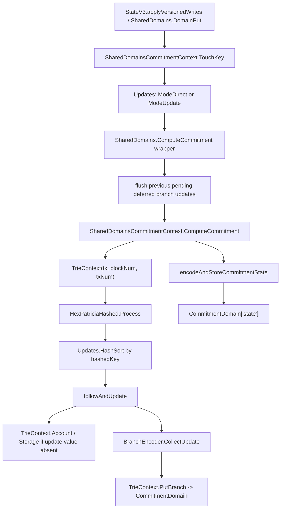

# 模块 06 CommitmentBuilder：Erigon 源码对照深挖

日期：2026-06-01

关联设计文档：[java-tron Archive 模块 06：CommitmentBuilder 细化设计](./20260521-java-tron-archive-module-06-commitment-builder.md)

关联需求：[tronprotocol/java-tron#6289 Implementation of Archive Node on TRON](https://github.com/tronprotocol/java-tron/issues/6289)

逐文件 Patch 清单：[java-tron Archive 模块 06：CommitmentBuilder 逐文件 Patch 清单](./20260602-java-tron-archive-module-06-commitment-builder-patch-checklist.md)

本轮复核基线：本地 Erigon `/Users/boson/GolandProjects/erigon` 当前工作区。

前置源码对照：

- [模块 01：ArchiveTxNumIndex Erigon 源码对照深挖](./20260523-java-tron-module-01-txnum-index-erigon-source-deep-dive.md)
- [模块 02：ArchiveDomainRegistry Erigon 源码对照深挖](./20260525-java-tron-module-02-domain-registry-erigon-source-deep-dive.md)
- [模块 03：ArchiveWriteCollector Erigon 源码对照深挖](./20260526-java-tron-module-03-write-collector-erigon-source-deep-dive.md)
- [模块 04：ArchiveTemporalStore Erigon 源码对照深挖](./20260527-java-tron-module-04-temporal-store-erigon-source-deep-dive.md)
- [模块 05：ArchiveStateReader Erigon 源码对照深挖](./20260527-java-tron-module-05-state-reader-erigon-source-deep-dive.md)

## 1. 本轮调研范围

本轮对照 Erigon 当前源码中的 commitment pipeline，继续细化 java-tron 的 `CommitmentBuilder`。模块 06 的核心问题是：模块 03/04 已经能按 `txNum` 捕获并保存历史状态后，如何把交易级 write-set 转换成稳定、可恢复、可证明的 state root。

`java-tron#6289` 明确了几个背景约束：java-tron 目前不是完整 Archive Node；Archive Node 需要按历史 block 查询 account balance、contract code、contract storage，并支持 `eth_getBalance`、`eth_getCode`、`eth_getStorageAt`、`eth_call` 等以历史 state 为基础的接口。该 issue 也指出 TRON 状态分散在多类 DB 中，不像 Ethereum 只围绕 account/state trie 组织；初期 stateRoot 不参与共识，主要服务 archive 查询与工程验证。

主要源码入口：

- `execution/commitment/commitment.go:92`：`Trie` 接口，抽象 root、context、process。
- `execution/commitment/commitment.go:130`：`PatriciaContext` 接口，抽象 branch/account/storage IO。
- `execution/commitment/commitment.go:153`：`InitializeTrieAndUpdates`，创建 trie 和 updates buffer。
- `execution/commitment/commitment.go:320`：`PendingCommitmentUpdate`，延迟 branch 写入的原始 block/tx 归属。
- `execution/commitment/commitment.go:342`：`BranchEncoder`。
- `execution/commitment/commitment.go:452`：`ApplyDeferredBranchUpdates`。
- `execution/commitment/commitment.go:563`：`BranchEncoder.CollectUpdate`。
- `execution/commitment/commitment.go:1411`：`ModeDisabled` / `ModeDirect` / `ModeUpdate`。
- `execution/commitment/commitment.go:1429`：`Updates`。
- `execution/commitment/commitment.go:1585`：`Updates.TouchPlainKey`。
- `execution/commitment/commitment.go:1624`：`Updates.TouchPlainKeyDirect`。
- `execution/commitment/commitment.go:1714`：`Updates.TouchAccount`。
- `execution/commitment/commitment.go:1746`：`Updates.TouchStorage`。
- `execution/commitment/commitment.go:1757`：`Updates.TouchCode`。
- `execution/commitment/commitment.go:1797`：`Updates.HashSort`。
- `execution/commitment/commitment.go:1981`：`keyUpdateLessFn`，按 hashed key 排序。
- `execution/commitment/hex_patricia_hashed.go:2493`：`HexPatriciaHashed.RootHash`。
- `execution/commitment/hex_patricia_hashed.go:2502`：`followAndUpdate`。
- `execution/commitment/hex_patricia_hashed.go:2607`：`GenerateWitness`。
- `execution/commitment/hex_patricia_hashed.go:2755`：`Process`。
- `execution/commitment/commitmentdb/commitment_context.go:45`：`SharedDomainsCommitmentContext`。
- `execution/commitment/commitmentdb/commitment_context.go:248`：`TouchKey`。
- `execution/commitment/commitmentdb/commitment_context.go:302`：`ComputeCommitment`。
- `execution/commitment/commitmentdb/commitment_context.go:589`：`KeyCommitmentState`。
- `execution/commitment/commitmentdb/commitment_context.go:636`：`SeekCommitment`。
- `execution/commitment/commitmentdb/commitment_context.go:682`：`encodeAndStoreCommitmentState`。
- `execution/commitment/commitmentdb/commitment_context.go:781`：`TrieContext`。
- `execution/commitment/commitmentdb/commitment_context.go:812`：`TrieContext.PutBranch`。
- `execution/commitment/commitmentdb/commitment_context.go:833`：`TrieContext.Account`。
- `execution/commitment/commitmentdb/commitment_context.go:877`：`TrieContext.Storage`。
- `execution/commitment/commitmentdb/reader.go:9`：`commitmentdb.StateReader`。
- `execution/commitment/commitmentdb/reader.go:199`：`RebuildStateReader`。
- `db/state/execctx/domain_shared.go:183`：`NewSharedDomainsCommitmentContext(... ModeDirect ...)`。
- `db/state/execctx/domain_shared.go:817`：`SharedDomains.DomainPut`。
- `db/state/execctx/domain_shared.go:878`：`SharedDomains.DomainDel`。
- `db/state/execctx/domain_shared.go:997`：`SharedDomains.ComputeCommitment` wrapper。
- `db/state/execctx/domain_shared.go:1056`：`TouchChangedKeysFromHistory`。
- `execution/state/rw_v3.go:369`：`StateV3.ApplyStateWrites`，step boundary commitment。
- `execution/state/versionedio.go:510`：`VersionedWrites.TouchUpdates`。
- `execution/stagedsync/committer.go:51`：`commitmentCalculator`。
- `execution/stagedsync/committer.go:115`：`newCommitmentCalculator`。
- `execution/stagedsync/committer.go:199`：`commitmentCalculator.handleMessage`。
- `execution/stagedsync/committer.go:303`：`computeAndPublish`。
- `execution/stagedsync/committer.go:483`：`computeWithBlockAccumulator`。
- `execution/stagedsync/calc_state.go:60`：`calcState`。
- `execution/stagedsync/calc_state.go:213`：`calcState.ApplyWrites`。
- `execution/stagedsync/calc_state.go:317`：`calcState.FlushToUpdates`。

## 2. 核心结论

Erigon 的 commitment builder 不是一个单独的“root 表扫描器”，而是一条增量 pipeline：

```text
DomainPut/DomainDel
  -> TouchKey
  -> Updates
  -> ComputeCommitment
  -> Trie.Process
  -> TrieContext(Account/Storage/Branch)
  -> PutBranch(CommitmentDomain)
  -> KeyCommitmentState checkpoint
```

对 java-tron 的直接启发：

1. `CommitmentBuilder` 应消费 write-set/touch-set，而不是从 DB 全量扫描每个 block。
2. root 计算要绑定明确 `StatePoint`，不能只绑定 block height。
3. touched key 的顺序必须按 commitment path 排序，不是按原始 store key、domain name 或 Java map iteration。
4. root builder 必须有自己的 reader view，能读取“当前 root 计算点”的 post-state，而不是读 latest live Store。
5. branch/node 更新必须和原始 state point 绑定，否则 hot unwind 和 reorg 会回滚错 root。
6. trie/checkpoint state 是独立持久化对象，不能只存 root hash。
7. Erigon 是单棵 Ethereum state trie；java-tron 更适合先做 `domainRoot -> globalRoot` 的 sidecar root。

`java-tron#6289` 说 TRON 状态分散在多类 DB 中，并且第一阶段 stateRoot 不参与共识。这个约束和模块 06 原设计一致：先实现 archive sidecar root，用于历史查询、校验、rebuild 和 proof 试验；不要第一阶段就强行替换区块头 root 或共识校验。

## 3. Erigon commitment 链路总览



这个流程的关键边界：

- `Updates` 只描述哪些 key 或哪些 post-value 需要进入 trie。
- `TrieContext` 决定怎么读 account/storage/branch 和怎么写 branch。
- `HexPatriciaHashed` 只关心 commitment path、fold/unfold、branch encoding、root hash。
- `SharedDomains` wrapper 负责把 pending deferred writes 放回正确 changeset。

java-tron 可以复用这个分层，但不应照搬单棵 Ethereum trie：

```text
ArchiveWriteCollector
  -> CommitmentUpdates(domainId, logicalKey, encodedPostValue, deleteFlag)
  -> DomainCommitmentTree(domainId)
  -> GlobalDomainRootTree
  -> RootRecord(statePoint)
```

## 4. Trie 接口和 IO 上下文

`execution/commitment/commitment.go:92` 的 `Trie` 接口只要求几类能力：

```go
type Trie interface {
    RootHash() ([]byte, error)
    ResetContext(ctx PatriciaContext)
    Process(ctx context.Context, updates *Updates, logPrefix string, onProgress func(*CommitProgress), warmup WarmupConfig) ([]byte, error)
    Reset()
    Release()
}
```

`execution/commitment/commitment.go:130` 的 `PatriciaContext` 则把 IO 压到边界：

```go
type PatriciaContext interface {
    Branch(prefix []byte) ([]byte, kv.Step, error)
    PutBranch(prefix []byte, data []byte, prevData []byte) error
    Account(plainKey []byte) (*Update, error)
    Storage(plainKey []byte) (*Update, error)
}
```

这说明 Erigon 的 trie 不是直接依赖 DB，也不理解 `SharedDomains` 内部结构。trie 只通过 context 读写 branch 和 plain state。

对 java-tron 的建议：

```java
interface CommitmentTree {
  Hash rootHash();
  void resetContext(CommitmentContext context);
  Hash process(CommitmentUpdateBatch updates, RootBuildOptions options);
  CommitmentTreeState encodeState();
  void restoreState(CommitmentTreeState state);
}

interface CommitmentContext {
  byte[] readNode(DomainId domainId, byte[] nodePath, StatePoint point);
  void writeNode(DomainId domainId, byte[] nodePath, byte[] newNode, byte[] prevNode, StatePoint point);
  Optional<byte[]> readCanonicalValue(DomainId domainId, byte[] logicalKey, StatePoint point);
}
```

不要让 tree 直接调用 `AccountStore`、`ContractStore`、`StorageRowStore`。这些 store 到 commitment key/value 的映射应来自 `ArchiveDomainRegistry` 和 `ArchiveStateReader`。

## 5. Updates：touch-set 和 post-value 两种模式

Erigon 有三种 update mode：

- `ModeDisabled`：不维护 commitment。
- `ModeDirect`：只保存 touched plain keys，计算时再通过 reader 读取 post-state。
- `ModeUpdate`：保存具体 `Update` 值，计算时不需要再读该 key 的 post-state。

`execution/commitment/commitment.go:1429` 的 `Updates` 同时支持两套结构：

- `ModeDirect` 用 `keys map[string]struct{}` 去重，并把 `hashedKey -> plainKey` 放入 ETL collector。
- `ModeUpdate` 用 btree 保存 `KeyUpdate{plainKey, hashedKey, update}`，按 hashed key 排序。

`execution/commitment/commitment.go:1585` 的 `TouchPlainKey` 是 serialized-value 路径。它会根据 account/storage/code 解析 `val`，只在 `ModeUpdate` 中保存具体 flags/value；在 `ModeDirect` 中只记录 key。

`execution/commitment/commitment.go:1624` 的 `TouchPlainKeyDirect` 是 direct-update 路径。并行 commitment calculator 已经拿到结构化 post-value，所以直接写入 `Update`。

对 java-tron，建议显式拆成两种 batch：

```java
sealed interface CommitmentUpdateBatch permits TouchOnlyBatch, ValueBatch {
  StatePoint statePoint();
  List<CommitmentTouchedKey> touchedKeys();
}

record CommitmentTouchedKey(
    DomainId domainId,
    byte[] logicalKey,
    byte[] commitmentPath,
    RootDomain rootDomain) {}

record CommitmentValueUpdate(
    DomainId domainId,
    byte[] logicalKey,
    byte[] commitmentPath,
    Optional<byte[]> canonicalPostValue,
    boolean deleted) {}
```

使用建议：

- 串行 block apply：可先用 touch-only，计算 root 时通过 `ArchiveStateReader.openForCommitment(statePoint)` 读取 post-state。
- 并行 block apply：优先用 value batch，避免 root builder 读到 live Store 中未来 tx 或未来 block 的值。
- tx-level root：优先用 value batch，因为 `TX_AFTER(n)` 的状态边界比 block-end 更细，读错边界的概率更高。
- rebuild：可用 touch-only，从 history/index 扫 changed keys，再通过 historical reader 读取 as-of value。

## 6. 排序不变量：必须按 commitment path 排序

这是 Erigon 源码里最值得 java-tron 直接吸收的 correctness rule。

`execution/commitment/commitment.go:1434` 的注释说明，trie traversal 必须按 hashed key 顺序处理；按 plain key 迭代会得到错误 root。`execution/commitment/commitment.go:1981` 的 `keyUpdateLessFn` 也再次强调按 `hashedKey` 排序，`plainKey` 只作 tie-breaker。

`execution/commitment/hex_patricia_hashed.go:2755` 的 `Process` 会调用 `updates.HashSort`，然后对每个 sorted key 执行 `followAndUpdate`。`followAndUpdate` 的算法依赖相邻路径的公共前缀：先 fold 到当前 key 仍是新 key 前缀的位置，再 unfold 到目标 leaf，再更新 cell。

如果输入顺序错了，fold/unfold 会在错误时机折叠分支，最终 root 可能稳定但错误。

java-tron 的规则应写死：

```text
Domain tree:
  commitmentPath = H(rootAlgorithmId || domainId || canonicalLogicalKey)
  sort by commitmentPath ASC, then canonicalLogicalKey ASC

Global tree:
  globalPath = H(rootAlgorithmId || domainId)
  value = domainRoot || domainMetadataHash
  sort by globalPath ASC, then domainId ASC
```

注意：如果 java-tron 使用 `domainRoot -> globalRoot`，domain 内可以不把 `domainId` 放入 leaf path；但 global root 必须包含 domain namespace。为了迁移安全，建议 domain tree 也把 `rootAlgorithmId` 和 `domainId` 纳入 hash preimage，避免未来把多个 domain 合并到同一 tree 时出现碰撞。

## 7. DomainPut/DomainDel 到 TouchKey

`db/state/execctx/domain_shared.go:183` 创建 `SharedDomainsCommitmentContext` 时默认使用 `ModeDirect`。

`db/state/execctx/domain_shared.go:817` 的 `DomainPut` 在 no-op 判断前调用 `TouchKey`：

```text
TouchKey(domain, key, value)
read prev
if prev == value: return nil
write mem/history
```

`db/state/execctx/domain_shared.go:878` 的 `DomainDel` 同样先 `TouchKey(domain, key, nil)`，再处理 account delete cascade、state cache、domain delete。

这种设计把三个概念分开：

- 原始执行是否触达了 key；
- 状态历史是否需要写新版本；
- commitment 是否需要看到最终 post-state。

对 java-tron 很重要。模块 03 已经建议 no-op 和 touch 分层，模块 06 进一步要求：

```java
record DomainWrite(
    DomainId domainId,
    byte[] key,
    Optional<byte[]> prevValue,
    Optional<byte[]> newValue,
    boolean sameValueRewrite,
    boolean touchesCommitment,
    StatePoint statePoint) {}
```

即使 `prevValue == newValue`，也可以不写 history；但如果该 tx 的语义要求 root builder 确认该 key，touch-set 仍可保留。第一版如果为了简化把 same-value rewrite 从 commitment 中也丢弃，必须在测试里证明 root 不变且 proof/audit 不依赖 touch 事件。

## 8. Domain 映射：Erigon 的三类状态，不等于 java-tron 的多 domain

`execution/commitment/commitmentdb/commitment_context.go:248` 的 `TouchKey` 只处理三类 domain：

- `AccountsDomain` -> `TouchAccount`
- `CodeDomain` -> `TouchCode`
- `StorageDomain` -> `TouchStorage`

`execution/commitment/commitment.go:1714` 的 `TouchAccount` 从 account encoding 中提取 nonce、balance、codeHash。

`execution/commitment/commitment.go:1746` 的 `TouchStorage` 把 empty value 变成 `DeleteUpdate`，非空 value 变成 `StorageUpdate`。

`execution/commitment/commitment.go:1757` 的 `TouchCode` 不把 code bytecode 本身放入 state trie，而是计算 code hash，并合并到账户 leaf 的 codeHash。

这和 Ethereum 的 account 模型一致：账户 leaf 里包含 nonce、balance、storageRoot、codeHash；storage 是 address+slot 的子路径；code 内容不直接作为 state trie value。

`java-tron#6289` 指出 TRON 当前状态分散，涉及 account、contract、TRC10、voting、delegation 等约 25 类 state DB。因此 java-tron 不能照搬“account/code/storage 三类合成一棵 Ethereum trie”。更合理的第一阶段：

```text
domainRoot(account)
domainRoot(contract)
domainRoot(contractStorage)
domainRoot(assetIssue)
domainRoot(vote)
domainRoot(delegation)
...
  -> globalRoot
```

每个 domain descriptor 必须声明：

- 是否进入 archive root。
- domain 内 key 的 canonical encoder。
- value 的 canonical encoder。
- delete marker 是否参与 root。
- 是否与其他 domain 合并为同一个 logical leaf。
- root algorithm version。

不要让 `CommitmentBuilder` 内置 `AccountStore`、`ContractStore`、`VotesStore` 的 hard-coded switch。Erigon 的 hard-coded switch 是因为 Ethereum state domain 已经固定；java-tron 的 root 范围仍在演进，需要 registry 驱动。

## 9. TrieContext：root builder 的 reader view

`execution/commitment/commitmentdb/commitment_context.go:781` 的 `TrieContext` 保存：

- `getter`：读 temporal domain。
- `putter`：写 temporal domain。
- `txNum` / `blockNum`：本次 root 的边界。
- `stepSize`：用于 step 和 file availability。
- `stateReader`：真正决定读 latest、history、rebuild、split view。

`TrieContext.Branch` 读取 `CommitmentDomain`，并复制返回 bytes，避免并发 worker 复用底层 slice。

`TrieContext.PutBranch` 写 `CommitmentDomain`，但如果 `stateReader.WithHistory()` 为 true，则不写 branch。这个行为服务历史只读/校验场景：用历史状态计算 root，但不污染当前 commitment domain。

`TrieContext.Account` 和 `TrieContext.Storage` 通过 `stateReader.Read` 读取 plain state，然后转成 commitment `Update`。如果 account 不存在，返回 `DeleteUpdate`；storage 不存在也返回 delete。

对 java-tron，`CommitmentBuilder` 至少需要四类 reader policy：

| 场景 | plain state reader | node/branch reader | 是否写 node |
|---|---|---|---|
| latest block apply | current archive overlay | latest commitment nodes | 是 |
| tx-level apply | tx-after overlay/value batch | latest tx commitment nodes | 是 |
| historical verify | history as-of reader | history/as-of or checkpoint nodes | 否或写临时 tree |
| rebuild commitment | history as-of plain state | rebuilding temp/latest nodes | 是 |

建议接口：

```java
interface CommitmentReadPolicy {
  ArchiveStateReader plainStateReader(StatePoint point);
  CommitmentNodeReader nodeReader(StatePoint point);
  CommitmentNodeWriter nodeWriter(StatePoint point);
  boolean persistNodes();
}
```

不能直接用 `latestStore.get(key)` 来算历史 root。这个错误在 block-end root 里可能不明显，但在 transaction-level root 中会立即造成 `TX_AFTER(tx1)` 读到 `tx2` 或后续 block 的值。

## 10. ComputeCommitment 生命周期

`execution/commitment/commitmentdb/commitment_context.go:302` 的 `ComputeCommitment` 做了这些事：

1. 如果 pending deferred update 未通过 public wrapper flush，直接 panic。
2. 如果 `updates.Size()==0`，直接返回当前 trie `RootHash`。
3. 设置 trace/capture/metrics。
4. 构造 `TrieContext(tx, blockNum, txNum)`。
5. 构造 warmup / concurrent context。
6. 如果 defer mode 开启，让 trie 把 deferred branch updates 留给 caller。
7. 调用 `patriciaTrie.Process(...)`。
8. 如果 concurrent trie 产生 per-goroutine collectors，统一 drain 到 `TrieContext.PutBranch`。
9. 如果 trie 留下 pending deferred updates，记录 `BlockNum`、`TxNum` 和 deferred jobs。
10. 如果 `saveState`，调用 `encodeAndStoreCommitmentState`。

`db/state/execctx/domain_shared.go:997` 的 public wrapper 先 flush 上一次 pending deferred updates，再进入 `sdCtx.ComputeCommitment`。这个 wrapper 非常关键，因为直接调用 context 会绕过 deferred writes 的正确 changeset routing。

java-tron 的 `CommitmentBuilder.compute` 也应该有 wrapper/context 两层：

```java
interface CommitmentBuilder {
  RootRecord computeAndPersist(StatePoint point, CommitmentUpdateBatch updates);
  RootRecord computeReadOnly(StatePoint point, CommitmentUpdateBatch updates);
}

final class CommitmentBuildContext {
  RootRecord computeInternal(...); // package-private
}
```

外层负责：

- flush 上一次 pending node updates；
- 加锁或绑定 block apply transaction；
- 选择 read policy；
- 记录 root record；
- 处理 unwind/reorg 归属。

内层只做 tree process。

## 11. HexPatriciaHashed.Process：增量 fold/unfold

`execution/commitment/hex_patricia_hashed.go:2755` 的 `Process` 是 Erigon commitment 的核心。

简化流程：

```text
updates.HashSort(ctx, warmuper, callback)
  for each hashedKey/plainKey/update:
    followAndUpdate(hashedKey, plainKey, update)

while activeRows > 0:
  fold()

rootHash = RootHash()
apply deferred branch updates if needed
```

`execution/commitment/hex_patricia_hashed.go:2502` 的 `followAndUpdate` 依赖当前 trie cursor：

1. 当当前 key 不再是目标 key 的前缀时，持续 fold。
2. 当还没展开到目标路径时，持续 unfold。
3. 如果 `stateUpdate == nil`，根据 plainKey 长度判断 account/storage，从 `PatriciaContext` 读取 post-state。
4. 调用 `updateCell` 更新 leaf。

这也是为什么排序不变量不可放松。`followAndUpdate` 不是每个 key 独立从 root 开始重走全路径，而是基于上一条 sorted path 的上下文增量 fold/unfold。

java-tron 如果自研 tree，应选择两条路线之一：

1. 简单优先：每个 update 独立从 root update，算法更容易正确，但性能较低。
2. Erigon 路线：按 path sort 后增量 fold/unfold，性能更好，但必须严格测试排序、prefix、delete、branch collapse。

第一阶段建议不要同时追求 Erigon 的全部优化。先把 root policy、canonical encoding、state point、rebuild/unwind 做正确，再替换 tree engine。

## 12. BranchEncoder 和 deferred branch writes

`execution/commitment/commitment.go:563` 的 `BranchEncoder.CollectUpdate` 会：

1. 读取旧 branch。
2. 编码新 branch。
3. 如果旧值和新值相同，跳过写入。
4. 如果旧值存在，做 merge。
5. `ctx.PutBranch(prefix, update, prev)` 写入 commitment domain。

`execution/commitment/commitment.go:452` 的 `ApplyDeferredBranchUpdates` 可以并行编码 deferred branch updates，但写入仍由主流程通过 `putBranch` 完成。

`execution/commitment/commitment.go:320` 的 `PendingCommitmentUpdate` 记录：

- `BlockNum`
- `BlockHash`
- `TxNum`
- `Deferred`

`BlockHash` 的注释说明，在 fork/reorg 场景中，同一个 block number 可能对应多个 saved changeset，仅靠 block number 会随机落到错误 changeset。

对 java-tron，这里是 hot unwind/reorg 的关键设计点。建议定义：

```java
record PendingRootNodeUpdate(
    long blockNum,
    ByteString blockId,
    StatePoint statePoint,
    List<NodeUpdateJob> jobs) {}
```

flush 时必须写回原始 `statePoint` 的 root changeset，而不是当前正在执行的 block/tx。否则会出现：

- root node 历史归属到错误 block；
- unwind 到目标 block 后 `archive_commitment_state` 仍指向未来 root；
- rebuild 后 root 与 incremental root 不一致；
- fork 切换后 canonical branch 缺少某些 node deltas。

java-tron 第一版如果不做 deferred encoding，可以先同步写 node，降低复杂度；但数据模型里仍应保留 `statePoint` 和 `blockId`，为后续 parallel/async builder 留空间。

## 13. Commitment state checkpoint

Erigon 不只保存 root hash。`execution/commitment/commitmentdb/commitment_context.go:589` 定义 `KeyCommitmentState = []byte("state")`，`encodeAndStoreCommitmentState` 会把当前 trie state 编码后写到 `CommitmentDomain["state"]`。

encoded state 包含：

- `txNum`
- `blockNum`
- `trieState`

`SeekCommitment` 会优先从 commitment state 恢复 trie；如果没有 commitment state，则 fallback 到 Execution stage progress 和 TxNums。

这对 java-tron 的含义是：

```text
root hash 不足以恢复增量 builder
```

必须存：

- root hash；
- tree cursor/checkpoint state；
- node storage manifest/progress；
- root algorithm version；
- domain registry checksum；
- state point；
- build mode；
- canonical block id。

建议表：

```text
archive_root_records
  state_point_type
  block_num
  tx_index
  tx_num
  block_id
  registry_checksum
  root_algorithm
  global_root
  build_status

archive_domain_root_records
  root_record_id
  domain_id
  domain_root
  leaf_count
  changed_key_count

archive_commitment_state
  checkpoint_point
  root_algorithm
  registry_checksum
  encoded_tree_state

archive_commitment_nodes
  root_domain
  node_path
  node_value
  state_point / tx_num
  prev_node_value reference
```

`archive_commitment_state` 用于快速恢复 builder；`archive_root_records` 用于查询和校验；`archive_commitment_nodes` 用于 proof 和历史 node 回溯。不要把三者混成一张只存 root hash 的表。

## 14. StateReader 类型：latest、history、rebuild、split

`execution/commitment/commitmentdb/reader.go:9` 的 `StateReader` 接口：

```go
type StateReader interface {
    WithHistory() bool
    CheckDataAvailable(d kv.Domain, step kv.Step) error
    Read(d kv.Domain, plainKey []byte, stepSize uint64) ([]byte, kv.Step, error)
    Clone(tx kv.TemporalTx) StateReader
}
```

Erigon 提供多种实现：

- `LatestStateReader`：读 `GetLatest`，并检查 frozen steps。
- `HistoryStateReader`：读 `GetAsOf(domain, key, limitReadAsOfTxNum)`。
- `FilesOnlyStateReader`：只读 `.kv` files，用于校验文件边界。
- `SplitStateReader`：commitment branch 和 plain state 用不同 reader。
- `CommitmentReplayStateReader`：commitment 读 latest/temp，plain state 读 history。
- `RebuildStateReader`：commitment branch 读正在重建的 latest mem，plain state 读 historical as-of。

`execution/commitment/commitmentdb/reader.go:199` 的 `RebuildStateReader` 尤其适合 java-tron：重建 commitment 时，plain state 已经在历史库里，commitment nodes 则是本次 rebuild 逐步生成的临时/latest 数据。

java-tron 的 `ArchiveStateReader` 和 `CommitmentBuilder` 要共享同一个 `StatePoint` 解析规则，但 reader 实现要分开：

```java
enum CommitmentReaderKind {
  LATEST_APPLY,
  TX_AFTER_APPLY,
  HISTORICAL_VERIFY,
  REBUILD_FROM_HISTORY,
  FILES_ONLY_INTEGRITY,
  SIMULATION_READ_ONLY
}
```

每种 kind 都明确：

- plain value 从哪里读；
- node/branch 从哪里读；
- 是否允许写 node；
- missing value 是 delete 还是 archive gap；
- prune/archive gap 如何报错。

## 15. Step boundary、block-end root 和 tx-level root

`execution/state/rw_v3.go:369` 的 `ApplyStateWrites` 在 `(txNum+1)%stepSize == 0` 时计算并保存 commitment。这个 root 主要服务 domain aggregation step 和 commitment snapshots。

`execution/stagedsync/exec3.go:780` 在 block 执行后用 block 的 max txNum 计算 commitment，并和 header root 比较。串行路径 `execution/stagedsync/exec3_serial.go:194` 也在 block 边界按配置计算 commitment。

Erigon 的 root 节奏大致是：

- step boundary：保证 temporal file/snapshot 边界有 commitment state；
- block-end：验证 Ethereum header stateRoot；
- batch mode：为了性能可以延后，但有 changeset/proof/reorg 要求时需要 per-block。

java-tron 的目标不同：`java-tron#6289` 初期 stateRoot 不参与共识，但 archive 需要历史 state 查询。建议把 root 节奏做成 policy：

| policy | 行为 | 用途 |
|---|---|---|
| `BLOCK_END_ONLY` | 每个 block 保存 globalRoot | 第一阶段默认，成本最低 |
| `TX_CHECKPOINTED` | block-end + step/checkpoint + 可按需重算 tx root | 交易级查询与成本折中 |
| `TX_AFTER_ALL` | 每个 logical tx 后保存 root | 完整交易级 root/proof，成本最高 |
| `REBUILD_ONLY` | 不在同步路径算 root，只离线 rebuild | 大规模迁移/验证 |

如果用户需求是“交易级别的状态树”，不能只做 `BLOCK_END_ONLY`。但也不建议一开始默认保存每个 tx 的完整 root/node history。更稳妥的分阶段：

1. 同步路径保存 block-end root 和 step checkpoint。
2. write-set/history 保留 tx-level 数据，保证 `TX_AFTER` root 可重算。
3. 对热点 block 或开启 proof 模式时保存 tx-level root record。
4. 性能验证后再打开 `TX_AFTER_ALL`。

## 16. 并行 commitment calculator

Erigon 的并行路径不是直接让 apply goroutine 写同一个 updates buffer。`execution/stagedsync/committer.go:51` 的 `commitmentCalculator` 拥有自己的 `updates` 和 `calcState`。

`newCommitmentCalculator` 创建 `ModeUpdate` buffer，并打开长期 read-only tx。注释说明 `asOfStateReader` 对 account/storage 用 `GetAsOf`，对 commitment branches 用 `GetLatest`。

`commitmentCalculator.handleMessage` 收到 `txResult` 时，把该 tx 的 writes 先积累到本地 `calcState`；收到 `blockResult` 时再 flush 到 updates 并计算 block-end root。

`execution/stagedsync/calc_state.go:213` 的 `ApplyWrites` 会处理 selfdestruct、storage、code、nonce/balance 等语义，保证 block 结束时 flush 的是最终值。

`execution/stagedsync/calc_state.go:317` 的 `FlushToUpdates` 只把当前 block dirty account/slot 输出为 direct `Update`。account update 总是包含完整当前 account state，storage 零值输出 delete。

这里有几个 java-tron 必须吸收的设计纪律：

- 并行执行时，root builder 不能读取 shared latest store 来推断当前 block 的最终状态。
- 每个 worker/collector 输出的 writes 要先合并成确定性的 post-value。
- root 计算要用 value batch 或显式 overlay reader。
- `TX_AFTER` root 不能被 block-level final values 压扁；如果要交易级 root，calcState 需要按 tx 边界 flush 或记录 per-tx snapshot。

建议 java-tron 拆两层：

```java
interface CommitmentAccumulator {
  void applyTxWrites(StatePoint txAfter, TxWriteSet writes);
  CommitmentUpdateBatch drainTx(StatePoint txAfter);     // tx-level mode
  CommitmentUpdateBatch drainBlock(StatePoint blockEnd); // block-end mode
}

interface CommitmentCalculator {
  RootRecord compute(StatePoint point, CommitmentUpdateBatch batch, CommitmentReadPolicy policy);
}
```

`drainBlock` 只适合 block-end root；`drainTx` 才能支持交易级 root。不要用 block-end accumulator 假装支持 `TX_AFTER(txIndex)`，同 block 多笔 tx 修改同一 key 时会丢中间状态。

## 17. VersionedWrites.TouchUpdates：结构化 writes 到 commitment updates

`execution/state/versionedio.go:510` 的 `VersionedWrites.TouchUpdates` 展示了结构化写集如何直接变成 trie update：

- `BalancePath` -> `BalanceUpdate`
- `NoncePath` -> `NonceUpdate`
- `CodeHashPath` / `CodePath` -> `CodeUpdate`
- `SelfDestructPath=true` -> `DeleteUpdate`
- `StoragePath` -> `address || slot` composite key，零值为 delete，非零为 storage update

这比 `TouchPlainKey(serializedValue)` 更适合并行路径，因为它不需要把 value 先编码成 domain bytes、再反序列化成 commitment update。

java-tron 可以对应做两级 API：

```java
// 通用 domain route，适合简单 domain
CommitmentValueUpdate fromDomainWrite(DomainWrite write);

// 语义 route，适合 account/contract/storage 等需要 field 合并的 domain
List<CommitmentValueUpdate> fromSemanticWrite(SemanticStateWrite write);
```

第一阶段如果所有 root domain 都按 `domainId + key -> canonicalValue` 作为 leaf，就可以只用 `fromDomainWrite`。但如果未来要把 account 的 balance、permission、contract metadata 合并成一个 logical account leaf，就需要 `fromSemanticWrite` 和 domain-specific merger。

## 18. TouchChangedKeysFromHistory：从历史重建 root

`db/state/execctx/domain_shared.go:1056` 的 `TouchChangedKeysFromHistory(tx, fromTxNum, toTxNum)` 从 history 中扫描某个 txNum 范围内发生变化的 account/storage key，并把它们 touch 到 commitment trie。

`db/state/execctx/domain_shared_test.go:1600` 的测试验证：用历史 changed keys touch 出来的 root，必须等于原始 incremental root。

这对 java-tron 的 rebuild 非常关键。不要把 rebuild 写成“遍历全部状态 key 重新构树”作为唯一方案。更好的 rebuild 路径：

```text
找到最近 checkpoint root
扫描 checkpointTxNum..targetTxNum 的 changed keys
按 domain/root policy touch changed keys
用 ArchiveStateReader(targetStatePoint) 读取 post-state
增量 process
得到 target root
```

这要求模块 04 保存 history 时能高效回答：

- 某个 domain 在 `[fromTxNum, toTxNum)` 改过哪些 key；
- prefix delete 展开后影响哪些 concrete keys；
- delete 后 key 在 targetStatePoint 是否存在；
- domain 历史可用起点是否覆盖 rebuild 范围。

## 19. Witness/proof：Erigon 有 witness，不等于 java-tron proof 直接可用

`execution/commitment/hex_patricia_hashed.go:2607` 的 `GenerateWitness` 通过 updates 加载路径，生成 witness trie。`SharedDomainsCommitmentContext.Witness` 会调用这个能力。

Erigon witness 面向 Ethereum MPT 和执行 witness；java-tron archive proof 的目标应更明确：

```text
proof = domain proof + global domain proof + metadata proof
```

建议 proof 返回：

```java
record ArchiveStateProof(
    StatePoint point,
    DomainId domainId,
    byte[] logicalKey,
    Optional<byte[]> canonicalValue,
    Hash domainRoot,
    List<ProofNode> domainProof,
    Hash globalRoot,
    List<ProofNode> globalProof,
    RootAlgorithm algorithm,
    Hash registryChecksum) {}
```

如果某个 key 不存在，proof 必须证明 non-existence。对 MPT 是 extension/branch 路径证明；对 sparse merkle tree 是 default subtree proof；对 domainRoot/globalRoot 两层结构，两层都要能证明。

`java-tron#6289` 把 `eth_getProof` 列为讨论项，并提到 storageRoot/lite fullnode/L2 等问题。因此第一阶段可先保存 root record 和 node history，proof API 可以作为第二阶段，但 tree/node schema 不能把 proof 路堵死。

## 20. Root 和 consensus 的关系

Erigon 的 block-end `ComputeCommitment` 会和 Ethereum header `stateRoot` 比较。java-tron 的 issue 明确说初期 stateRoot 不参与共识，以降低 SR 和普通 fullnode 性能影响。

因此 java-tron 的 `CommitmentBuilder` 必须在数据模型里区分：

- `archiveSidecarRoot`：archive node 自己生成和校验；
- `candidateConsensusRoot`：未来 proposal 可启用的候选 root；
- `existingAccountStateRoot`：当前 TRON 已有的 accountStateRoot 语义；
- `txTrieRoot`：交易 root，不属于 archive state root。

第一阶段 root record 建议带字段：

```text
root_scope = ARCHIVE_SIDECAR
consensus_participation = NONE
coverage = COMPLETE_ARCHIVE_DOMAIN_SET | PARTIAL_DOMAIN_SET
registry_checksum = ...
```

这样未来 proposal 启用共识 root 时，可以从同一 builder 升级，而不是把 archive root 和 consensus root 混成一个不可迁移字段。

## 21. java-tron CommitmentBuilder 建议接口

模块 06 原设计中的接口可以结合源码对照收敛为：

```java
public interface CommitmentBuilder {
  RootRecord stageBlockEnd(BlockWriteSet blockWriteSet, ArchiveBatch batch);

  RootRecord computeReadOnly(StatePoint point, CommitmentUpdateBatch updates, RootBuildOptions options);

  RootRecord rebuildFromCheckpoint(StatePoint checkpoint, StatePoint target, RebuildOptions options);

  ArchiveStateProof prove(StatePoint point, DomainId domainId, byte[] logicalKey);

  CommitmentCheckpoint checkpoint(StatePoint point);

  void unwindTo(StatePoint target);
}
```

`RootBuildOptions` 至少包含：

```java
record RootBuildOptions(
    RootPolicy rootPolicy,
    RootAlgorithm algorithm,
    boolean persistRootRecord,
    boolean persistNodes,
    boolean persistCheckpoint,
    boolean verifyAgainstExpected,
    boolean readOnly) {}
```

`RootRecord` 至少包含：

```java
record RootRecord(
    StatePoint point,
    Hash blockId,
    Hash globalRoot,
    Map<DomainId, Hash> domainRoots,
    Hash registryChecksum,
    RootAlgorithm algorithm,
    RootScope scope,
    RootCoverage coverage,
    long touchedKeyCount,
    long changedKeyCount) {}
```

## 22. Root algorithm 选择

Erigon 使用 hex Patricia trie，适配 Ethereum 的 state root 兼容性。java-tron 第一阶段没有共识兼容压力，可以选更易实现和证明的算法。

建议做成版本化：

```text
RootAlgorithmId:
  V1_SHA256_SPARSE_MERKLE_DOMAIN_ROOT
  V1_BLAKE3_MERKLE_DOMAIN_ROOT
  V1_KECCAK_MPT_COMPAT
```

选择原则：

- 如果目标是 EVM/Ethereum API 兼容 proof：考虑 MPT 或 Ethereum-compatible path。
- 如果目标是 archive sidecar 可校验、可重建、实现简单：考虑 sparse merkle tree 或 binary merkle tree。
- 如果未来要共识启用：必须固定 hash、encoding、domain list、delete semantics，并设置 proposal activation height。

不管选哪种，必须把 `algorithmId` 写入 root record、node key preimage、checkpoint state 和 proof。

## 23. 数据结构修订建议

结合 Erigon 源码，模块 06 原设计应进一步明确这些表/列：

### 23.1 Root records

```text
archive_root_records
  point_type
  block_num
  tx_index
  tx_num
  block_id
  global_root
  algorithm_id
  registry_checksum
  root_scope
  coverage
  status
```

唯一键：

```text
(point_type, block_num, tx_index, tx_num, algorithm_id, registry_checksum)
```

不要只按 block height 存 root；交易级 root 需要 txIndex/txNum。

### 23.2 Domain root records

```text
archive_domain_root_records
  root_record_key
  domain_id
  domain_root
  leaf_count
  changed_key_count
  tree_state_ref
```

### 23.3 Commitment nodes

```text
archive_commitment_nodes
  algorithm_id
  root_domain
  node_path
  node_value
  tx_num
  block_num
  tx_index
  prev_node_value_ref
```

如果 node history 太大，可以先只持久化 latest nodes + checkpoint state，把历史 proof 延后。但一旦承诺支持 historical proof，就必须能按 state point 找回对应 node。

### 23.4 Commitment checkpoints

```text
archive_commitment_checkpoints
  checkpoint_tx_num
  checkpoint_block_num
  checkpoint_block_id
  algorithm_id
  registry_checksum
  encoded_builder_state
  global_root
```

checkpoint 不能只存 global root。需要能恢复 tree 状态，类似 Erigon 的 `KeyCommitmentState`。

## 24. 测试矩阵

建议新增以下测试：

1. deterministic sort：
   - 同一批 writes 用随机顺序输入；
   - root 必须一致；
   - 如果按 plain key 排序，应有用例能暴露差异。

2. same-value touch：
   - tx 写入与 prev 相同的 value；
   - history 不新增版本；
   - root 不变；
   - touched count 行为符合配置。

3. tx-level root：
   - 同 block 两笔 tx 修改同一 key；
   - `TX_AFTER(tx1)` root 与 `TX_AFTER(tx2)` root 不同；
   - block-end root 等于最后一笔 tx 后 root。

4. delete semantics：
   - key 从存在到删除；
   - root 与全量 rebuild 一致；
   - non-existence proof 可生成。

5. prefix delete：
   - contract selfdestruct / storage clear 类操作；
   - builder 前展开 concrete keys 或保存可证明 tombstone；
   - incremental root 等于 rebuild root。

6. domain namespace collision：
   - 两个 domain 使用相同 logical key；
   - domainRoot/globalRoot 不碰撞。

7. code/value canonical encoding：
   - 同一对象不同 Java 序列化路径；
   - canonical bytes 一致；
   - root 一致。

8. historical reader isolation：
   - latest store 有未来值；
   - root builder 计算旧 tx root 不得读到未来值。

9. rebuild from changed keys：
   - 从 checkpoint 开始扫描 changed keys；
   - root 等于同步路径 incremental root。

10. unwind:
   - build roots 到 block N；
   - unwind 到 block M；
   - root record、domain roots、commitment state、nodes 都不指向 N。

11. reorg/fork:
   - 相同 blockNum 不同 blockId；
   - pending node updates 必须落到正确 blockId 的 changeset。

12. block-end vs tx-after:
   - block finalize/system tx 也有 state changes；
   - root point 必须区分 regular tx、system tx、block end。

13. parallel vs serial:
   - 串行 touch-only + reader；
   - 并行 value batch；
   - root 一致。

14. checkpoint restore:
   - 从 checkpoint 恢复 builder；
   - 继续 apply 后 root 与不中断路径一致。

15. proof:
   - existence proof；
   - non-existence proof；
   - domain proof + global proof 都校验通过。

## 25. 与前五个模块的接口收敛

### 25.1 ArchiveTxNumIndex

`CommitmentBuilder` 存 root 必须用 `StatePoint`，不是裸 block number。

```java
StatePoint.BLOCK_END(blockNum)
StatePoint.TX_AFTER(blockNum, txIndex)
StatePoint.SYSTEM_TX_AFTER(blockNum, systemTxKind)
```

模块 01 负责把这些 point 转成 `txNum/asOfTxNum`。

### 25.2 ArchiveDomainRegistry

Registry 决定 domain 是否进入 root、key/value 怎么 canonical encode、delete 怎么编码、root domain 如何分组。

`CommitmentBuilder` 不硬编码 domain 常量。

### 25.3 ArchiveWriteCollector

Collector 输出 tx-level `DomainWrite` / `SemanticStateWrite`。Builder 只消费最终 write-set，不从 live store 推断本 tx 修改了什么。

如果启用 tx-level root，Collector 必须在每个 logical tx 边界 flush。

### 25.4 ArchiveTemporalStore

TemporalStore 保存 state history 和 changed-key index。Builder rebuild 时通过 TemporalStore 的 changed-key range 和 StateReader as-of 读取 post-state。

TemporalStore 不负责计算 root。

### 25.5 ArchiveStateReader

Builder 需要 `openForCommitment(point, policy)` reader。该 reader 可能和 RPC 历史 reader 不同，因为 commitment branch 和 plain state 可以来自不同 view。

## 26. 实施顺序建议

第一阶段：

1. 固定 root domain registry。
2. 固定 canonical key/value encoder。
3. 实现 domain-level incremental tree。
4. 实现 global domain root tree。
5. 每 block 保存 block-end root record。
6. 支持从 changed-key history rebuild block-end root。

第二阶段：

1. 增加 tx-level root policy。
2. 支持按需计算 `TX_AFTER` root。
3. 保存热点或配置开启的 tx-level root record。
4. 增加 proof node schema。

第三阶段：

1. 历史 proof API。
2. async/deferred node encoding。
3. parallel builder。
4. 多磁盘/segment root manifest。

第四阶段：

1. candidate consensus root。
2. proposal activation height。
3. genesis/current-state bootstrap root。
4. 网络一致性校验。

## 27. 下一步源码对照问题

后续如果转向 java-tron 源码，需要确认：

- 当前 `accountStateRoot` 的实现入口和启用条件。
- `balance.history.lookup` 当前如何保存和查询历史 balance。
- `AccountStore`、`ContractStore`、`StorageRowStore`、TRC10、vote/delegation 等 store 的写入口是否统一。
- TVM 每笔交易结束时是否有完整 dirty state/write-set。
- block finalize/system contract 写入如何建模成 logical tx。
- fork/reorg/unwind 当前怎么回滚 store。
- 是否已有 changed-key index，可作为 rebuild root 输入。
- RocksDB/LevelDB 多 column family 或多 DB 的一致 snapshot 能力。
- 历史 state 查询接口的 blockTag/txIndex 解析入口。
- 是否已有 Merkle/MPT 工具可复用，或需要引入新 tree engine。

## 28. 小结

模块 06 原设计方向仍然成立：`CommitmentBuilder` 应生成 archive sidecar root，而不是第一阶段就绑定共识 root。源码对照后需要加强四个实现纪律：

- 按 commitment path 排序，不按原始 key/map 顺序。
- root builder 读取显式 state point view，不读模糊 latest。
- node/checkpoint 更新绑定原始 block/tx，支持 unwind/reorg。
- Erigon 单棵 Ethereum trie 只能作为增量计算模型参考；java-tron 第一阶段应使用 registry 驱动的多 domain root，再聚合 global root。

这样既能支撑 `java-tron#6289` 的历史状态查询目标，又为后续 tx-level root、proof、甚至 candidate consensus root 留出迁移路径。
